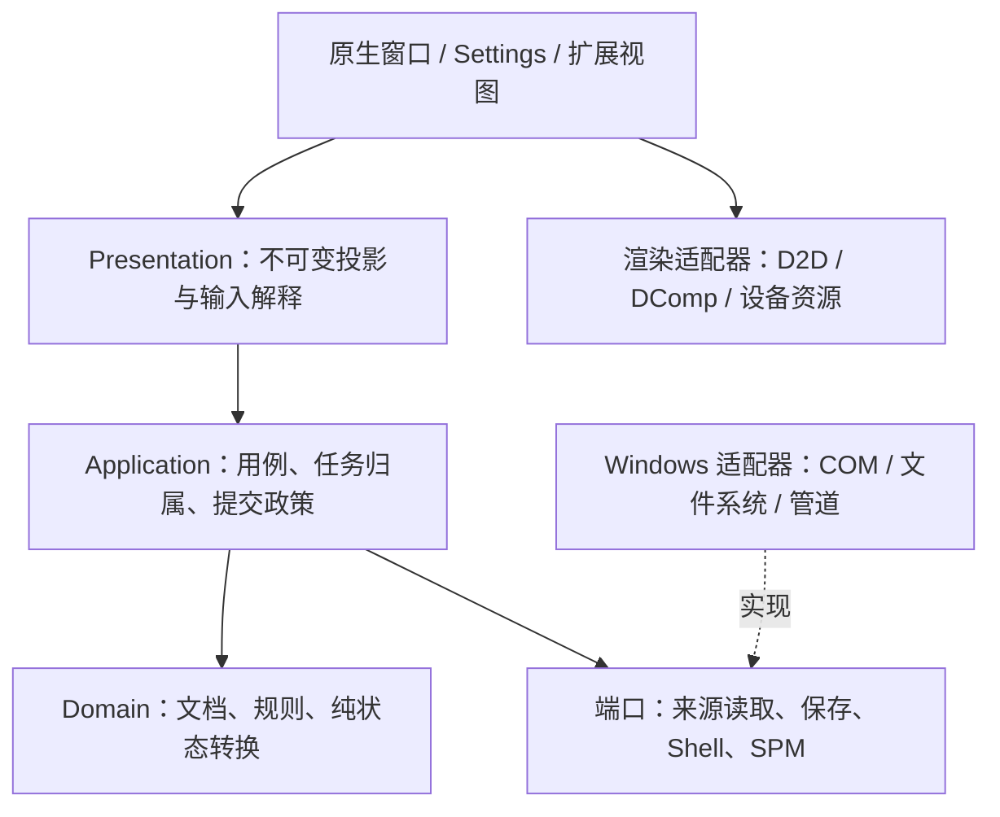

# PecoFence：应用边界与类型化接口重设计

状态：目标架构；按完整用例逐条替换实现，不表示整套架构已完成。

本设计按维护者要求**不考虑后向兼容**：不保留旧配置 schema、旧插件 API、旧 token、旧 Settings 消息或自动迁移链。已有用户文件不因“不兼容”而被删除、当成空配置或覆盖。实现进度与验收入口见 [路线图](ROADMAP.md)，关键取舍见 [ADR-006](decisions/ADR-006-application-boundaries.md)。

本文件是后续应用、扩展接口和宿主边界的统一设计入口。旧 Cordis/P0–P2a 文档保留为历史分析；其中服务定位器、依赖图、兼容策略和实现顺序不再构成新设计约束。[ADR-005](decisions/ADR-005-theme-invalidation.md) 的主题/设备失效分离原则仍有效。

## 1. 要解决的不是文件太大，而是所有权不清

本轮开始时的源码基线为 `43b6b7d`。以下是实现事实，不是性能测量或事故报告：

| 现有边界 | 问题 | 新规则 |
| --- | --- | --- |
| `AppState` 同时持有配置、发现的文件、门户缓存和 I/O | 修改、发现、保存和显示耦合；失败容易被当作空结果 | 持久文档、来源观测、会话交互分别拥有 |
| 门户先清旧列表，再同步枚举 | 暂时不可读会显示空目录；UI 路径执行文件/Shell 查询 | 带代际的异步读取，完整结果原子替换 |
| `App` 处理窗口、规则、文件任务、设置和保存 | 原生命令泵事实上也是业务应用层 | `App` 只组合与分发；用例负责政策 |
| `IpcService` 的订阅和操作共用 `Token`、字节和 `cancel` | 返回值不能证明请求归属；一次操作按订阅广播 | 订阅和操作使用不同句柄、不同完成契约 |
| `PluginContext` 固定装入通用服务 | 有无效实现和伪完成 token；依赖图没有降低使用成本 | 静态注册，显式注入有真实实现的领域端口 |
| WebView 替换整个 Settings/Rules 对象 | 客户端旧副本可能覆盖其他修改；接受和落盘混淆 | 带请求 ID、修订号的细粒度命令与确认 |
| 保存、Shell 操作使用 bool/字符串或忽略结果 | 部分成功、取消、失败和未知不能可靠表达 | 每个实际副作用有类型化终态 |

源码入口：[应用组合根](../crates/app/src/app/mod.rs)、[状态](../crates/app/src/state.rs)、[现有插件 API](../crates/plugin-api/src/lib.rs)、[设置处理](../crates/app/src/app/settings.rs)、[SPM 管道适配器](../crates/app/src/spm_transport.rs)。这些链接用于追踪替换，不表示它们已经符合目标接口。

## 2. 选择：有约束的模块化单体，不再扩大微内核

采用五个逻辑边界，依赖向内。边界首先通过模块可见性、输入/输出类型和真实调用落实，不用增加 crate 数量来代替设计。



### 层的权利与禁止事项

| 层 | 拥有什么 | 不允许做什么 |
| --- | --- | --- |
| Domain | 文档不变量、规则求值、成员关系、布局/标签操作 | 读目录、拿 HWND、发管道、显示 toast、决定重试时机 |
| Application | 用例、操作/来源代际、提交顺序、取消与错误政策 | 绘制、调用 WebView/Explorer 对象、解析 SPM wire |
| Presentation | 文件列表、设置、面板的只读投影；本地编辑草稿 | 将显示状态直接写回完整文档；把断连当作业务失败 |
| Adapters | 真实 I/O、序列化、Shell/COM、协议、设备实现 | 把不完整结果伪装成空/成功；自行修改领域状态 |
| Native host | UI 线程、窗口/消息泵、组件挂载、渲染提交、OS 生命周期 | 在 WndProc 中做目录遍历、同步等待 worker 或业务事务 |

否决两条路线：

1. **继续泛化服务注册、事件总线、effect DAG。** 当前只有明确的静态集成需求；更多运行时发现会让错误从类型检查转移到字符串/生命周期检查。
2. **立即拆出 domain/application/persistence/shell/render-model 等多个 crate。** 当前边界还没有真实消费者约束。先替换完整用例；当模块确有第二个调用方、独立测试或依赖隔离收益时再提取。

不采用事件溯源、全局 CQRS 框架、动态 DLL ABI、插件市场或共享内存总线。读写模型分离不需要这些基础设施。

### 目标模块归属

```text
core/
  workspace       持久领域模型及不变量
  rules           纯规则判断
  observations    来源结果和覆盖/健康契约
app/
  application/    portal、workspace、settings、file-transfer 等用例
  adapters/       storage、directory-reader、shell、spm-client
  presentation/   fence、settings、extension 的投影
  windows_host/   现 App、原生窗口和组合根
plugin-api/       仅组件生命周期、帧、语义输入契约
plugin-spm/       类型化 SPM 客户端的视图和交互状态
plugin-kernel/    收缩为宿主内部的 activation/owner/task 生命周期
render/          原生测量、绘制和设备资源
platform/        Windows 具体操作
```

这是目标归属，不要求第一批重命名全部目录。禁止借助 `use super::*`、公开可变字段或新的 `SharedState` 绕过边界。便于过渡的转换只能位于调用边界，不能保留两套同用例 API。

## 3. 四种状态，不再只有一个 AppState

### 3.1 `WorkspaceDocument`：用户作出的持久决定

包含容器/标签结构、位置和显示偏好、文件来源定义、虚拟归属、手动顺序、分类规则、用户设置、扩展类型化配置和命名布局快照。文件内容从来不在文档中；布局快照不能称作文件备份。

不包含目录枚举列表、mtime/size、图标/GPU 缓存、当前门户子目录、hover/selection、连接状态或 worker token。来源自动整理确需改变归属时，由明确用例提交文档变化；“发现一个文件”本身不等于需要保存配置。

文件归属使用持久 `AssetRef`，观测使用 `ObservedEntryId`，不能将它们混为同一 ID。`AssetRef` 包含来源归属和可重新解析的定位信息；Windows 文件标识可用于核对，但路径、文件标识、Shell namespace ID 都不是全球永久身份。重命名/替换无法证明为同一文件时，保留未解析归属，不猜测、不执行真实文件移动。

配置版本是新格式的精确标识，不继续使用“读不懂就改成当前版本”。扩展配置由对应 provider 解码，原始 JSON 只存在存储边界，不在面板交互中传递。

### 3.2 `ObservationStore`：外部世界最近一次可靠观测

按 `SourceId + SourceEpoch` 持有不可变目录/桌面观测，包括覆盖范围、观测时间、完整性和错误类别。目录筛选、路径、来源类型改变都产生新 epoch；旧结果不能进入新来源。

`Complete([])` 表示在声明的覆盖范围内，成功读到了空目录。打开失败、遍历中断、单项 metadata 失败都不是完整空目录。过滤掉 hidden/system/desktop.ini 是声明的筛选政策，不是读错误。

一致性承诺是“一次完整遍历的观测”，不是文件系统事务快照；文件可在遍历期间变化。删除/真实文件移动必须依据操作时核验和实际 Shell 结果，不能仅凭列表少了一个条目推断成功。

### 3.3 `SessionState`：本次进程的交互

当前门户导航、选中项、正在拖动的标签、编辑草稿、Peek、Quick Hide 和任务状态属于会话。来源健康由 ObservationStore 唯一拥有，Session 只引用当前来源，不再复制一份健康状态。若某项确实需要跨重启保留，应显式提升为文档字段，不通过顺手序列化缓存实现。

门户切换路径时，可将旧列表作为不可交互的历史视图保留，但不能将其项目当作新路径里的文件打开、删除或拖出。第一实现选择清除当前可交互投影；新路径读失败显示不可用，不展示旧路径的活动列表。

### 3.4 `ViewSnapshot`：只读呈现结果

领域/观测/会话状态经 projection 生成文件窗口、设置页或扩展的只读视图。分别使用 `DocumentRevision`、`ObservationEpoch`、`ViewRevision`；刷新目录不能推进配置修订，颜色变化不能假装为文档修改。

渲染只能消费投影，不能读取/修改配置 Store。设置推送也是投影，不是允许客户端回传覆盖的数据库对象。

## 4. 用例与副作用：先承认，再用真实结果确认

命令表达用户目的，例如 `RefreshPortal`、`NavigatePortal`、`AssignAsset`、`MoveFiles`、`SetSetting`、`CommitWorkspace`。原生消息 `WM_APP_*` 只是投递信号，不是领域命令。

每个用例拥有其状态机。不要建立一个包含所有业务的巨大 `Intent/Effect/Event` 枚举；共用 ID、时钟、队列和取消工具即可，业务状态机彼此独立。

```text
输入 -> 校验/权限/修订核对 -> 更新内存状态或安排任务
                           -> 真实适配器执行
结果 -> 核对 owner/epoch/request -> 原子应用 -> 新视图/明确确认
```

### 4.1 目录读取契约

以下为目标 Rust 形状，名称可随第一条真实用例收敛，不是新增未使用 trait 的要求：

```rust
struct DirectoryRead {
    owner: SourceOwner,       // 含来源生命周期，不只是 FenceId
    epoch: SourceEpoch,
    request: ReadId,
    source: DirectorySpec,    // 路径与筛选均为 owned 数据
}

enum DirectoryOutcome<T> {
    Complete(Vec<T>),
    Partial { entries: Vec<T>, issues: Vec<SourceIssue> },
    Unavailable(SourceIssue),
}

struct DirectoryResult<T> {
    read: DirectoryRead,
    outcome: DirectoryOutcome<T>,
}
```

应用政策：

- 同一路径：Complete 原子替换，包含真正空目录；Partial/Unavailable 保留最后完整列表，标记 stale/unavailable。
- 改路径/来源：撤销旧 epoch 的交互与结果接收，新路径有独立列表；失败不自动回到根目录。确认不存在与权限/离线/共享违规不能混淆。
- 删除、重建、导入和布局切换：新 owner 生命周期；旧结果即使 FenceId/路径相同也被拒绝。
- 刷新突发：每个来源最多一个活动读取与一个合并后的最新重读需求；重复通知不是 N 个任务。
- 来源 epoch 与每次派发的 ReadId 分开。同路径通知只安排后续读取，不使当前完整观测失效；否则持续变化的目录会永远不能提交。导航/来源重建仍立即更换 epoch 并拒绝旧观测。
- 来源数、任务输入/结果队列和保留条目有预算；队列满返回显式拒绝/待重试，不静默丢操作。快照可合并，终态不可覆盖。
- 一个读取终态被消费后，不再允许其重复应用。失败也要结束任务，不能留下永远“正在刷新”的记录。

### 4.2 Shell 文件任务

`FileTransferPlan` 是目标、来源和用户选择；`FileTransferOutcome` 才是实际发生的事：

```rust
enum FileTransferOutcome {
    Completed { items: Vec<TransferredItem> },
    Partial { completed: Vec<TransferredItem>, issues: Vec<FileIssue> },
    Cancelled { completed: Vec<TransferredItem> },
    Failed(FileIssue),
    Indeterminate { operation: FileOperationId },
}
```

Shell 对重名文件可能重命名、跳过或取消。返回每项真实目标路径；不能用预计算路径 `PendingRoute` 声明传输成功。先完成真实文件任务，再根据完成项修改虚拟归属；部分成功不能当作全部成功。操作期间来源观测可刷新，但不能据此抢先完成归属事务。

无法获取最终结果时为 `Indeterminate`，不是 `Cancelled`。取消请求不证明已经移动的文件被移回。

不可逆任务由**应用 operation ledger**拥有，发起窗口只拥有观察权。关闭/删除/替换窗口会撤销回调并请求取消，但不能销毁真实文件结果记录。完成项仍按接纳时的文档身份和归属前提核对：目标还存在且前提成立才归入；否则记为 `CompletedUnassigned` 并提供真实路径，不强行归入新建的同 ID 容器。

真实传输前写入最小 `TransferJournal`：操作 ID、文档身份、来源/目的计划和阶段；写入失败不派发 Shell。实际结果逐项确认后记录，完成再清理 journal。这是少量未决操作记录，不是整个领域的事件溯源。崩溃/强制退出留下的未决记录在下一次启动标为需核对；无法证明的结果保持 Indeterminate，不能根据目录差异自动重做移动。可逆的目录读取结果可丢弃，不可逆文件任务的账目不可随 UI owner 丢弃。

### 4.3 Windows 线程与停止

UI 线程拥有 HWND、DComp/D2D 提交、WebView controller、OLE drop target、组件和 `Rc` 帧。worker 仅接收 owned、`Send` 请求并返回 owned 结果，创建并销毁自己的 COM apartment；COM 接口、绘制 session 和可变应用状态不跨线程。

不同适配器有不同 executor 契约：

- 纯 `std::fs` 读取/CPU 壁纸处理不需要 COM，可运行于普通有界 worker。
- Shell metadata/name 查询由专用 STA reader 执行；`CoInitializeEx` 失败产生真实错误结果。消息循环在任务间泵送，并支持 COM 调用所需的 apartment 消息处理；不能只在任意线程初始化 COM 就声称所有 Shell extension 都可安全使用。
- 交互式 Shell 文件任务使用有消息泵的独立 STA executor。任务只有仍有效的宿主 dialog-owner lease；原生 HWND 的有效性由 UI 注册/撤销，不能将一个复制的地址当作所有权。owner 消失则取消或按明确的无 owner 政策继续，不转投新 HWND。
- OLE drag/drop、WebView controller 与 D2D/DComp 留在既有 UI apartment。worker 不同步调用 UI/等待 UI 回调，避免 UI 等 worker、worker 等 UI 的死锁；STA 可能重入的回调不得持有业务可变借用或用例锁。

有限消息泵不能保证一个阻塞文件系统或任意第三方 Shell extension 有界完成；此限制继续由下面的隔离政策处理，不在 SDK 声称通用 Shell 执行保证。

结果通过宿主邮箱回 UI；邮箱内容与唤醒信号分离，`PostMessage` 合并不丢结果。失效 HWND 不成为 worker 随意发消息的裸地址：关闭投递门先于窗口销毁。worker 不能调用组件回调。

组件/来源关闭顺序：关闭观察 owner 接收门 → 禁止新工作 → 请求取消/关闭来源 → 撤销挂载与权限 → 限时 drain → 丢弃迟到观测并隔离未结束工作。应用 ledger 仍核算已派发副作用，不能将撤销 UI 回调当作抛弃账目。UI 不等待不可取消的 Windows 文件/Shell 调用。

不能伪称能够强制取消阻塞 OS 调用。第一批使用有界 worker；如果实测一个慢来源阻塞其他来源，升级为有界并行读取。如果需要强制回收，使用可终止的独立辅助进程，而非无限开线程或阻塞退出。进程退出可终止线程，但这不是正常任务取消保证。

本仓 release 使用 `panic = "abort"`。类型化 I/O/COM 错误属于可恢复终态；调试/测试中的 `catch_unwind` 不代表发布程序能在 Rust panic 后继续运行。要提供崩溃隔离需另外建立进程边界。

## 5. 保存与损坏处理是应用接口，不只是日志

### 启动结果

| 结果 | 默认政策 |
| --- | --- |
| `Absent`：新路径和候选数据确认不存在 | 新建文档，允许正常提交 |
| `Loaded`：格式、结构、不变量正确 | 启动可写会话 |
| `RecoveryAvailable`：主文件坏但有可验证备份 | 用户选择恢复；选择前不得覆盖主文件 |
| `Unavailable`：读取失败 | 显示错误和重试，禁止普通自动保存 |
| `Corrupt`：内容无效且无可用恢复 | 保留原件；显式恢复/新建，不能静默默认 |
| `UnsupportedFormat` | 显示不支持的版本；不改版本、不自动迁移、不覆盖 |

尚无有效文档时只启动恢复界面和诊断，不创建默认文件栅栏、不开始自动归类或隐藏 Explorer 图标。重试/选择受支持文档/明确新建成功后，才激活正常工作区。只读展示仅适用于已经得到可验证文档、但提交不可用的情况，不能把读取失败的默认值称作只读恢复。

新格式使用独立配置文件名/命名空间。新文件不存在但检测到旧配置时，提示“打开受支持文档”或“创建新的工作区”；明确选择新建后才能创建，旧文件保持原状。这不是兼容读取。导入同样只接受新格式。

### 提交结果

```rust
struct CommitRequest {
    revision: DocumentRevision,
    expected_store: StoreStamp,
    document: WorkspaceDocument,
}

struct CommitReceipt {
    committed: DocumentRevision,
    store: StoreStamp,
    backup: BackupStatus,
}
```

只有主文件确认原子替换成功才返回 receipt。提交前失败是 `CommitFailed`；主文件已经提交但可选备份失败是 `Committed + BackupDegraded`，不能要求用户重复同一提交。无法确定替换结果时进入“需重新核对”状态，不假装成功或直接继续覆盖。

单写入者串行提交，保存过程中后续修改仍为 dirty：提交 r8 时内存已为 r9，只能确认 r8。存储目录使用不可被应用替换的 sibling lock 文件，Windows adapter 以不共享的文件句柄持有它；在初次读取前获取，覆盖整个可写工作区 activation，提交/替换完成后、关闭工作区时才释放。采用相同规范的 PecoFence 写入者因此互斥；配置别名/目录归一化必须由 adapter 明确处理。

`StoreStamp` 含内容摘要和已提交修订，检测到当前内容不同就拒绝覆盖。**合作锁不约束任意编辑器，也不是文件路径的原子 compare-and-swap。** 非合作编辑器在核对后、替换前仍可能竞争；不得宣称绝对防覆盖。工作区打开期间不支持外部直接写配置，检测到差异进入只读/冲突状态，并保留上个有效版本。提交前核对和独立锁的职责分开，需测试竞争外部替换；若未来要求严格跨编辑器 CAS，应更换有该能力的存储协议，而不是加一次 metadata 检查。

暂存文件在同一文件系统写入并同步，Windows adapter 明确使用原子替换语义并保留上个有效版本。atomic replace 与断电 durability 分开验证，不以一次 rename 声称两者都满足。

设置视图必须显示可写/只读、未提交修订、最近提交结果与备份退化。Toast “已保存”只能对应 committed，不能对应排队或 800ms 防抖开始。

### 关闭工作区/应用

当前 B2-1 的文档保存/退出接线见 [PERSISTENCE.md](PERSISTENCE.md)。下述单写入锁、磁盘核对、断电和 operation ledger 保证仍为目标；当前结果不能证明全部成立。

正常关闭进入 `Closing`：停止接纳修改，取消保存防抖，异步提交最近 dirty 修订并等待明确的主文件结果；不在 UI 线程 join。提交失败显示重试/取消关闭/明确放弃未提交修改。替换结果不确定时先重新读取核对；不能直接重试覆盖或显示保存成功。文档提交和 operation ledger 的收尾由应用拥有，不随组件关闭而取消。

强制 OS 结束或进程崩溃没有保存保证。允许期限内尽力完成已开始的提交，不以 Accepted 宣称可恢复；原子替换保留最近明确 committed 的文档，未决文件任务按 journal 核对。无法写入任何存储时也不能承诺未提交修改幸存。测试在 Accepted 后立即关闭、提交中关闭、CommitFailed 后关闭与强制结束。

## 6. Settings 协议：客户端发操作，不发权威对象

采用精确版本、serde-tagged 消息和受验证 DTO。第一版使用文档级 optimistic revision；**不**立即加入每字段向量时钟或自动冲突合并。

```rust
struct SettingsRequest {
    protocol: u16,
    client: Uuid, // page handshake identity
    sequence: u64,
    base: DocumentStamp, // activation UUID + expected revision
    command: SettingsCommand,
}

enum SettingsCommand {
    SetSetting { change: SettingChange },
    SetContent { content_id: ContentId, container_id: ContainerId, change: ContentChange },
    SetContainer { content_id: ContentId, container_id: ContainerId, change: ContainerChange },
    Rule { change: RuleChange },
    Action { action: Action },
}

struct Receipt {
    client: Uuid,
    sequence: u64,
    base: DocumentStamp,
    current: DocumentStamp,
    rejected: Option<Rejection>,
    cancelled: bool,
}

struct PersistenceNotice {
    page: Uuid,
    client: Uuid,
    stamp: DocumentStamp,
    committed_revision: Option<u64>,
    issue: Option<String>,
}
```

以上为已实现 C1 的契约形状，精确 wire、去重容量和测试见 [SETTINGS_PROTOCOL.md](SETTINGS_PROTOCOL.md)。原生接线使用这些枚举；ViewSnapshot 的 JSON 是只读投影，不是权威可写对象。后文 OS 操作健康和异步存储为后续目标，不应理解为当前全部完成。

细粒度操作防止无关字段被覆盖；文档修订冲突则明确拒绝，返回新 snapshot 供客户端重试。`Accepted` 只表示内存中的文档已更新，`Committed` 表示该修订及之前的修改已落盘。每个请求只作一次接纳决定，持久化通知不是第二个命令回复。

当前 `DocumentStamp.workspace` 是本次激活 UUID，导入/恢复接受/新建/重新载入都会改变它；它不是持久文档 ID。revision 只在该 activation 内比较，不假设跨文档全局唯一。所有 snapshot、回复、提交确认和 PersistenceNotice 绑定 activation；旧 activation 消息即使 revision 相同也拒绝，旧提交不能确认新文档已保存。若 B2 引入持久文档 ID，必须与激活身份分别建模。

`ready` 带 page UUID，为新 WebView 会话分配 client UUID，返回协议版本、激活、完整 ViewSnapshot、文档修订和保存健康；同 page 的重试保持 client。客户端 request sequence 单调递增；宿主有界保存最近 32 个请求与接纳决定。相同序号/相同内容重试返回原决定，内容不同拒绝；已淘汰的旧序号拒绝，绝不重新执行。乱序/跳号拒绝并要求重新打开页面；更换 client 后不能重发旧未决修改当作新请求。此去重只覆盖活动会话，不声称跨重启操作恰好一次。

推送视图有独立序号；前端丢弃旧 activation/旧推送。前端草稿与服务器投影分开：新状态只更新未编辑字段，脏草稿显示冲突；不能收到 state 后整页覆盖用户输入。

未知协议/字段/操作、无效数值、找不到的目标、只读会话、过期修订、过大 payload 均有明确拒绝。OS autostart、文件选择、导入、备份恢复有自己的操作结果；内存设置已接受不代表注册表/文件 I/O 已成功。OS 集成的期望值、实际状态与最近失败分开投影；失败不伪造实际状态，用户可重试或用新命令撤回期望值，不在后台偷偷回滚可能已被后续命令改变的设置。

## 7. 扩展：静态 provider + 显式领域端口

### 7.1 分离三种契约

1. **组件契约**：创建、挂载、输入、准备帧、卸载、停止。平台无关，但 UI-thread-bound。
2. **领域端口**：查询/操作的输入、输出和错误。例如 SPM 类型化客户端。由真实调用方定义，不是万能 IPC。
3. **宿主内部生命周期**：activation、owner gate、任务记录、drain。实现细节不出现在 provider API。

provider 具有关联 `Config`、`Ports`、`Component` 类型；组合根用注册包装器做一次类型擦除和配置解码。`Ports` 中是什么，依赖就是什么；删除 `required_services: &[&str]`、通用 service locator、跨 provider 的热替换依赖图和固定 `PluginContext` 服务袋。

```rust
trait Provider {
    type Config;
    type Ports;
    type Component: Component;

    fn create(
        &self,
        config: Self::Config,
        ports: Self::Ports,
    ) -> Result<Self::Component, CreateFailure>;
}
```

`Ports` 由组合根绑定实例 owner，组件不能伪造 ScopeId 给别的实例发请求。配置解码/能力检查/初始挂载是事务：任一步失败撤销全部已获取资源，没有半活跃实例。

面板模式请求改为组件返回的 host intent，由容器校验再应用。主题、语言、可见性、DPI 和 text scale 作为不可变帧输入提供，不是临时查询 locator。render invalidation 是宿主职责，不暴露永远返回 Ok 的服务。

没有真正持久化需求时不提供 StorageService。剪贴板/导航只有有真实 policy-check 和完成结果才注入；缺能力时隐藏/禁用对应操作，不返回假 token。

### 7.2 SPM 端口，不是协议包

```rust
trait SpmClient {
    fn watch_project(
        &self,
        query: ProjectQuery,
    ) -> Result<Subscription<ProjectView>, SubmitFailure>;

    fn refresh(
        &self,
        delivery: DeliveryRef,
    ) -> Result<Operation<RefreshReceipt>, SubmitFailure>;

    fn build_briefing(
        &self,
        delivery: DeliveryRef,
    ) -> Result<Operation<Briefing>, SubmitFailure>;

    fn resolve_navigation(
        &self,
        source: SourceRef,
    ) -> Result<Operation<NavigationTarget>, SubmitFailure>;
}
```

`OperationId`、`SubscriptionId`、`InstanceActivation` 和 `MountGeneration` 不可互换。端口实例绑定 owner；返回句柄也绑定该 owner。

- `Subscription<T>` 是最新快照/健康流，close/drop 只撤销本地观察者。相同查询可共享远端订阅；最后一个观察者离开才关闭远端。
- `Operation<T>` 接纳后内部记录恰有一个本地终态：Completed、Failed、CancelledBeforeDispatch、OwnerClosed 或 Indeterminate。drop 表示不再观察并请求取消，不是远端回滚。OwnerClosed 只是本地观察结束；记录是否已派发及远端结果是否未知，不等于操作取消或失败。
- 尚未进入队列的失败为 `SubmitFailure`，不会产生 operation。已接纳的终态不能在队列满时消失；预留结果容量或在 operation 槽保存结果。
- owner 关闭先于取消，迟到结果不会调用组件；内部记录仍需终结并清理，不能因回调撤销而泄漏。
- 已发送后断连/取消，若 daemon 无法证明结果，返回 Indeterminate。**本地终态一次不等于远端副作用恰好一次。** 不自动重试不具备幂等键的命令。

每个接纳操作有本地 deadline（端口按操作定义默认值与最大值，不接受无限等待）。派发前到期可证明未执行；派发后到期但没有结果为 Indeterminate。一个已连接但不回应的 daemon 也会终结本地等待。deadline/断连终结之后的 wire 完成只进 ledger/诊断，不触发第二次终态或回调；是否仍可核算远端结果由 adapter 明确记录。

活动 operation 槽数量有上限；终态确认消费或 owner 关闭后释放。保留有界过期关联墓碑，session 结束清理；wire ID 在同一 session 不复用，墓碑淘汰后的迟到回复也不能命中新操作。副作用账目与 callback 槽分开，需人工核对的记录不靠无限内存保留。

句柄在 UI 线程消费类型化更新；只有请求、结果和取消信号跨后台线程。provider 不拿 Tokio handle、命名管道句柄、wire Envelope、原始 JSON 或任意 endpoint 字符串。

SPM adapter 独占序列化、request/operation correlation、握手、会话代际、重连、背压和共享订阅。远端 request ID 与 operation ID 映射必须明确；订阅收到的快照不可能被当作操作完成，也不能广播给不同实例的 operation。

`spmd` 仍拥有凭据、连接器、数据库和业务计算。PecoFence 的类型化视图不重新解释交付判断。若 wire 协议没有可证明的完成关联或取消，需要修改 SPM 仓库协议；本仓适配器不能凭空保证。未支持的组合明确失败，没有 v1/v2 fallback。

### 7.3 三类状态不要混为一个红灯

SPM ViewSnapshot 分别携带业务判断、连接状态和数据 freshness。断连可保留最后有效业务数据，但必须标记 stale；未知来源不能转成通过/失败。页面刷新按钮的任务状态独立于订阅状态。

“复制简报”流程：构建 operation 终态得到 Briefing → policy-checked clipboard operation → 剪贴板成功后才显示“已复制”。导航同样先解析，再由宿主验证 scheme/目标并执行；解析成功不等于页面已打开。

## 8. 渲染接口：屏幕、命中与语义是一份提交

组件准备一个 UI 线程不可变 `PreparedFrame`，包含 display list/paint、hit targets、语义树和 action map。宿主一次提交后，所有输入以**最近成功提交的逻辑帧**为准，不以尚未提交的新布局为准。

```rust
struct FrameKey {
    mount: MountGeneration,
    commit: FrameCommitId,
}

struct FrameDependencies {
    content: ViewRevision,
    interaction: InteractionRevision,
    metrics: TextMetricsEpoch,
    geometry: GeometryEpoch,
    theme: ThemeEpoch,
    device: DeviceEpoch,
}

struct ActionInvocation {
    frame: FrameKey,
    action: ActionId,
}
```

`FrameCommitId` 在每次挂载内单调分配。publication point 是同一 UI 线程完成所有目标绘制并确认原生 composition 提交成功之后，原子切换 paint 对应状态、hit/semantics/action map 和 current key。准备/绘制/提交失败不发布新交互状态；保留仍有效的上一帧。设备丢失、窗口重建等导致上一帧也不再有效时，禁用该 mount 的输入，直到成功提交。

DComp 异步显示不保证“提交成功那一刻物理像素已更新”。这里保证的是最近成功提交的逻辑帧一致性，不是屏幕扫描时序同步；不能把这个契约写成可证明的物理像素事务。失效依赖用于缓存和准备，不代替唯一提交身份；只改颜色也能产生新帧，不与旧帧共用 key。

action 含义、命中几何、语义结构/标签任一改变都推进 interaction revision；不能只比较 hit rect。来自旧帧、已卸载 mount 或不存在 action 的输入拒绝。viewport 变化推进 geometry epoch，不能只依赖组件自行发现 hit 改变。提供新的语义树不表示已有 UI Automation 支持；宿主接线与实机 accessibility 验收是独立交付。

文字测量由真实 renderer/TextMeasurer 执行，与绘制使用同一字体、DPI 和 text scale；删除近似的字符数宽度测量服务。组件拿不到 D2D/GPU 资源，资源由 renderer 根据 epoch 缓存和销毁。

沿用 ADR-005 的失效范围：颜色只重绘；字体/text scale 需测量与交互更新；DPI 更新几何和本地资源；设备恢复不重建领域实例。设备恢复本身有 retry/backoff 状态和用户可见退化，不能一条失败日志后永久停留 lost。

## 9. 原生桌面行为明确归属

| 行为 | 所有者 |
| --- | --- |
| HWND、桌面 Z-order、Peek 暗层、Quick Hide | Native host；策略来自会话/设置 |
| Explorer 图标隐藏/恢复、ownership marker、watchdog | 独立 desktop-visibility adapter；成功恢复后才能清 marker |
| 文件窗口图标/Shell 菜单/OLE | Windows adapter + native presentation，真实文件任务由应用用例确认 |
| 壁纸读取、CPU 处理 | 带签名/代际的有界后台任务 |
| D3D/D2D/DComp 资源与恢复 | render adapter；UI 线程提交 |
| 配置和可选备份 | storage adapter；应用决定是否允许提交 |
| 系统热键/开机启动 | system-integration adapter；失败不报告为成功 |

虚拟栅栏归属变化与真实文件移动是不同用例；普通栅栏、门户、SPM 只共享容器/帧/输入基础设施，不强迫所有文件 Shell 行为成为通用插件服务。

自动高度是内容投影，包含高度动画终态，不写回用户几何或触发保存；手动拖动/调整大小和明确卷起/展开才是文档编辑。不能只让来源提交方法保持 clean，却在随后渲染/布局回调中重新持久化观测。

日志是诊断，不是用户错误通道。单实例确认之后才打开独占实例日志，使用有上限轮转；不记录凭据或业务正文。性能优化以真实耗时/资源数据为依据，不能用减少错误信息换取体积。

## 10. 替换顺序与完成定义

| 阶段 | 替换的完整链路 | 删除的旧路径 | 必须证明 |
| --- | --- | --- | --- |
| A | 门户读取/导航 → 有界 worker → 原子观测 → 视图 | UI 同步枚举、失败即空列表 | 空/失败/partial/迟到/停止/共享来源 |
| B | 新文档 → 载入状态 → 串行提交 → 保存健康 | Config 混入观测、读失败默认写回 | 未支持原件保留；r8 提交不清 r9 dirty |
| C | Settings typed command → 用例 → 真实确认 | raw Value switch、整对象 patch | 冲突/草稿/OS 失败/accepted≠committed |
| D | SPM watch 与 typed operation → provider | 通用 IPC、Token、字节事件、服务 DAG | 一请求一关联；取消未知；无假能力 |
| E | 原子帧/输入 + visibility/设备恢复 | 独立旧 hit/semantic 状态、one-shot recovery | stale frame 拒绝；失败重试；恢复 marker |

阶段按用例替换；阶段间仍未改造的原生功能是迁移中的旧实现，不是承诺支持旧 API 的兼容层。一个阶段完成时删去该用例旧入口和重复所有权，不能永久维护双路径。

新 SDK、文档/Settings schema 和 wire 改动在各自调用方同步替换。跨仓 protocol 改动必须在附加的 SPM worktree 中完成和配对测试；不能以本仓单测通过宣称 daemon 联调完成。

### 验收矩阵

- **纯状态机**：同样输入/结果产生相同决定；无目录、窗口、COM 调用。
- **故障注入**：完整空、部分遍历、权限错误、提交前/后失败、OS 取消、未知结果、关闭发起窗口后的真实文件结果核算、提交失败不发布 hit tree。
- **生命周期**：突发刷新、关闭/重建、同 ID 不同 activation、晚到结果、饱和队列、停止后无回调。
- **协议**：错版本、错 workspace/request/session、重复/迟到完成、去重缓存淘汰、已连接但不回应、订阅共享/退订竞态、断连后不自动重放命令。
- **视图**：stale 数据有标识；旧路径条目不可操作；草稿不被推送抹掉；帧/命中/语义一致。
- **Windows 工作流**：真实目录/watcher/F5，Shell 部分成功，多 DPI，Explorer 重启，Win+D，Peek，设备恢复和 WebView。未执行的项明确标记，不以 headless 测试代替。

交付是“请求到真实结果的链路可证明”，不是“新增了若干 trait / 拆了若干文件”。目录布局、抽象数量和日志行数都不是架构完成指标。

## 11. 按组件与功能实施的当前切片

以下是已落入源码的边界，不是前文所有目标都已实现的声明。

```text
Config / schema 2
  Layout
    Container: 独立窗口身份、几何、外观、卷起、自动高度、ordered tabs
      tabs: ContentId 引用，active_tab: ContentId
    ContentInstance: 独立内容身份、标题、内容视图
      FileCollection: 用户成员关系、inbox
      FolderPortal: 根目录及门户配置
      Panel: provider-owned 配置与业务实例
```

### 功能所有者

| 组件 | 已拥有的责任 | 不应拥有的责任 |
| --- | --- | --- |
| `Workspace` | 图不变量、创建、选择、重排、合并、拆出、删除 | HWND、文件读取、保存、provider 重建 |
| `PortalRuntime` | 来源生命周期、读取关联、合并重读、完整观测提交 | 窗口、COM、用户文件移动 |
| `PortalReader` | 有界 STA 目录/Shell 元数据读取与真实终态 | UI 回调、内容归属、文档保存 |
| `ConfigStore` | 精确 schema、字节预算、主文件替换、原件 archive、备份状态 | 创建默认工作区、把读错误当 first run |
| `AppState` | 应用政策、规范化图与观测之间的投影、可写/恢复状态 | 把呈现快照作为可变持久副本 |
| 原生宿主 | 容器 HWND、放置、输入捕获、真实窗口挂载和呈现 | 将窗口 ID 当作内容或文件归属 ID |
| Settings 入口 | 显示健康、提交配对目标、确认恢复/替换 | 自行决定归属或绕过校验覆盖图 |

Root 仍名为 `Config`，且还保存部分桌面观测字段；不是已经完成第 3 节完整 `WorkspaceDocument/ObservationStore` 分离。`FenceId` 在过渡中的原生命名仅指 `ContentId`；`FenceSnapshot` 和 `FenceContentSpec` 是不序列化的只读投影，不读取旧配置。

### 实际功能链路

- 标签选择/重排只改变引用和活动内容；`ContainerId` 不随第一个标签或活动标签改变。
- 拆出创建独立容器；合并移走内容引用，最后一个标签离开才删除原容器。目录读取和 provider 业务实例不因 remount 重建。
- Native 需要实时拆出窗口，因此取消使用有拓扑前提的结构 receipt；不克隆/覆盖整个内容图。后续归属/标签变化使取消失败，内容编辑与仍存活的窗口外观/几何不回滚。
- 文件集合成员操作与真实 Shell 移动仍是不同链路；规则只允许集合目标，门户和面板不会成为“虚拟归类”目的地。
- Settings 提交 `contentId + containerId`；内容移走后旧配对拒绝。窗口属性共享到同容器标签，内容视图属性仍独立。
- 导入、重置、接受恢复都捕获旧设置并走同一原生 reconciliation；不只保存新值而留下旧热键、anchor 或行为状态。
- 普通 autosave 拒绝不支持/不可读/损坏的主文件；明确替换先保留原字节。主文件已提交但备份失败是 degraded commit，不是假失败或无条件“已保存”。

### 验证与剩余范围

纯组件测试覆盖图与身份、结构取消、来源 remount、迟到/重复读取、错误载入、原件保留和备份退化。Settings 的浏览器 mock 回归覆盖独立内容/共享容器属性、错误配对、只读恢复、集合目标与多语言布局；它不证明真实 WebView2/Explorer/Run-key/热键效果。

实验夹具使用 `core` 的 `validate_workspace` 示例程序生成和校验精确格式，不维护第二套 Python schema，也不自动迁移旧 seeds。真实桌面交互脚本的容器在 tear-off 中可能更换，属性命令在执行时从稳定内容 ID 解析当前配对。

C1 已接入类型化 Settings 修订/会话协议、细粒度操作、多条件规则编辑和保存通知；B2-1 已接入串行异步文档提交与文档退出策略。未改造的组件必须继续明确标记：跨进程存储保护/未知结果核对、文件操作逐项结果/journal、桌面来源异步化、Settings OS 集成健康、类型化 SPM 端口与操作完成、渲染恢复/帧发布、日志轮转。源码和 roadmap 的状态比“重构完成”这一笼统标签更重要。
