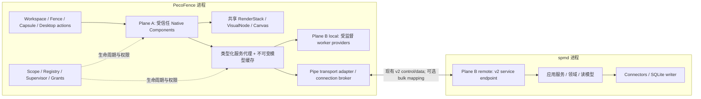
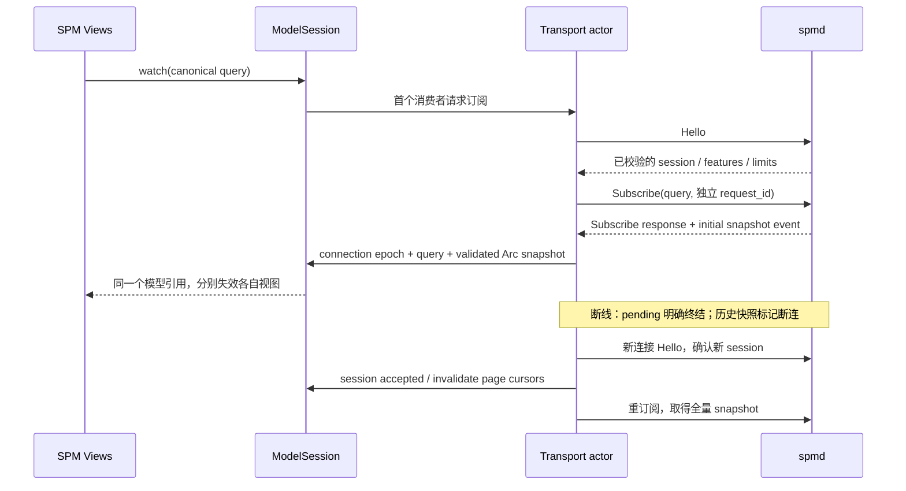

# PecoFence 与 SPM：架构优化与可扩展性分析

日期：2026-09-21。状态：供后续实施遵循的架构决策与迁移规范；本文不是实现完成报告。

分析对象：PecoFence Windows 桌面工作区宿主，以及 Sprocomm Multi-Project Delivery Panel（SPM，多项目交付面板）。全文区分**已核对事实**、**静态推导的风险**和**拟实施要求**。性能预算均为验收目标，未经实测的收益不作为结论。

## 1. 执行摘要与问题定义

### 1.1 架构结论

建议采用**统一扩展模型下的双平面架构**：

1. **Plane A：进程内原生视觉扩展。** 第一方、受信任的面板、卡片、胶囊和动作使用 PecoFence 的合成设备、布局、输入、主题与可访问性设施；局部交互不经过 IPC。
2. **Plane B：后台服务提供者。** 网络同步、SPM 领域计算、持久化和长任务通过类型化服务接口提供；根据可信程度、阻塞风险、后台存活需求选择受监督工作线程或独立进程。SPM 默认保留 `spmd`。
3. **连接两者的是服务契约，而不是每个插件直接面对的管道。** 传输适配器集中处理版本、身份、重连、订阅复用、背压、请求完成和取消。视图只消费不可变读模型并发出业务意图。
4. **保留 P0–P2a 的代码与契约投资，补全运行路径。** 不通过删除微内核、合并所有业务到 UI 线程、重新定义四态或更换现有 v2 endpoint 来达成统一。
5. **共享内存延后到瓶颈被证实之后。** 先做到一次解码、同查询共享、按需分页、可见范围绘制；大型快照及趋势数据才考虑经协商的映射缓冲区与事件环。

核心优化是减少组件开发者必须处理的边界，同时保留有故障、权限或生命周期价值的边界。进程数量、crate 数量和仓库数量不应相互决定。

### 1.2 当前拓扑与运行状态

当前设计拓扑为：

```text
PecoFence / pecofence.exe                 spmd.exe
┌──────────────────────────┐             ┌───────────────────────────┐
│ Win32 host + UI message   │             │ Tokio runtime             │
│ pump + Composition / D2D  │             │ IPC listener / application│
│ plugin-spm（进程内绘制）  │◄── Pipe ───►│ read model / domain       │
└──────────────────────────┘             └─────────────┬─────────────┘
                                                      │
                                           Data Sources / SQLite
```

P0/P2a 确定的 v2 endpoint 是：

```text
\\.\pipe\pecofence.spmd.v2.<user-sid>.<session-id>
```

其中 `session-id` 是 Windows 进程所在的 SessionId；它不是每次 daemon 启动生成的 `daemon_session` UUID，也不是 access token 内的 logon SID。三个概念必须分别命名、分别验证。

此图表示系统边界，不表示 v2 全链已连通。当前 v2 `spmd` 入口要求 fixture；真实源采集和 SQLite 路径仍见于既有 daemon 路径。宿主 transport 仍存在旧 envelope 的手工构造，不能把“双方引用同一个 contracts crate”视为通信已经兼容。证据见第 2 节。

**SPM 当前已经是进程内面板。** `plugin-api` 的模块说明直接定义了 in-process panels，`PanelInstance::paint(&mut dyn Canvas, ...)` 由宿主 `PluginPanelContent` 调用。原[重设计规范第 8 节](REDESIGN_UIUX_AND_CORDIS_ARCHITECTURE.md)也明确了这一边界。因此，不能把当前系统描述为“SPM 在另一个进程中绘制窗口，再嵌入 PecoFence”。跨进程视觉组合的问题是应避免的扩展方向，并非当前 SPM 绘制路径的事实。

### 1.3 “过于分离”的可操作定义

一个边界在下列情况下产生过度分离：其故障隔离、独立演进或资源管理收益，不足以抵消它给常见操作带来的额外状态机、复制、部署和调试成本。

| 观察维度 | 有价值的分离 | 本系统中的过度分离或接入摩擦 |
| --- | --- | --- |
| 交互 | 本地选择、滚动、悬停直接处理；后台刷新异步 | 简单卡片也必须取得 `IpcService`，自己构造 endpoint/query/envelope |
| 状态 | daemon 权威业务数据，host 权威视图状态 | 视图、transport、窗口分别管理同一连接或订阅的真假状态 |
| 视觉 | UI 由统一宿主绘制 | 若未来插件各自拥有 HWND/合成器，宿主只能嵌入像素而难以组合语义 |
| 扩展 | 新组件声明贡献点和服务需求 | 加一个笔记卡片也要复制 listener、frame reader、守护进程监督逻辑 |
| 运维 | 有必要的长任务独立存活 | 每个组件一个进程、一个升级链、一个 watchdog |
| 模块 | domain、store、UI 独立测试 | 通用 PanelManager 同时了解 SPM 消息名、pipe、布局与实例释放 |

这既有过度分离，也有局部过度集中：宿主的通用管理器集中承载 SPM 传输细节，而不同组件又缺少可复用服务。优化应同时纠正两者。

### 1.4 必须保持的边界

- SPM gate、客户义务、指定 baseline 的验证和 coverage 计算由 SPM 领域层负责；host 不重新计算或猜测业务结论。
- UI 线程不执行 HTTP、阻塞数据库操作、仓库扫描、等待 pipe 响应或任务 join。
- 未受信任代码不因实现 Rust trait 就进入宿主进程；进程内 capability 是受信任代码的约束机制，不是恶意代码沙箱。
- `spm-contracts` 不依赖宿主、Win32、SQLite 或完整领域实体；`plugin-api/kernel` 不依赖 SPM 业务。
- 数据新鲜度、连接状态、gate 状态、适用性分别表达，不以绿色连接标志代替交付满足条件。

## 2. 证据范围、基线与事实修正

### 2.1 本轮源码基线

| 仓库 | 本地 HEAD | 核对范围 |
| --- | --- | --- |
| PecoFence | `d0593ae6182e14292a01a7adf95d9e0b44ff3b63` | plugin-api/kernel/spm、host panel manager、render/backend、已有规范与路线图 |
| SPM | `e2d9df648e86e8173c70524f21a6206a8443e0a5` | contracts、v2 transport、fixture service/listener、daemon 入口 |

未执行 fetch，以上不是对远端最新状态的声明。开始时 PecoFence 有两个未跟踪脚本 `scripts/run_astra_analysis.sh`、`scripts/run_sol_p2b_p3.sh`；本文不修改它们。未发现适用于本次文件的 `AGENTS.md`。

| 源码证据 | 已核对事实 | 对本次决策的意义 |
| --- | --- | --- |
| [plugin-api](../crates/plugin-api/src/lib.rs) | 已有对象安全 PanelProvider、PanelInstance、Canvas、Capability、LayoutSnapshot；PluginContext 固定包含 IPC 等能力 | 不是从零增加进程内插件，而是让它成为完整、低成本的默认路径 |
| [host bridge](../crates/app/src/fence_window/plugin_panel.rs) | 宿主创建 Direct2dCanvas 并调用插件 paint；绘制时固定 Workspace/text_scale=1；每次调用 layout | 已经没有 SPM 子 HWND；原子 frame、模式、输入和资源缓存仍需建设 |
| [RenderStack](../crates/render/src/stack.rs)、[Panel](../crates/render/src/panel.rs) | 宿主管理 GPU、Compositor、drawing surface、device recovery | 可以在现有后端上扩展 VisualNode，不需要让插件自建图形设备 |
| [workspace manifest](../Cargo.toml)、[composition wrapper](../vendor/windows-composition/src/lib.rs) | 当前用 `windows-composition` 的 system 栈；生成绑定是 `Windows.UI.Composition`，Panel 用 SpriteVisual/CompositionDrawingSurface | “DirectComposition 原生合成”是技术方向，不应声称当前 API 就是直接暴露 IDCompositionVisual |
| [activation](../crates/plugin-kernel/src/activation.rs)、[drain](../crates/plugin-kernel/src/drain.rs)、[scope](../crates/plugin-kernel/src/scope.rs) | 已加入激活事务、callback/cleanup/native ledger、arena 回收等原语 | 保留并补全接入，不能用一次性重写丢弃其测试和行为 |
| [host PanelManager](../crates/app/src/app/panel_manager.rs) | 已有 open/close/attach/detach/poll；同时仍拥有 runtime、pipe state 和 SPM handshake 分支 | 生命周期运行时与传输适配器需要分开；两类职责不能继续在同一文件增长 |
| [contracts](../../spm/crates/spm-contracts/src/lib.rs)及 [version](../../spm/crates/spm-contracts/src/version.rs) | protocol 2.0；crate 当前继承 workspace package 0.1.0；强 ID、4 MiB framing、九种 RPC、schema/fixtures | protocol version 2.0 不等于 Cargo package version 2.0 |
| [host transport](../crates/app/src/app/panel_manager.rs) | run_pipe_subscription 仍手写 `version/session/requestId/method` 与 `spm.hello` | 与 P0 的 `protocol_major/daemon_session/request_id` typed envelope 不相同；P3 要解决真实适配 |
| [plugin-spm](../crates/plugin-spm/src/lib.rs) | 已消费 typed contracts；SnapshotCursor 首个 snapshot 锁定 session，未建立 Hello 驱动的完整重置路径 | 不再是任意 snapshot 都可切 session，但尚不能证明安全重连和旧连接隔离 |
| [v2 connection actor](../../spm/crates/spm-protocol/src/ipc/v2/connection.rs) | 有 Hello、异步请求路由和 Ping；请求任务通过 tokio::spawn 创建；未见完整 snapshot event 发布路径 | 九种 RPC 的类型存在，不等于多路订阅、完成事件及所有任务排空已端到端实现 |
| [v2 listener](../../spm/crates/spmd/src/v2/listener.rs)、[入口](../../spm/crates/spmd/src/main.rs) | v2 使用 fixture；listener shutdown 停止接受新连接，但已有 session 使用独立 cancellation token | 需要把 shutdown 传播到活动 session 并观察请求子任务；仅等待 JoinSet 可能等不到仍在线客户端退出 |

### 2.2 四态术语冲突的处理

任务上下文使用 `Satisfied / Unsatisfied / Unknown / Incomplete`。然而，已提交 P0 的 [GateStatus](../../spm/crates/spm-contracts/src/snapshot.rs)、schema、fixtures 及原路线图一致使用：

```text
Satisfied / Unsatisfied / Unknown / NotApplicable
```

本次架构优化**保持 P0 现有 wire 枚举**，不把 `NotApplicable` 改名成 `Incomplete`，也不把不适用当作证据不完整。业务仍必须表达不完整：使用 coverage、缺失证据及 reason/detail；必要时在 UI 显示“不完整”，但明确它是证据完整性，而非另一个已定义的 gate wire 值。

| 含义 | 表达方式 |
| --- | --- |
| 证据足以判定且满足规则 | Satisfied |
| 已有证据明确不满足规则 | Unsatisfied；可同时附带其他源的未知或不完整说明 |
| 证据、适用性或覆盖不足以判定 | Unknown + 结构化原因 |
| 此 gate 对目标范围不适用 | NotApplicable + 适用性依据 |
| 采集缺页、缺权限、未完成验证覆盖等 | coverage / evidence completeness / reason；不能直接等同 NotApplicable |

若产品明确要求把 Incomplete 作为新的独立 gate 状态，须单独提交语义 ADR、聚合真值表、契约兼容策略与 fixture；不得在本次 UI/IPC 重构中隐式改变。

### 2.3 本轮实际验证及其边界

在 WSL/Linux 执行：

| 命令 | 结果 | 证明范围 |
| --- | --- | --- |
| PecoFence：`cargo test -p pecofence-plugin-api -p pecofence-plugin-kernel -p pecofence-plugin-spm` | 16 passed，0 failed（1 + 13 + 2） | API、kernel 原语及纯 SPM view/cursor 测试 |
| SPM：`cargo test -p spm-contracts -p spmd -p spm-protocol` | 16 passed，0 failed（contracts 9、protocol 5、spmd 2） | contracts、分片 reader/quota、fixture 服务及少量既有协议逻辑 |

本轮未执行 Windows 链接、named pipe 实机互通、DACL 对抗测试、桌面交互、Narrator、GPU 故障注入或性能测量。局部测试通过不证明 P1/P2a 所有原规划出口条件已完成。本文不把先前文档的历史测试数量沿用为本轮结果。

## 3. 过度分离的结构性成本

### 3.1 性能与延迟：成本来自数据路径和频率

一次远程读模型到屏幕的路径可分解为：

```text
领域投影 → DTO 构建 → JSON 编码 → framing → writer 排队
→ pipe 内核传输 / 调度 → reader 缓冲 → JSON 解码 / 校验
→ host 模型分发 → UI 唤醒 → layout / paint → compositor / display
```

每帧增加的 4 字节长度头通常不是主要成本；JSON 字符串构建、内存分配、重复解码、队列等待和过量重绘更可能显著。管道经过内核、唤醒和进程/线程切换有成本，但每次 I/O 的实际切换与复制次数取决于缓冲及调度，不能固定宣称“一次 RPC 恰好发生若干次 context switch”。

定义 `B` 为每快照编码字节数，`U` 为每秒更新次数，`N` 为独立订阅相同查询的消费者数。缺少复用时，传输和解析负担约随 `B × U × N` 增长；统一订阅后，远端传输可接近 `B × U`，本地分发是 `N` 个共享引用和各自的视图投影。此式是量级模型，不是测量结果。

例如 2 MiB 快照、2 Hz、12 个重复消费者会产生约 48 MiB/s 的应用层 payload；复用后约 4 MiB/s。它没有计入 envelope、分配、pipe 缓冲或 D2D 成本，也不表示 SPM 当前实际运行在此负载。

成本还包括同时存活的编码 buffer、解码对象、旧 revision、新 revision、分页缓存和画面快照。减少字节数而不限制对象保留时间，仍然可能导致内存增长。

应采取的顺序：

1. 不把 hover、拖动、键盘导航、滚动、文本度量、尺寸协商放入 RPC。
2. transport 外只保留 typed DTO；一次验证/解码，随后 `Arc` 共享，避免 `DTO → JSON → Value → JSON → DTO`。
3. 按规范化 query 复用订阅；后台数据变化触发更新，避免每秒为了心跳生成新业务 revision。
4. 摘要限量、详情分页、趋势按视窗降采样；绘制只处理可见行。
5. 分别测量 encode/decode/queue/UI CPU，再判断是否需要二进制数据面。

网络采集的尾延迟也可能远大于本地 IPC。把 SPM 合入宿主并不能消除远端 API 延迟，反而扩大 UI 受数据库或连接器问题影响的范围。

### 3.2 渲染与视觉树碎片化

`IDCompositionVisual`、D2D device context、brush、text layout 不是可直接通过 JSON 或指针数值跨进程使用的资源。即便传递了共享 surface，宿主也没有自动获得对端内部的命中树、焦点、文字语义、布局约束和资源代际。

但“跨进程合成绝对不可能”同样不准确。Windows 提供共享 composition surface handle；`CreateSurfaceFromHandle` 可将其包装进合成树。共享的是受协议和同步约束的 surface/content，不等于共享任意 UI 对象图。另有同进程 cross-device visual tree 能力，不能据此推导普通 COM visual 指针可以直接跨进程复用。[Microsoft CreateSurfaceFromHandle](https://learn.microsoft.com/en-us/windows/win32/api/dcomp/nf-dcomp-idcompositiondevice-createsurfacefromhandle)、[DCompositionCreateSurfaceHandle](https://learn.microsoft.com/en-us/windows/win32/api/dcomp/nf-dcomp-dcompositioncreatesurfacehandle)、[DirectComposition 基本概念](https://learn.microsoft.com/en-us/windows/win32/directcomp/basic-concepts)

若将面板绘制移到外部进程，常见方案都有额外契约：

| 方案 | 可行性 | 新增成本 |
| --- | --- | --- |
| 外部 child HWND / SetParent | 特定场景可工作 | z-order、裁剪、激活、焦点、IME、捕获、DPI awareness、销毁顺序及 UIA 跨进程关系 |
| 共享 GPU surface | 可避免部分像素拷贝 | handle 权限、GPU 同步、缓冲切换、设备丢失、尺寸更新、输入和语义协议 |
| 远程 display list / 声明式视图 | 宿主可以统一绘制 | 额外 UI wire schema、验证、资源配额、事件反馈和版本协商 |
| 第一方进程内 visual node | 本项目默认 | 需要限制 CPU 工作、严格生命周期和可信代码边界 |

“airspace”在这里指 HWND 与 visual 子树的层级、裁剪、输入和效果边界，不应泛化成所有原生合成都无法遮盖子窗口。`SetParent` 文档明确提醒不同 DPI awareness 场景的失败或重置行为；跨进程窗口嵌入需要额外验证。[Microsoft SetParent](https://learn.microsoft.com/en-us/windows/win32/api/winuser/nf-winuser-setparent)

若两进程分别响应 DPI、主题和材质更新，消息到达与 frame commit 的时刻可能不同，出现暂时模糊、错位或命中区域滞后。Acrylic 的背景采样范围、透明度及性能策略也需要协调。Mica 是包含桌面壁纸/主题色的背景材质，不能简单等同于实时窗口模糊；独立进程本身并不必然造成 Mica 延迟。延迟来自重复拥有状态并异步协调的设计。[Microsoft Mica](https://learn.microsoft.com/en-us/windows/apps/design/style/mica)

当前 SPM 的绘制已在 host，本轮应直接修复本地的 paint/layout/hit/UIA 一致性，而不是为尚不存在的外部渲染实现跨进程视觉桥。

### 3.3 状态同步与 split-brain 风险

独立的计数器不必然错误。问题是不同计数器的作用域没有明确区分，或多个部件都宣称拥有同一事实。

- daemon 的 `(session, query, revision)` 标识业务读模型。
- host 的 `activation` 标识实例生存期。
- `mount generation` 标识当前挂载。
- `layout/frame revision` 标识输入和视觉几何。
- service generation、device epoch、theme epoch 各自标识资源或环境变化。

这些值不能互相比大小，不能合并成一个“全局 version”。两个进程也不是数据库共识系统；此处 split-brain 指 UI 与数据服务出现相互矛盾的权威判断，例如 UI 显示刷新完成但 daemon 只有 accepted，或面板使用新图形与旧命中区域。

现有 host 除 Win32 pump 外，也创建 Tokio runtime；daemon 又有独立 Tokio runtime。因此实际并发域多于简单的“两条循环”。合并进程仍有 UI/I/O 的并发边界，不能消除排队、取消和迟到完成。

典型竞态如下：

| 场景 | 错误结果 | 必须建立的规则 |
| --- | --- | --- |
| 旧连接 r=100 晚于新 daemon r=1 到达 | 新数据被旧值覆盖，或新 session 永久被 cursor 拒绝 | Hello 接受 session；连接 generation 过滤；重连全量重订阅 |
| 删除面板后收到成功响应 | 已删除实例重绘或发出 Shell 动作 | owner + activation + operation 的完成校验 |
| 同 query 不同筛选器共用缓存 | 项目或 scope 数据串用 | canonical query 包括授权域、过滤、排序、detail level |
| paint 失败但插件已更新内部布局 | 旧画面对应新按钮逻辑 | 不可变候选 frame，成功后一次提交 |
| 多项目独立 revision 被取最大值 | 页面暗示一个不存在的原子业务时点 | revision vector 或 daemon portfolio snapshot 契约 |
| 服务替换后旧完成仍被接收 | 旧 provider 写入新缓存 | service generation 与连接 epoch 一并校验 |

### 3.4 运维、打包和安全边界成本

PecoFence 与 `spmd` 至少形成两个二进制的构建、安装、诊断与升级关系；每个新的 daemon 都会增加身份、日志关联、资源限制和重启策略。后台运行可能需要独立退出策略，但不能让 host 和多个 watchdog 同时争抢启动权。

Named pipe 必须处理：

- 显式 DACL、仅本地连接、首实例创建、端点抢占和重复启动。
- 用户 SID、Windows SessionId、logon SID 的差异；同一用户多 RDP 会话、注销后 session ID 重用、run-as 与提升权限。
- 服务端/客户端真实身份校验和连接后的权限边界；不能相信对端自报 SID、PID 或安装路径。
- 管道名称不等于认证，first-instance 不等于对端可信，当前用户 DACL 也不隔离同用户恶意代码。

Microsoft 特别说明使用 logon SID 控制不同终端会话访问，且 `FILE_GENERIC_WRITE` 与创建 pipe instance 权限有关联；实现应按所需具体权限审计。[Named Pipe Security and Access Rights](https://learn.microsoft.com/en-us/windows/win32/ipc/named-pipe-security-and-access-rights)

这些成本对保存凭据、独立采集和数据库写入的 SPM 可以合理；对只显示时钟、两行笔记或局部计数器的组件则通常不合理。保留两进程不意味着必须增加两个无条件常驻 watchdog。已有 [watchdog crate](../crates/watchdog/Cargo.toml) 不应据名称被推断为已经监督 spmd；该关系需要单独实现和验证。

### 3.5 开发体验与扩展门槛

当前 `PluginContext` 固定持有 render/theme/desktop/ipc/storage，SPM 又直接构造 `Query { endpoint, payload }`。这种 API 容易把“SPM 需要远端数据”扩散为“所有插件都必须理解 IPC”。其实际摩擦包括：

1. 简单组件需学习连接状态、消息路由和 lifecycle，才能编写第一段可见 UI。
2. 同一 SPM 数据用于 Dashboard、Tile、Capsule 时，容易出现三个连接、三份缓存、三个重试循环。
3. 测试 UI 被迫启动 daemon，无法仅用 fake service 验证布局和输入。
4. host 通用模块出现 `spm.*` 分支，使后续 git/Jira/notes 扩展继续复制特例。
5. renderer 只有 fill/text，组件只能自行模拟裁剪、滚动和文本度量，导致视觉及命中不一致。

改进后的最低接入标准是：静态笔记组件仅需 descriptor、状态、布局/绘制和宿主 Storage；系统统计组件额外声明一个受监督采样服务；已有 SPM 视图额外请求 `SpmReadModel`。这些组件都不需要自行创建 named pipe。

## 4. 对 Cordis 风格微内核的评价

### 4.1 应保留的设计

| 设计 | 解决的问题 | 保留条件 |
| --- | --- | --- |
| ScopeTree | 资源归属、级联停止、迟到事件判断 | 每个 scope 一个拥有型父边；依赖图和窗口撤销关系另建 |
| LIFO Undo | 部分初始化回滚、按依赖逆序撤销 | 区分停止外部作用和最终销毁；异步资源进入 ledger |
| 两阶段 stop/drain | 取消后仍有任务、回调或 native completion | 关闭入口后持续观察完成，UI 不阻塞等待 |
| activation transaction | create/mount/能力获取中途失败 | 事务覆盖全部资源，不仅 Panel 对象 |
| capability attenuation | 最小权限、作用域和服务代际绑定 | 权限取交集且每次调用与完成提交均验证 |
| object-safe PanelProvider/PanelInstance | 不依赖具体插件类型的实例管理与绘制 | 本工具链静态链接；不承诺 Rust DLL ABI |
| registry + supervisor | 依赖生命周期与后台工作的统一诊断 | 只有一套权威实例记录及完成账本 |

“六层 ScopeTree”是早期简化表述：Root、Service、Provider、Instance、Mount、Gesture 并不组成必须逐层穿过的链；Service 通常在另一分支。当前 enum 已有十个 kind，增加 Subscription、Window、Shell、Peek。应追踪实际拥有关系和撤销约束，避免为满足“六层”而创建空 scope。

### 4.2 现有实现离完整保证还有距离

本节描述源码中尚未闭合的不变量，不否认 P1 原语的价值：

- `DrainLedger` 已存在，但 host 当前完成判断主要依据 `TaskSupervisor::poll_scope(instance_scope)`；没有证明已聚合 mount/subscription 后代、callback、cleanup 和 GPU retirement。`PollBudget` 也未成为 host poll 的完整预算控制。
- create/mount 失败路径会直接 finish/remove scope；`ActivationTransaction::rollback` 调用 stop 后取走 panel。若 create 已登记异步工作，需要由统一 abort/drain 记录继续持有，而不是仅依赖 Panel Drop。
- `finish_dispose` 是可直接调用的入口，没有在内部要求完整 drain proof。arena 回收检查 Disposed 状态，但 Disposed 本身必须先由完整账本证明。
- API 的 Token、ScopeLease/ServiceCell 构造入口较开放；已有 weak lease 与 generation 检查不等于全面的 owner/权限收缩。kernel 的 `cancel_owned` 原语存在，也不证明所有服务都在使用它。
- ServiceRegistry revoke 返回 barrier，但 registry 自身仍需要锁定 Revoking 槽位，禁止未排空时同键重新发布绕过屏障。
- kernel 和 host 都存在 PanelManager 类型；后续必须明确运行时唯一拥有者，不能让双方各自拥有一份可独立修改的 instance 表。

生产配置为 `panic=abort`。进程内插件 panic、无限循环或 unsafe 内存错误仍可能终止/卡住宿主。微内核的资源协议不能提供进程级故障隔离。

### 4.3 应纠正的过度设计与错误归因

原规范并没有要求所有面板进程外运行；它已经提出进程内第一方 UI、独立 SPM 数据引擎。问题主要是**实现接口仍以 IPC 为中心、通用扩展贡献点不足、生命周期原语尚未统一接入**，而非 Cordis 本身导致必须多进程。

需要避免以下进一步过度设计：

- 以一个全功能分布式消息总线替代简单函数调用和 typed service。
- 为每个按钮或计数器发布独立 service、版本和 daemon。
- 在第二个组件尚未接入前实现任意远程 visual tree、热卸载 native DLL 或通用 schema 动态解释器。
- 为“统一”让所有本地调用先序列化，再经同进程 loopback IPC 回到服务。
- 在没有性能证据时先构建共享内存 allocator、无锁多生产者队列和 delta replay 系统。

微内核应保持机制层的小体积：身份、所有权、registry、取消、排空、配额、诊断。布局系统、SPM domain 和数据库不进入 kernel。

## 5. 统一扩展模型：双平面与依赖关系

### 5.1 目标拓扑



“双平面”描述职责，不是只能存在两个线程或必须两个进程。Plane B 本地 worker 与远程 daemon 实现相同的服务语义，但故障、延迟、权限与存活性质明确暴露。传输位置不会被伪装成完全透明的同步调用。

### 5.2 Plane A：原生视觉快路径

- UI 线程持有组件实例及 mutable view state；绘制使用宿主提供的借用 Canvas 与 VisualNode transaction。
- 本地事件改变局部状态，标记必要的 layout/paint/input/semantics 脏位，按 frame 合并提交。
- 同一宿主设备域共享字体、图像和几何资源缓存；不把 raw COM、HWND 或 drawing session 交给组件长期持有。
- 跨 worker 的数据交付使用不可变 `Arc<T>`；host UI 在有预算的 mailbox drain 中接收，worker 不直接回调可重入的组件。
- 典型用途是局部选择、排序意图、面板导航、卡片展开、即时输入反馈与轻量 widgets。

“零拷贝布局/绘制指令”在此指借用不可变 frame、字符串/资源句柄及按引用调用，不做序列化和整棵树深拷贝。D2D、驱动、GPU 上传仍可能分配或复制；不承诺整个绘制管线零复制。目标是轻量组件本地输入处理 p95 小于 1 ms，完整显示仍受 frame cadence 及 DWM 调度限制。

### 5.3 Plane B：后台服务与执行位置选择

| 服务 | 默认位置 | 理由及限制 |
| --- | --- | --- |
| SPM source sync / gate projection / SQLite | spmd | 长时间 I/O、权威事务、凭据和独立后台存活；继续复用 v2 |
| 系统统计 | host 受监督 worker service | 可共享采样与节流；CPU/内存采样不能放 paint 中 |
| 快速笔记 | host scoped Storage worker | 小型本地持久化；无独立 daemon 必要 |
| git worktree 状态 | 有界 worker；阻塞/第三方执行器必要时独立进程 | 扫描取消、路径授权、长时间卡住的任务需要可终止边界 |
| Jira quick-entry | UI 本地；远端动作经有凭据的 adapter | 不能让视觉插件直接读取 token；写入需动作授权和可追踪完成 |
| 未受信任第三方 adapter | 受约束独立进程 | 进程隔离是必要条件之一；限制 token、文件/网络权限及资源，不仅换 PID |

线程服务提供调度隔离，不提供地址空间、崩溃或恶意代码隔离。独立进程如果仍使用同一高权限 token，也不自动成为完整安全沙箱。不能通过“都实现 ServiceProvider”掩盖这两种差异。

SPM 在关闭最后一个可见 mount 后是否继续采集，由 daemon 与订阅/保留策略决定。隐藏视图可以降低数据细节和更新频率，但 host 不应无条件杀死可能仍被 CLI 或其他窗口使用的 daemon。

### 5.4 建议的模块边界

先按模块分离，再根据独立依赖和构建需求拆 crate：

| 模块或 crate | 职责 | 禁止依赖/操作 |
| --- | --- | --- |
| plugin-api | Component/Panel、几何、Frame、service key、能力公共接口 | SPM DTO、Win32、Tokio runtime、数据库 |
| plugin-kernel | activation、scope、registry、grants、ledger、监督 | 布局、业务 gate、pipe wire method |
| render / platform | Composition、D2D、UIA/窗口适配、OS 资源 | SPM 规则、外部源协议 |
| host shell | contribution 布局、输入路由、配置、通用服务桥 | 直接解析 `spm.*` 业务包 |
| spm-client（先可为模块） | typed read-model service、query cache、v2 adapter | Win32 UI、SQLite schema、重复 gate 计算 |
| plugin-spm | SPM 视图模型、展示与动作映射 | raw named pipe、手写 envelope、凭据 |
| plugin-notes / plugin-system / plugin-files | 各自组件与视图 | 为复用 host 而引入 SPM |
| spm-contracts | 稳定 DTO、RPC、错误、schema/fixtures | 通用 host capability 或 visual ABI |

跨仓库 contracts 使用固定发布源/版本及 lockfile；当前 manifest 中直接相邻 `../spm` path 是开发便利，不是最终安装依赖。统一产品体验不要求立刻合并 Git 仓库。

## 6. 统一 Canvas 与 VisualNode 合成集成

### 6.1 保留现有后端，抽象逻辑节点

当前 system composition stack 已具备 host-owned Compositor、SpriteVisual 和 D2D surface。第一步继续使用它，新增平台无关的 `VisualNode`，其后端映射到现有 Composition visual；将来如果使用直接 `IDCompositionVisual` 实现，仍在 render 内部转换。两套 API 的对象不能随意混用。

```text
WindowTarget（窗口级，host 创建）
└─ ContainerRoot（位置、桌面层级、材质、DPI）
   ├─ Chrome（标题、标签、拖动和系统菜单）
   └─ ContentClip
      ├─ ComponentRoot A（mount 所有）
      │  ├─ D2D content layer
      │  ├─ scroll/transform node（需要时）
      │  └─ overlay node（需要时）
      └─ ComponentRoot B
```

同一个 fence 内组件不新增 child HWND。顶层 workspace、fence 窗口或系统必要的弹出窗口仍可有自己的 HWND；“无 HWND 边界”限定在组件内容组合，不代表整个桌面只允许一个窗口。

`VisualNode` 暴露逻辑句柄、局部 transform、clip、opacity、content resource 和 invalidate；不暴露 `IDCompositionVisual*`、surface handle 或目标 HWND。节点 ID 绑定 owner、mount generation 和资源代际，宿主校验不能重挂到其他插件的子树。所有节点改变通过 host transaction 暂存，插件不能自行 commit GPU 状态。

不是每个文本或按钮都分配一个 native visual。默认一个组件一块内容 surface，静态内容使用 Canvas 绘制；仅滚动、独立动画、缓存图层或需要独立剪裁时升格为 visual 子节点。限制节点数、surface 像素总量和 effect 层数，避免以“可组合”换来过大的 GPU 内存。

### 6.2 Canvas 的最小扩展

保留 fill/text 并逐步增加以下能力：

- clip、transform 和绘制状态栈；状态栈必须平衡，失败退出由 host 恢复。
- rounded rect、stroke、path/polyline、icon/image、opacity，以及文本布局资源绘制。
- 真实 DirectWrite 度量、字体 fallback、字重、locale、双向文字、文本缩放。
- theme token 或已解析 style，避免每个组件硬编码颜色；高对比有独立 token 和无模糊降级。
- host 资源缓存句柄与预算；text layout 缓存键包含字体、宽度、DPI/文本缩放及相关 epoch。

Canvas 仅在 paint 回调期间借用；组件不能保存其引用，也不能把它发送到 worker。复杂图表在 worker 预处理成不可变点集，但实际 D2D 调用仍遵循 host 线程策略。

共享 D2D device 不等于任意线程可以同时修改同一 context。多线程 factory 会对相应访问同步，但 D3D/DXGI 互操作和有状态绘制仍需明确同步。首期由 UI/render 所属线程独占绘制上下文，避免锁争用和 COM 重入。[Microsoft Multithreaded Direct2D Apps](https://learn.microsoft.com/en-us/windows/win32/direct2d/multi-threaded-direct2d-apps)

### 6.3 Frame 是视觉、输入与语义的统一提交单位

当前插件 `layout` 会修改内部 view 并递增 revision，普通 repaint 也可能使按下/抬起之间的 action 失效。必须将布局候选与已提交状态分开：

1. UI 收到数据、输入、主题或尺寸事件，只改变模型/脏标记。
2. 以固定 `model revision + view state + environment epoch` 构造不可变 `PreparedFrame`。
3. frame 同时包含布局、draw 数据、hit tree、semantic tree、焦点与 action 映射。
4. host 在暂存 surface/visual transaction 上准备 paint；任何失败都保留旧 committed frame。
5. 后端成功接受画面与 visual 更新后，UI turn 内一次替换 committed frame，更新命中、UIA 和焦点。
6. 普通重绘复用 frame；几何或动作映射变更才增加 layout revision，单纯颜色变化不强制取消点击。

若直接在当前可见 surface 上 clear/paint 后失败，不能声称“保留旧画面”。需要后备 surface、可回放 display list 或后端提供的等价 staging 机制。是否每组件双缓冲由内存预算决定，但失败语义不可省略。

这里保证的是应用层的一致提交。DWM 实际呈现是异步的，不能把 API 返回成功解释为屏幕已经扫描出该 frame。尺寸/挂载变更期间可暂缓相关输入；需要严格呈现确认的实验应使用后端反馈，而非阻塞 UI 等待 GPU。

### 6.4 输入、DPI、材质与可访问性

- host 执行 screen px → client px → DIP → inverse visual transform 的统一转换，使用 committed frame 的 clip 和 z-order 做 hit-test。
- pointer down 绑定 `(MountKey, NodeId, layout_revision, action)`；up 时校验。布局改变可取消 gesture；颜色变化或无关数据到达不无条件取消。
- 键盘路由、焦点环、IME、文本选择、滚轮和 pointer capture 由 host input service 统一管理，GestureScope 拥有捕获/拖放资源。
- UIA 从同一 committed semantic tree 构造缓存；屏幕坐标转换包含 DPI 与窗口位置。UIA 跨线程请求读取不可变快照，动作回送 UI mailbox，不直接借用 `Rc<RefCell<PanelInstance>>`。
- 跨屏时 host 接收 `WM_DPICHANGED`，按建议窗口矩形与工作区约束更新，重建受影响的像素资源和 frame；daemon 无须知道像素尺寸。[Microsoft WM_DPICHANGED](https://learn.microsoft.com/en-us/windows/win32/hidpi/wm-dpichanged)
- acrylic/mica、背景透明度、系统关闭透明效果和高对比由容器统一决定；组件请求材质语义，不能各自采样桌面或创建独立材质窗口。
- device loss 增加 device epoch，失效设备资源并从 CPU 模型重建；不重新订阅业务数据、不增加业务 revision。字体/主题变化同理使用各自 epoch。
- visual/surface 释放遵守后端完成语义；尚有 GPU 或异步资源使用时纳入 retirement obligation。不能仅因 COM 引用已从组件移除就提前复用资源槽。

### 6.5 视觉组件的性能约束

组件回调必须有界。host 可记录超预算并在返回后暂停组件；无法在同一线程安全抢占一个无限循环的 native callback。计算量不可预测的插件需要 Plane B，代码不可信时还需要进程隔离。

布局使用可见行虚拟化和稳定记录 ID；hover 不触发全部项目重新投影。合成动画优先更新 transform/opacity，不每一帧重算 gate 或重新解析 JSON。隐藏组件暂停 frame clock 和无意义动画，Capsule 只依赖摘要与连接/新鲜度状态。

## 7. 标准扩展点与组件模型

### 7.1 四类贡献点

| 扩展点 | 内容与宿主责任 | 数据与资源策略 |
| --- | --- | --- |
| Dashboard / Multi-Project Viewport | 全尺寸多项目总览、基线/证据详情、排序、分页、键盘操作；host 提供窗口、标签、导航与焦点 | 摘要共享；仅活动详情页请求固定 revision 的分页/趋势 |
| Fence Embedded Tile | fence 内轻量卡片、项目风险、笔记、工作树摘要；host 控制网格尺寸、拖动和 clip | 小型读模型；无每 tile 的 daemon 或 runtime |
| Capsule / Status Bar Indicator | 可扫视的计数、gate 标记和异常摘要；host 控制可见性、点击展开及可访问名称 | 使用同一模型的摘要投影；显示 Unknown/断连/过期，不仅颜色 |
| Desktop Contextual Action / Shell Hook | 上下文菜单命令、拖入解析、选中文件/项目动作；host 构造 action context 并授权 | 不要求创建可见 PanelInstance；Shell/OLE 原生注册由 host 持有 |

第三行中的 status bar 是 PecoFence 自有容器状态栏；未来若接系统托盘，也通过宿主 Tray capability，不假设可以任意修改 Windows taskbar。

Shell hooks 首期限定为 PecoFence 窗口的上下文菜单、拖放及 host 管理的 WinEvent/OLE 接口。Explorer 进程内 Shell extension 是另一种部署和故障边界，不能作为普通组件注册行为顺带加载。

### 7.2 Component、View 与 ModelSession

区分三种身份：

1. `ComponentInstanceId`：用户配置的逻辑组件；负责视图偏好和激活身份。
2. `ViewInstance / MountKey`：实际呈现位置；拥有布局、滚动、焦点、visual nodes 和输入。
3. `ModelSession`：某授权域内的规范化 query 及订阅缓存；可以被多个视图引用。

同一个 Atlas 查询可以同时被 Dashboard 和 Capsule 使用一个 ModelSession，但各有自己的 MountScope 和 frame。默认 `PanelInstance` 仍只挂载一次：多个同时可见位置创建多个 view instance，共享 model。不要把当前单 mount 可变 PanelInstance 同时借给两个 HWND。

```text
SpmReadModelService / QuerySession(Atlas, scope A, summary)
├─ Dashboard view / Mount 41 / scroll position 0
├─ Fence tile view / Mount 62
└─ Capsule view / Mount 79

关闭 Mount 62 → 释放该 view 引用
其余引用存在 → 保留 QuerySession 和底层订阅
最后引用释放 → 按保留策略取消订阅，不终止其他 query 或其他客户端
```

同一个 view 从 Workspace 变成 Capsule 可以先保存 view state、detach，再以新 mount generation attach；ModelSession 不必重连。不要把“呈现模式”和“放置位置”混成一个枚举：FenceTile 是 placement，Compact/Capsule 是 presentation policy。

### 7.3 声明式 descriptor 与安装模型

descriptor 至少包含 provider/component ID、UI API major、config major、支持的 contribution kinds、required/optional services、capability requests、资源预算和信任等级。

首期第一方 provider 由组合根静态注册，descriptor 可以直接是 Rust 数据，不强迫引入外部 manifest parser。后续外部适配器包才需要签名/安装元数据与独立 provider protocol。

配置是持久化的用户意图；effective placement、服务状态、实际材质和降级原因是运行状态。配置版本变更必须纳入实例身份比较，不能复用与当前配置 major 不兼容的 activation。

### 7.4 以第二、第三个组件验证通用性

- **Quick Notes**：无需 IPC，使用 Storage CAS、文本输入、Clipboard。覆盖异步保存失败、冲突、隐藏恢复与 IME。
- **System Stats**：一个受监督采样 provider 供多个 tile/capsule 使用，按订阅需求调节采样；验证本地服务与远端服务的统一完成语义。
- **Git Worktree**：路径能力授权、后台扫描、变化合并、取消与过期结果过滤；验证长任务及文件变化事件。
- **Jira Quick-entry**：本地输入表单，adapter 负责凭据与写入。默认仅显式用户提交才执行创建；连接恢复不自动重放非幂等写操作。

这些是架构验收样例，不意味着本次文档授权或执行真实 Jira 写入，也不意味着必须同一阶段交付四个完整产品插件。

## 8. 声明式能力与统一服务总线

### 8.1 “总线”的范围

服务总线是 typed registry、请求/订阅路由和生命周期设施的统称，不建设任意主题的全局广播系统。视觉节点调用本地 Render/Theme，领域视图调用 typed domain service；只有远程代理跨 transport。

```text
组件 → Capability<dyn SpmReadModel> → SpmClient facade
                                    ├─ fixture/local provider（测试或特定本地服务）
                                    └─ remote provider adapter → v2 pipe

组件 → Capability<dyn ClipboardService> → host OS adapter
```

本地/远程后端对组件保持相同的请求、结果、取消和失效语义；连接状态、可用性、权限与超时仍可查询。禁止 UI 线程通过同步方法等待远程结果。

### 8.2 能力声明与收缩

```text
effective grant = manifest request
                ∩ installed/admin/user policy
                ∩ provider capability
                ∩ workspace visibility
                ∩ parent scope authority
```

attenuation 只能减少权限、范围、期限或配额，不能扩大。能力内部绑定 provider identity、consumer identity、scope generation、service generation、允许操作与资源范围。公开描述符与私有授权对象分开，插件不能通过构造一个数字 token 获取权限。

| 能力 | 允许的受控操作 | 必须限定的内容 |
| --- | --- | --- |
| Clipboard | 写入预览文本或明确格式；读取为单独权限 | 用户动作来源、格式/大小、busy 重试；不默认后台读取 |
| Navigation | 打开结构化、验证后的外部目标 | scheme/origin/path、源记录身份、当前 action context |
| Notification | 通知和应用内消息 | rate limit、来源标记、点击回调及过期 activation |
| Storage | scoped KV / CAS / stream | namespace、容量、键长度、completion、持久化故障 |
| Shell | 文件选择/打开、受控拖放与上下文动作 | 路径授权、操作类型、OLE 生命周期；不等同任意命令执行 |
| Render / Theme / Desktop | 原生绘制、主题快照、呈现请求 | mount/窗口范围、资源预算、effective mode |
| Domain service | SPM 查询、刷新、简报；以后其他领域服务 | project/scope/tenant、读写权限、幂等性和结果期限 |

required service 缺失使依赖 activation 等待，optional service 缺失触发局部降级。连接短暂断开是同一服务的健康状态变化，保留历史模型与 view state，不等于每次断线都卸载整个面板。只有 service 实例撤销或版本失配才进入依赖停止流程。

### 8.3 服务发现不能变成权限获取捷径

- service key 使用 `(namespace, name, API major)`；在明确可见域内查找，版本与运行位置作为描述信息。
- discovery 只返回调用者有权看到的 descriptor；请求授权是另一个动作，不能“发现即持有”。
- concrete registry wrapper 可以提供泛型 `require::<S>(typed_key)`；对象安全的 service trait 不需要泛型方法。
- optional capability 的新增/撤销通过有序事件通知；替换保持 Revoking 槽位，旧消费者 drain 后才发布新 generation。
- 依赖环在激活前拒绝；停止按服务依赖图反向拓扑，重新启动按正向拓扑。

### 8.4 进程外 adapter 如何使用 host 能力

远程进程不能收到 `Capability<dyn ClipboardService>` 的内存表示。broker 将其映射为**连接绑定的有限授权句柄**，并对每次调用验证身份、权限、owner、期限和配额。来自 adapter 的请求先进入 host 路由，必要时在 UI 线程执行，结果经独立 completion 返回。

当前 SPM 九种 RPC 是领域读模型协议，不具备通用 Clipboard/Shell 双向调用契约。首期 SPM 的导航、复制和通知仍由本地 UI adapter 发起；不得把通用 host capability 偷塞进现有任意 JSON 字段。未来确需远程能力调用时，使用独立 provider-broker 协议或明确协商的扩展，单独编写安全和兼容测试。

例如后台源状态变化可投递 `NotificationIntent`；host 根据已有通知授权和频率策略显示。远程 adapter 不能通过同一路径伪造用户点击、读取剪贴板或执行任意 Shell 命令。用户动作 token 必须由 host 在真实输入事件中生成、短期有效且限定目标操作。

### 8.5 请求、取消与事件调度

- 同步方法只能返回已有内存快照、受限本地结果或异步 operation ticket；所有可能阻塞的操作经 supervisor。
- API 返回 accepted ticket 前必须成功登记 scope、配额和完成义务；队列满返回 Backpressure，不返回无法完成的 token。
- completion 不内联重入组件，即使 local fixture 立即完成也经过 mailbox 的后续 turn。
- cancel 是取消意图；实际 OS 操作可能已完成，必须发出唯一终态并保留原生资源至完成被观察。
- 业务事件通道可以因 scope stop 关闭；kernel completion/control 通道继续工作，直到 ledger 排空。
- control 通道也有界：预留容量、限制 outstanding requests；饱和时拒绝新请求或关闭受影响连接并终结 pending，不静默丢弃 completion。
- snapshot lane 按 query/session 存 latest-value，允许覆盖中间完整快照；delta 不能使用同样的静默覆盖规则。

Windows 的 `CancelIoEx` 不等待 I/O 完成，OVERLAPPED 与 buffer 需保留至完成确认。这个规则无论使用 pipe 还是共享内存通知都不能省略。[Microsoft CancelIoEx](https://learn.microsoft.com/en-us/windows/win32/api/ioapiset/nf-ioapiset-cancelioex)

## 9. 统一状态所有权与 SPM 数据流

### 9.1 单一权威表

| 状态 | 唯一权威拥有者 | 其他层允许保留什么 |
| --- | --- | --- |
| 源观察、coverage、关联证据、gate/obligation/verification | spmd application/domain + store | 不可变投影、来源与时间信息 |
| 数据 revision 与固定页 | daemon read-model publisher | 按 session/query 绑定的快照与页缓存 |
| 连接、Hello session、wire pending requests | 每 endpoint 的 transport connection actor | 只读连接状态事件 |
| typed query cache / subscriber 引用 | SpmClient / ModelSession service | Arc 快照及 view 的选择状态 |
| component activation、资源、授权、drain | kernel runtime | 受约束的 handle，不能另建权威实例表 |
| 窗口、mount、焦点、presented frame | host shell/render | 插件自己的局部意图与候选 frame |
| 用户视图偏好 | host scoped Storage | 带 CAS revision 的缓存和未保存标记 |

视图可以格式化、过滤当前可用行和计算布局，不能从 merge 数字推断 build 已验证或客户已验收。业务规则修改必须使相应 policy/revision 可追踪。

### 9.2 接收与重连流程



这是目标时序，当前 fixture actor 的完整 snapshot 发布仍需补齐。SPM listener/router 的修正不能仅在 host 侧绕过。

接收条件至少包含：当前连接 epoch、Hello 接受的 daemon_session、有效 subscription ID、完整 canonical query identity、递增 revision、consumer activation。不同 query 的 revision 不能互相排序。相同 revision 的重复完整快照可幂等忽略；变化的内容使用相同身份则是协议错误，不能悄悄覆盖。

旧 session 的迟到包丢弃，新 session 即使 revision 更小也可在新 Hello 后接受。断连保留最后成功快照和 observed_at，但明确标记 historical/disconnected；Ping 只证明连接活性，不更新证据时间。

### 9.3 查询复用与多项目一致性

canonical query 至少包含服务/数据授权域、tenant（若独立配置）、project_id、delivery_scope_id、view、filter、sort、detail level 与相应 schema major。host 的实例 UUID 不应进入可共享查询身份。

共享前提是语义和授权等价；不能让仅有摘要权限的 Capsule 通过与 Dashboard 复用而得到隐藏详情。summary 和 detail 若不是同一个查询，要明确各自订阅及配额，不用强制全量数据供所有视图。

多个项目各自的 revision 不构成一个全局一致快照。首期 Dashboard 使用每项目 `(daemon_session, query, revision)` 向量，并展示各自更新时间；简报若要求跨项目同一截面，应由 daemon 生成 portfolio snapshot ID 和成员 revision vector，再固定分页及简报生成。不能通过 host 取 revision 最大值创建虚假的一致性。

### 9.4 持久化与操作语义

P2b 继续按单 writer/事务模型把 observations、coverage、读模型及 revision 一起提交，成功后发布；发布失败不回滚已提交事务，重连从已提交 head 重新获取。SQLite 阻塞调用由专用 writer 或受控阻塞执行器处理，不能阻塞 Tokio reactor 或 host UI。

Refresh 的 request completion 返回 accepted/coalesced 及 operation_id；后续 OperationCompleted 才表明采集尝试结束，且还需根据源错误/coverage 判断本次证据是否充分。超时不证明远端没有执行。重试遵循已有 session-bound idempotency 契约；daemon 重启后不能宣称拥有旧 operation 的去重记录。

BuildBriefing、ResolveNavigation 和 QueryPage 固定 revision。页面在用户预览后收到新数据，复制仍使用预览文本及标记；需要重新预览才能改用新 revision。宿主存储只保存视图偏好，不复制一份可写 SPM 业务数据库形成双写。

## 10. 必须跨进程时的共享内存与批量数据协议

### 10.1 启用门槛和优化顺序

默认继续使用 v2 JSON named pipe。它有可读性、成熟 fixtures、较低实现风险，摘要与小型操作通常不需要其他数据面。

共享内存 PoC 只在完成订阅复用、一次解码、摘要/分页/降采样之后启动，并要求测量表明大型 payload 的编码、复制或内存峰值是主要瓶颈。建议初始实验触发条件是：可重复出现 ≥1 MiB 的批量快照/趋势数据，且序列化/复制占相关数据处理 CPU 的 ≥20%，或仍无法达到已批准的内存/交付延迟预算。阈值是试验筛选条件，不是自动切换协议的硬编码策略。

三种“零拷贝”必须区分：

| 路径 | 能节省什么 | 仍然存在什么 |
| --- | --- | --- |
| host 内 `Arc<ProjectSnapshot>` | 多 view 的 DTO 深拷贝与反复解码 | 初始解码、Arc 引用操作、视图投影 |
| mmap 内 JSON | 部分 pipe buffer 传输与大 payload 拷贝 | JSON 解析、字符串分配、校验、page fault |
| mmap 内有界二进制布局 + borrowed view | 大部分 host 对象构建与 payload 复制 | 生产者编码、边界校验、page fault/cache miss、部分渲染资源上传 |

因此把 `CreateFileMapping` 包在 JSON 外面不等于真正零拷贝。列式趋势、固定宽度数值和字符串表较适合 borrowed view；复杂可变关系图不应为了“零拷贝”牺牲可验证性。

### 10.2 控制面与批量数据面

控制面继续承载 Hello、权限、请求/订阅身份、错误、期限、心跳、mapping offer/ack/release 以及取消；批量数据面承载不可变 snapshot batch/trend blocks。

```text
producer private model
  → validated binary encoder
  → mapping payload pages（单 writer，发布后不改写）
  → descriptor ring（sequence + mapping/buffer metadata）
  → Windows event / pipe wake hint
  → consumer validates descriptor and mapping
  → SnapshotLease owns mapping view
  → view accessors borrow data
  → release/ack; safe retirement
```

Windows 可以用 `CreateFileMapping(INVALID_HANDLE_VALUE, ...)` 与 `MapViewOfFile` 建立 paging-file-backed 共享区域。当前按用户/Windows session 分离的拓扑优先使用匿名 handle duplication 或 `Local\...` 命名对象，不引入跨会话 `Global\...`；后者有额外命名空间与权限要求。它不替代 SQLite 持久化。[Creating Named Shared Memory](https://learn.microsoft.com/en-us/windows/win32/memory/creating-named-shared-memory)

### 10.3 ABI 与数据结构

共享内存是独立的二进制 ABI，不能直接 `memcpy` Rust struct。规范需要精确定义：

- magic、format major/minor、header size、total size、little-endian 和目标架构支持矩阵。
- daemon_session、connection/mapping epoch、canonical query ID、snapshot revision、buffer/slot generation。
- section table：每段 offset、length、element count、固定元素大小、必要对齐和编码。
- 字符串 UTF-8 表与索引；缺失值标记；数值范围和浮点 NaN/Infinity 规则。
- 校验和用于检测损坏，但不提供身份认证或防止恶意修改。
- 已发布状态、sequence、容量、只读 payload 与单独控制页的访问约定。

每个 offset/length 使用 checked arithmetic，检查不越界、不重叠必要保护段、不触发 usize 截断，限制嵌套深度、元素数与总解析工作量。对齐不满足时用安全读取或拒绝，不能用任意字节地址构造 `&T`。

不得包含跨进程指针、Rust `Vec/String/Arc`、trait object/vtable、COM 引用、Mutex 内部布局或宿主地址。进程在各自地址空间映射到不同基址是正常情况。

### 10.4 Event ring 与发布顺序

首个可实现版本选择**每连接一个有界 SPSC descriptor ring**，由 daemon 的该连接 writer 统一发布。payload 可由多个连接共享只读 mapping，但消费游标与授权分别持有；不直接采用多生产者、多消费者共享环。

1. producer 确認有未占用 descriptor 槽及 payload budget，写完当前 payload。
2. producer 写 descriptor 内容，再以 release 语义发布 sequence/head。
3. consumer 以 acquire 语义观察已发布 sequence，复制小型 descriptor 到私有内存并验证，再读取 payload。
4. consumer 完成 descriptor 处理后推进 ring cursor；payload lease 的 release 是另一个生命周期事件，不能把“descriptor 已读”当成“payload 不再使用”。
5. 唤醒 event 只是提示；consumer 每次被唤醒都检查真实 head/tail。采用 reset/recheck 或经过证明的通知协议避免丢唤醒，不能假定一次 SetEvent 对应一条数据。

Windows 事件与 memory mapping 并不自动定义应用字段的无锁发布协议。实现应采用经过平台验证的对齐原子访问/Interlocked 封装、明确内存序和 x64/ARM64 测试；不能凭 Rust 类型的名字就假定跨进程原子 ABI 已被验证。若首版用具名同步原语简化证明，也应先比较实际性能，而不是坚持无锁。

对可同时被另一进程写入的 ring/control 内存，不向普通 Rust 代码暴露长期 `&Header` 或 slice；使用审计过的访问器读取原子字段和私有 descriptor 副本。`volatile` 不能替代同步协议或生命周期证明。

### 10.5 生命周期、背压与崩溃恢复

`SnapshotLease` 持有 mapping handle、mapped view、epoch 和读取边界；所有 borrowed 字符串/数组的生存期受 lease 约束。scope 停止先禁止新增 view 和回调，再等待现有 CPU/GPU 使用结束，最后 unmap/close。跨进程不共享 Rust Arc 引用计数，release 由控制面协议管理。

首版 payload 发布后保持不可变，直到全部授权消费者 release。禁止覆盖仍被读取的 slot。若 producer 崩溃，已建立的有效映射可按 OS 对象生存期保留，但 host 立即标记连接断开；新 daemon 建立新 epoch，不重用旧 mapping 身份。

慢消费者处理：

- ring 满时可合并尚未发布的完整快照，只保留最新待发版本。
- 不能修改或回收已被 lease 引用的快照；达到 retained-byte 上限后报告 Backpressure、取消该消费者的后续流或降级为分页。
- delta 有明确 base revision 和 sequence；一旦缺口必须重新取得全量。首版不启用 delta，避免与 latest-value 策略冲突。
- release 丢失可通过连接终止清理 producer 的连接账本，但不能指示尚存活的 consumer 继续读取一块已复用缓冲区。首版通过不复用仍映射 payload、采用新 mapping 解决。
- 共享物理页、每进程虚拟映射、retained revisions 和 descriptor 元数据分别计数。慢 UI 不得无限钉住趋势历史。

进程死亡不是“安全地完成了某次业务操作”。重连按新 Hello/epoch 全量重订阅，仍执行第 9 节的一致性规则。

### 10.6 安全与 Rust 借用安全的前提

mapping 使用显式 ACL、最小访问权限、不可执行页和不可继承的 handle；consumer payload 映射只读，控制写入页单独授权。mapping 与已认证连接/session 绑定，不能接受对端随便传来的对象名并打开任意系统对象。[File Mapping Security and Access Rights](https://learn.microsoft.com/en-us/windows/win32/memory/file-mapping-security-and-access-rights)

**consumer 只读不表示 producer 无法修改。** 如果对端不可信，它可能在验证后改写 offset、长度或内容。checksum、seqlock 重读或 consumer 只读权限本身都不能证明 Rust 不可变引用在借用期稳定。

首期真正的 borrowed view 仅对遵守发布后不可变协议的受信任第一方 spmd 开启，并封装全部 unsafe 边界；更强威胁模型下应复制进 host 私有内存后验证，或使用经独立审计且可证明生产者不能继续修改的传递机制。第三方 adapter 不因支持共享内存就自动获得零拷贝借用资格。

### 10.7 v2 兼容决策

当前 contracts 使用严格字段/枚举解析，`Feature` 也是闭合枚举。因此不能简单发送 `SharedMemory` 新 feature 并假设旧 2.0 peer 会忽略它。保持 v2.0 现有 endpoint、frame、九种方法和 fixtures 不变。

未来 bulk transport 在独立 ADR 中决定版本。默认采用新 wire major/独立 endpoint 来引入 mapping offer、release、feature 扩展及容错规则，同时保留 v2 adapter；只有经过旧 reader 兼容测试证明可行时才选 minor 扩展。新客户端允许在明确版本策略下使用受支持的 v2 JSON 路径，这不是向历史 v1 静默降级。

mapping 故障的回退仍受 4 MiB frame 限制：回退为有界分页或更小批次，不能把超大映射内容直接塞进一个 v2 JSON 帧。无可表达的降级路径时返回明确错误。

## 11. Rust 接口与运行时契约草案

以下是**拟实施的接口伪代码**，不是当前仓库已经存在的 API，也不声称这些片段独立可编译。几何、ID、错误、资源 handle 和 mailbox 类型省略内部实现；opaque handle 的构造仅由 host/kernel 完成。UI trait 不要求 Send/Sync；worker trait 明确要求。

### 11.1 扩展描述与能力解析

```rust
pub enum ContributionKind {
    Dashboard,
    FenceTile,
    Capsule,
    ContextAction,
    DropHandler,
}

pub struct ExtensionDescriptor {
    pub id: &'static str,
    pub ui_api_major: u16,
    pub config_major: u16,
    pub contributions: &'static [ContributionKind],
    pub required: &'static [ServiceRequirement],
    pub optional: &'static [ServiceRequirement],
    pub capabilities: &'static [CapabilityRequest],
    pub budgets: ResourceBudget,
}

// concrete wrapper；不是 dyn trait，所以可以使用泛型方法。
// 此 wrapper 已绑定调用者身份，调用者不能随意传另一个 scope 冒名。
pub struct ComponentServices { /* private broker + owner + grants */ }
impl ComponentServices {
    pub fn require<S: ?Sized + 'static>(
        &self, key: ServiceKey<S>,
    ) -> Result<Capability<S>>;

    pub fn optional<S: ?Sized + 'static>(
        &self, key: ServiceKey<S>,
    ) -> Result<Option<Capability<S>>>;
}

pub struct ComponentContext {
    pub identity: ComponentIdentity,
    pub services: ComponentServices,
    pub events: HostEventRouter, // 绑定 owner；创建 typed sink，不公开 runtime
}
```

`Capability<S>` 对每次入口以及结果提交校验 owner/grant/generation；不能靠插件自行调用 `scope.check()` 建立信任。registry 中的 typed key 与 TypeId 检查由统一实现保证，不能仅根据字符串做未经检查的 downcast。

现有固定字段 PluginContext 通过兼容 adapter 迁移；不要一次修改所有插件。随后提高 UI API major，移除默认必需 IPC，保持 config major 与 UI API major 分开。

### 11.2 对象安全 Canvas 与 VisualNode

```rust
pub trait Canvas {
    fn save(&mut self) -> Result<DrawStateToken>;
    fn restore(&mut self, token: DrawStateToken) -> Result<()>;
    fn clip_rect(&mut self, rect: RectDip) -> Result<()>;
    fn transform(&mut self, transform: Transform2D) -> Result<()>;
    fn fill_rect(&mut self, rect: RectDip, paint: PaintRef) -> Result<()>;
    fn stroke_path(&mut self, path: PathRef<'_>, stroke: Stroke) -> Result<()>;
    fn draw_text(&mut self, layout: TextLayoutId, origin: PointDip) -> Result<()>;
    fn draw_image(&mut self, image: ImageId, dest: RectDip) -> Result<()>;
}

// tx 仅对所属 mount 的 staging tree 生效；各方法不直接提交 GPU。
pub trait VisualNode {
    fn id(&self) -> VisualId;
    fn set_transform(&self, tx: &mut VisualTxn<'_>, value: Transform2D)
        -> Result<()>;
    fn set_clip(&self, tx: &mut VisualTxn<'_>, value: Option<RectDip>)
        -> Result<()>;
    fn set_opacity(&self, tx: &mut VisualTxn<'_>, value: f32) -> Result<()>;
    fn set_content(&self, tx: &mut VisualTxn<'_>, value: Option<SurfaceId>)
        -> Result<()>;
}

pub trait VisualTreeService {
    // 返回值属于当前 bound consumer 的 MountScope；不泄露 COM。
    fn create_node(&self, parent: VisualId, kind: NodeKind)
        -> Result<VisualNodeLease>;
    fn begin_update(&self, mount: MountKey) -> Result<VisualTxn<'_>>;
    // commit 由 host frame coordinator 执行，不作为插件自由入口。
}
```

`VisualNodeLease` 是受 scope 跟踪的 wrapper，可在当前 UI turn 借出 `&dyn VisualNode`。Drop 发起本地 detach/retirement；尚有异步资源时由 ledger 保留最终释放责任。`VisualTxn` 不能在 await 期间持有，也不能跨线程；host 提交前校验树无环、parent 权限、generation、clip/数值范围及预算。

### 11.3 候选 Frame 与面板 API 演进

```rust
pub struct FrameIdentity {
    pub mount: MountKey,
    pub frame: FrameRevision,
    pub layout: LayoutRevision,
    pub theme: ThemeEpoch,
    pub device: DeviceEpoch,
}

pub trait PreparedFrame {
    fn identity(&self) -> FrameIdentity;
    fn hit_tree(&self) -> &[HitNode];
    fn semantics(&self) -> &[SemanticNode];
    fn paint(&self, canvas: &mut dyn Canvas) -> Result<()>;
    fn stage_visuals(&self, tx: &mut VisualTxn<'_>) -> Result<()>;
}

// 这是下一版 PanelInstance 签名方向，不新增一套竞争的实例管理器。
pub trait PanelInstance {
    fn mount(&mut self, ctx: MountContext) -> Result<()>;
    fn event(&mut self, event: HostEvent) -> Result<Invalidation>;
    fn prepare_frame(&mut self, input: FrameInput)
        -> Result<std::rc::Rc<dyn PreparedFrame>>;
    fn unmount(&mut self, key: MountKey);
    fn begin_stop(&mut self, reason: StopReason);
}

pub trait PanelProvider {
    fn descriptor(&self) -> &ExtensionDescriptor;
    fn validate(&self, config: &PanelConfig) -> Result<()>;
    fn create(&self, ctx: ComponentContext, input: CreatePanel)
        -> Result<Box<dyn PanelInstance>>;
}
```

PreparedFrame 必须逻辑不可变：paint/stage 不能改变点击映射或依赖“当前最新模型”；其所需数据固定在 frame 中。host 保存 committed frame 并路由该 frame 的 action，即使插件已准备下一候选也不能改变旧画面的操作含义。`prepare_frame` 可以缓存可重用资源，但只有 host commit 成功才推进已呈现身份。

这些 trait 不含泛型方法、返回 Self 或裸 async 方法，可用于 dyn 分发；生命周期参数本身不使其失去 dyn compatibility。未来 worker async trait 用显式 boxed future 或具体泛型实现，不能误认为所有 `async fn` trait 都能直接转换为 trait object。[Rust Reference：dyn compatibility](https://doc.rust-lang.org/reference/items/traits.html#dyn-compatibility)

### 11.4 类型化 SPM facade：放在 spm-client，不能放进 plugin-api

```rust
pub enum SpmModelEvent {
    Connection(ConnectionState),
    Snapshot {
        key: QuerySessionKey,
        value: std::sync::Arc<ProjectSnapshot>,
    },
    OperationFinished(OperationResult),
    Invalidated(QuerySessionKey),
}

pub trait SpmReadModel {
    // sink 是 host 创建并绑定 owner 的 mailbox 端点，禁止直接 inline callback。
    fn watch(
        &self,
        query: ProjectQuery,
        sink: TypedUiSink<SpmModelEvent>,
    ) -> Result<WatchLease>;

    fn query_page(&self, request: QueryPageRequest)
        -> Result<RequestTicket<QueryPageResponse>>;
    fn refresh(&self, request: RefreshRequest)
        -> Result<RequestTicket<RefreshResponse>>;
    fn resolve_navigation(&self, request: ResolveNavigationRequest)
        -> Result<RequestTicket<ResolveNavigationResponse>>;
    fn build_briefing(&self, request: BuildBriefingRequest)
        -> Result<RequestTicket<BuildBriefingResponse>>;
}

pub struct RequestTicket<T> { /* owner + operation + completion slot */ }
impl<T> RequestTicket<T> {
    pub fn id(&self) -> OperationToken;
    pub fn try_take(&mut self) -> Option<Result<T>>; // 不阻塞
    pub fn cancel(&self) -> Result<()>;             // 终态仍会被观察
}
```

ticket 完成时由 host event router 定位 owner 唤醒；组件不自行轮询计时器。request ticket 和长业务 operation_id 是不同身份。ticket Drop 的策略须明确为取消消费者等待/释放引用；不能在远端已接受写入后伪称业务已回滚。

typed facade 在本地 provider 上直接使用不可变对象，在 remote provider 上转成已有九种 RPC；视觉插件不拼 envelope、不判断 pipe SID。每种 provider 都运行同一组 facade contract tests。

### 11.5 Worker service 与生命周期证明

```rust
pub type ServiceFuture<'a, T> = std::pin::Pin<
    Box<dyn std::future::Future<Output = Result<T>> + Send + 'a>
>;

// worker 契约位于服务实现层。不是 UI Capability 的跨线程表示。
pub trait BackgroundProvider: Send + Sync {
    fn descriptor(&self) -> ServiceDescriptor;
    fn start(&self, ctx: WorkerContext) -> ServiceFuture<'_, ProviderStarted>;
    fn request_stop(&self, reason: StopReason);
    fn stopped(&self) -> ServiceFuture<'_, ()>;
}

// kernel 内部。外部代码不能伪造 DrainProof 或直接 finish_dispose。
struct DrainProof { /* private: subtree + generation + complete obligations */ }
impl Runtime {
    fn begin_stop(&mut self, scope: ScopeId, reason: StopReason) -> Result<()>;
    fn poll_drain(&mut self, budget: PollBudget) -> Vec<DrainProgress>;
    fn finish_dispose(&mut self, proof: DrainProof) -> Result<()>;
}
```

WorkerContext 包含受限配置、取消、线程安全 grant proxy、预算和 completion sender，不含 UI `Rc`、COM 或裸 Tokio runtime。`request_stop` 非阻塞且幂等；`stopped` 仅由 supervisor 驱动并观察，不能在 WndProc block_on。

完整 drain proof 聚合 scope 后代、task joins、native ops、callback、cleanup 和资源 retirement。activation rollback 把失败实例及资源转入同一 runtime，使用相同 proof 完成释放。5 秒是诊断期限，超时进入 Quarantined；不强杀线程、不提前释放其仍在访问的内存。

### 11.6 动作贡献接口

```rust
pub trait ActionProvider {
    fn descriptor(&self) -> &ActionDescriptor;
    fn availability(&self, context: &ActionContext) -> ActionAvailability;
    fn invoke(&self, action: AuthorizedAction)
        -> Result<RequestTicket<ActionOutcome>>;
}
```

availability 必须基于已缓存的局部状态且有界；菜单展开或 OLE hover 时不等待网络。`AuthorizedAction` 由 host 创建，绑定输入、目标记录/路径及 scope。ActionProvider 可以没有 PanelInstance，但仍有实例/订阅/任务的资源归属。

