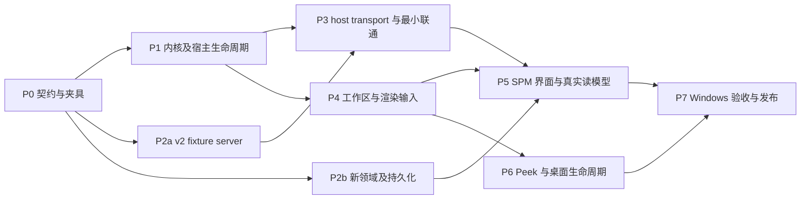

# PecoFence 与 SPM：当前实现核对与后续阶段规划

日期：2026-09-21。核对环境：WSL2 / Linux，Rust 1.98.1。本文交付为代码评估和实施规划，不表示下述阶段已经实现。本轮只新增本文，不修改应用代码、不启动或替换桌面程序、不调用业务系统写入接口。

依据：[界面及 Cordis 风格架构重设计规范](REDESIGN_UIUX_AND_CORDIS_ARCHITECTURE.md)，以下简称“规范”。现有提交是实施起点；与规范冲突的实现不自动成为新契约。本文中的阶段、默认参数和验收条件属于后续实施要求，未测量的性能不表述为当前结果。

## 1. 核对结论与证据范围

PecoFence 已建立平台无关的面板接口、scope/服务/任务基础组件，并将 FenceWindow 的 SPM 专用内容分支替换为通用 Panel 路径。SPM 已有领域计算、三系统读取适配、v1 管道服务和可选快照持久化。两个仓库尚不构成规范要求的端到端实现。

后续工作包含五类缺口：共享 v2 协议和读模型、实际宿主生命周期、工作区及三种呈现模式、daemon 新模型和存储、Windows 实机验证。协议缺口涉及 endpoint、envelope、会话所有权、消息方法和 payload；仅修改 `VERSION` 不能接通现有双方。

### 1.1 仓库基线

| 仓库 | 本地 HEAD | 本地 origin/main 引用 | 初始工作区 |
| --- | --- | --- | --- |
| PecoFence | `9e5ea0b4f3d71971d5a0cd717037fa6be920398e` | 与 HEAD 一致 | 无未提交修改 |
| SPM | `e37e0ee21ee73784a5d5c7c06e8f0899d117fa18` | 与 HEAD 一致 | 无未提交修改 |

本轮未执行 fetch，因此上表只确认本地远程跟踪引用，不额外声称远端实时状态。规范第 2 节记录的是更早的提交及当时未提交修改；本文以表中提交重新核对。

### 1.2 本轮执行的验证

| 位置 | 命令 | 结果及范围 |
| --- | --- | --- |
| PecoFence | `cargo test -p pecofence-core -p pecofence-plugin-api -p pecofence-plugin-kernel -p pecofence-plugin-spm` | 55 passed，0 failed：core 40、api 2、kernel 11、plugin-spm 2 |
| PecoFence | `cargo check --target x86_64-pc-windows-msvc` | exit 0，0 errors |
| SPM | `cargo test --workspace` | 23 passed，0 failed：application 6、cli 2、domain 9、protocol 3、store 2、widget 1 |
| SPM | `./scripts/check-windows.sh` | exit 0，0 errors；脚本使用 Windows SDK / MSVC headers 与 LLVM 工具检查 MSVC target |

SPM 的本轮全工作区结果是 23 项，与交接记录中的 21 项不同；本文不推测先前的命令范围。以上测试含既有兼容和历史数据用例，不等于新增目标规范用例全部通过。PecoFence app 的 binary 设置 `test = false`；55 项测试未覆盖 Windows 宿主执行路径。`cargo check` 不证明 Windows 可执行文件已链接、启动或与真实 named pipe 互通。

本轮完成代码静态核对，未执行 Windows 桌面交互、Narrator、跨屏 DPI、Explorer 重启、原生资源故障注入或性能测量。下文由调用关系推导的后果均属静态分析结论，不标记为实机复现。

## 2. 相对规范的实现评估

状态采用“已实现并有局部测试”“部分接入”“尚未接入目标路径”“本轮未验证”。不以完成百分比代替验收证据。

### 2.1 模块与职责

| 规范目标 | 当前事实与源码位置 | 评估及后续处理 |
| --- | --- | --- |
| 平台无关、可 dyn 分发的面板接口 | [plugin-api](../crates/plugin-api/src/lib.rs) 定义 Provider、Instance、Canvas、LayoutSnapshot、七项服务，不暴露 HWND/COM | 接口已实现；尚缺可执行的能力身份约束、完整输入/连接/语义事件 |
| host/kernel 不依赖 SPM domain/store | [app manifest](../crates/app/Cargo.toml)、[plugin-spm manifest](../crates/plugin-spm/Cargo.toml) 已无相邻 SPM path 依赖 | 这部分依赖边界已建立；SPM DTO 仍由插件单独声明，没有双方共用 contracts |
| 宿主无 SPM 特殊业务路由 | [FenceWindow bridge](../crates/app/src/fence_window/plugin_panel.rs) 使用通用面板；[宿主 PanelManager](../crates/app/src/app/panel_manager.rs) 仍硬编码 `spm.v2/read-model`、`spm.hello`、`spm.refresh` | 窗口层已解耦；传输 adapter 和组合根仍需分离，不能把 SPM 消息语义留在通用 PanelManager |
| 统一 provider 内容模型 | [core/model.rs](../crates/core/src/model.rs) 已有 `PanelSpec` 与 `FenceContentSpec::Panel`，Files 仍为独立分支 | 通用描述符已实现；文件 provider、workspace/container/panel 三层配置尚未实现 |
| 一个面板管理器控制生命周期 | [kernel/panel.rs](../crates/plugin-kernel/src/panel.rs) 和宿主各有一套 PanelManager；实际运行使用后者 | 合并为 kernel 生命周期管理与 host 窗口绑定两层职责，避免两套实例表和 stop 规则 |
| 新配置命名空间，无旧数据迁移链 | [app/state.rs](../crates/app/src/state.rs) 仍使用原目录及 `ConfigStore::with_legacy`；[SPM store](../../spm/crates/spm-store-sqlite/src/odm.rs) 有 additive migration 和旧 cases 复制 | PanelSpec 的注释不证明新命名空间落地；新路径须独立建立，不删除旧文件 |

`pecofence-types`、`pecofence-host`、`pecofence-plugin-files`、`spm-contracts`、`spm-connectors` 尚未按规范拆为对应 crate。首先落实依赖方向和运行契约，crate 移动跟随这些边界，不用目录重命名作为阶段完成证据。

### 2.2 生命周期、能力与服务

| 编号 | 当前事实 | 与规范的差异及可推导影响 |
| --- | --- | --- |
| K01 | [scope.rs](../crates/plugin-kernel/src/scope.rs) 有六种 ScopeKind、子树先封闭、子节点优先 LIFO、登记失败立即 release 的测试 | 六个种类不是完整运行树。缺 Subscription、Shell/Window/Peek 的拥有或撤销关系；宿主未创建独立 Mount/Gesture scope |
| K02 | 宿主 `resolve` 给 `mount` 传 instance scope、固定 generation=1、默认 viewport 和 dpi=96 | mount 未绑定实际窗口，标签切换、拖出、收起及设备重挂载不能按目标 generation 撤销 |
| K03 | `resolve` 中服务解析、provider.create、mount 使用 `?` 返回 | 没有覆盖整个激活过程的回滚事务；create 已启动资源而 mount 失败时，无统一停止/排空路径 |
| K04 | 宿主只在再次 `resolve` 同一 ID 时 poll 旧 activation；没有面板删除 API 接到关闭标签路径 | 关闭窗口不等于关闭实例；排空不能依赖用户再次访问该配置。成功释放后 ScopeTree 也没有 arena 删除路径 |
| K05 | 宿主 `shutdown` 按实例调用同步 `stop_and_drain`，每个实例可等待 5 秒；App 先清空窗口 | 与 UI 继续泵消息及先停 mount 再销毁 HWND 的顺序不同。应改成统一异步 shutdown 状态机与一个总体诊断期限 |
| K06 | [supervisor.rs](../crates/plugin-kernel/src/supervisor.rs) 保留 thread/Tokio JoinHandle，native completion 按 token/generation 去重，超时记录保留 | 局部任务测试通过；没有 callbacks-in-flight、cleanup-in-flight 和子 scope 完成的统一账本。native record 本身未强制保存 buffer/OVERLAPPED owner |
| K07 | 任务 wrapper 只有正常返回后才发送 completion；`poll_scope` 同时要求 completion 集合和 `is_finished` | unwind 场景下已结束的任务可能永远无法被观察为完成；必须从实际 join 结果采集成功、取消和 panic。release 的 `panic=abort` 仍不提供进程内 panic 隔离 |
| K08 | `finish_dispose` / `finish_destroy` 可直接执行，未自行验证完整 drain ledger；destroy error 后仍置 Disposed | Disposed 目前不是由单一不变量保护的最终状态；禁止外部绕过账本完成释放 |
| K09 | [service.rs](../crates/plugin-kernel/src/service.rs) 使用 typed key、弱 lease、撤销 barrier；已有 lease 撤销测试 | revoke 从 registry 删除键并把 barrier 交给调用方，publish 可立即重用该键；registry 未强制替换屏障、反向拓扑停止或依赖等待 |
| K10 | service registry 为单层 map；descriptor.required_services 未驱动宿主解析；RuntimePhase 只有 Open 等停止状态 | 尚无作用域可见域、WaitingDependencies/Starting/Active、可选能力增减事件；当前服务都从同一 ServiceScope 发布 |
| K11 | `Token(pub u64)`、ScopeLease、ServiceCell 和 capability 构造入口公开；服务只检查传入 scope 是否打开 | token 未绑定调用者和服务代际；`cancel(token)` 不校验 owner。需要 host/kernel 内部校验，不能以 `doc(hidden)` 代替访问约束 |
| K12 | 两套 `register_provider` 都先 `insert` 再返回 Duplicate；宿主实例复用不比较 config_version | 重复注册已替换原对象；仅改变 config major 可能沿用旧实例。需事务化登记和包含版本的配置身份 |
| K13 | [kernel/event.rs](../crates/plugin-kernel/src/event.rs) 有自撤销测试 | [platform/winevent.rs](../crates/platform/src/winevent.rs) 仍取出 callback 后 `or_insert(cb)`；hook 在 callback 内 Drop 后会重新插入 map。通用 EventSink 测试没有覆盖原生 hook |

Acquire-and-Track 当前证明的是本地资源创建后登记失败的同步释放。它尚未成为 IPC、WinEvent、mount、storage 的统一资源入口，也不能单独证明异步 I/O 已排空。

### 2.3 IPC 三方差异

| 项目 | PecoFence 当前客户端 | SPM 当前服务端 | 规范目标 |
| --- | --- | --- | --- |
| endpoint | `\\.\pipe\spm.v2.<SID>` | `\\.\pipe\spm.v1.<SID>` | `\\.\pipe\pecofence.spmd.v2.<user-sid>.<session-id>` |
| frame | LE u32 + JSON，8 MiB | LE u32 + JSON，8 MiB | LE u32 + JSON，4 MiB |
| envelope | `version/session/requestId/method/payload`，客户端生成 session | 按 `method` 标记的 Request/Response，无通用 request/subscription/session 字段 | major/minor、daemon_session、request_id、subscription_id、kind、revision、payload |
| subscribe scope | 配置发送 `project/delivery_scope`；refresh 手工拼 `deliveryScope` | `project/scope_id` | 一套明确字段与 typed query |
| snapshot | 插件内 `SpmSnapshot`，camelCase 汇总字段和 work 列表 | `PanelSnapshot`，policy/report/cases/source health 等 domain 类型 | 独立 contracts DTO；不序列化导出 domain 实体 |
| connection | 每次 subscribe 新建受监督任务和连接 | 一连接一个订阅，单 LiveState | 每 endpoint 共享 transport，多路订阅、相同 query 引用计数 |
| request result | refresh 复用 subscription ID；`send` 返回的新 token 未对应响应；只投递 snapshot | refresh 返回 accepted | 每个请求独立 ID，响应不静默丢弃，accepted 与采集完成区分 |

证据：[endpoint](../crates/platform/src/named_pipe.rs)、[host transport](../crates/app/src/app/panel_manager.rs)、[plugin DTO](../crates/plugin-spm/src/lib.rs)、[SPM v1 IPC](../../spm/crates/spm-protocol/src/ipc.rs)、[SPM snapshot](../../spm/crates/spm-protocol/src/odm.rs)。

其他已确认差异：

- 宿主把 `read_frame` 放入同时处理 commands 的 select；command 获胜后会丢弃半读 future，再从同一连接重新读长度。Tokio 明确说明 `read_exact` 和 `read_u32_le` 不具备该场景的取消安全性，因此存在帧错位路径。v1 server 已使用独立 reader，后续可保留这种结构。[Tokio AsyncReadExt](https://docs.rs/tokio/1.53.1/tokio/io/trait.AsyncReadExt.html)
- 宿主 handshake 没有 5 秒 timeout、heartbeat 或 45 秒失活检测；重试为 100 ms 至 5 秒且无 jitter。断开和协议错误未转换成 panel 连接状态事件。
- 宿主 UI 队列总容量 128，满时丢弃队首 snapshot；没有按 subscription 的 latest 槽或字节预算。一次 poll 排空全部队列，随后重绘所有 fence。
- 插件 `SnapshotCursor` 会接受任意不同 session，包括迟到旧 session；没有以本次 Hello 接受的 session 为唯一授权，也没有校验 snapshot 的 project/delivery scope 与配置一致。
- v1 server 已有当前用户 DACL、拒绝远程连接和 first-pipe-instance。客户端 endpoint 目前只由 SID 构造，没有核实服务端所属用户、会话及安装身份。不能把 SID 字符串当作认证。[Microsoft named pipe security](https://learn.microsoft.com/en-us/windows/win32/ipc/named-pipe-security-and-access-rights)

### 2.4 daemon、领域与持久化

| 当前事实 | 相对规范的缺口 |
| --- | --- |
| [domain/odm.rs](../../spm/crates/spm-domain/src/odm.rs) 使用整数阈值计算，检查 counts/target；存在 ticket 去重和 outcome conflict 测试 | gate 只有 Pass/Fail/Incomplete，没有显式 NotApplicable；Incomplete 优先于已知失败，与规范聚合顺序不同。阈值采用 basis points，尚无一般 p/q 规则 |
| CustomerObligation、三系统记录、patch set、acceptance 和 evidence 已有类型 | 尚未形成规范的 Project/DeliveryScope/ReleaseBaseline/Verification/RelationEvidence 图及基线绑定判断；不能把现有 acceptance 字段视为指定 build 验证已完成 |
| [live.rs](../../spm/crates/spm-application/src/live.rs) 按配置 ID 读取 Jira、Meegle、Gerrit；失败保留上次 observation | 单 policy、显式 ID 列表和 scope_complete 声明不等于多项目分页发现、权限覆盖、水位及删除 tombstone；尚无完整限流/Retry-After 调度 |
| 凭据由 daemon 侧环境变量读取，host 不接收 token | 目标 secret backend / credential reference 尚未实现；不得把环境变量的值复制到宿主配置 |
| [spmd/main.rs](../../spm/crates/spmd/src/main.rs) 可选 SQLite 保存，producer 定期采集，ticker 每秒克隆、递增 revision 并发布 | 每秒变化的 snapshot_id/revision 不是新业务证据；wire snapshot 与持久化 snapshot 使用不同发布路径，不能支持目标 revision 固定分页与简报 |
| [store/lib.rs](../../spm/crates/spm-store-sqlite/src/lib.rs) 把 snapshot JSON 写入 panel_snapshots；store 已开启 WAL，已有事务 upsert 测试 | daemon 未用同一事务提交观察、coverage、读模型和 revision；周期保存错误被忽略仍发布；SQLite 同步调用运行在 async task 内 |
| daemon 退出对 producer/ticker 调用 abort、对 sessions 调用 abort_all | 未观察这些任务的 join 完成；目标 daemon shutdown 也需完整排空 |

现有纯计算和连接器代码可作为新实现的输入，但需逐项满足新 contracts fixture。历史导入、旧 schema 复制与 spm-widget 不成为目标版本的依赖链。

### 2.5 UI、桌面与能力实现

| 当前事实 | 尚需实现或修正 |
| --- | --- |
| plugin-spm 有确定性 `build_view`、命中树和语义节点 | 仅汇总行/指标/可见 work 行/复制按钮；没有内部导航、详情、分页滚动、趋势、组合总览及简报预览 |
| `Presentation` 定义了三种模式 | host draw 固定 Workspace/text_scale=1.0；插件忽略 mode/text_scale。现有 rolled_up 不等于规范 Capsule |
| 每次 draw 都 layout，插件每次 layout 递增 revision | 普通 repaint 会取消 down/up 之间的点击。布局、paint、hit/UIA 必须共享已提交 revision |
| 绘制失败时 host 不替换 hit snapshot | 插件已在 layout 内修改内部 view/layout；失败后 host 旧 hit 与插件新 revision 仍可能不一致，需原子提交机制 |
| 按钮事件和 snapshot event 返回 PanelUpdate | 宿主未执行其中的命令；`RequestMode`、SetTitle、局部 invalidate 未形成调度路径 |
| HostRender 使用字符数估算宽度；invalidate 返回 Ok；HostDesktop.request_mode 返回 Ok | 这些方法尚未完成实际宿主操作；不能以成功返回值作为能力工作证据 |
| HostTheme 固定深色；插件硬编码颜色；Canvas 每次创建 brush/TextFormat | 没有完整 sRGB token、系统高对比、Cascadia Mono、text scale、weight 应用及 epoch 缓存 |
| MemoryStorage 的 read 只返回 token，CAS 写内存且未发 completion | 需要命名空间、持久化、异步结果、CAS 冲突与保存失败状态 |
| Navigation 只检查 `https://` 前缀；plugin 直接打开 snapshot 的第一个 URL | 需要 SourceRef/revision 解析、origin/path 校验、多目标选择及 action token 复核 |
| Clipboard 直接复制 snapshot.briefing | 需要 daemon BuildBriefing、固定预览 revision、用户确认复制动作及 busy 反馈 |
| 有 SemanticNode | 未查到 panel UIA provider 或 WM_GETOBJECT 接入；节点列表不等于 Narrator 可操作 |
| [Peek](../crates/app/src/app/peek.rs) 有现有快捷键和 fallback 通知 | 没有 Win+Alt+D；[overlay](../crates/app/src/peek.rs) 覆盖工作区并截获点击，另启线程使 dimmer 获前台，与 no-activate、不吞其他应用点击的目标不同 |

## 3. 后续实施边界与契约决定

以下是本规划选定的实施基线。凡改变协议、配置命名空间、模型口径或验收阈值，须在对应契约文件和 fixture 中同步修改并记录原因。

1. 不让 daemon 适配当前插件私有 JSON 作为长期 v2。先建立 `spm-contracts`，双方消费同一版本，PecoFence 删除手工 JSON 字段拼接。
2. 不向 v1 静默降级。v1 如需保留给旧入口，使用独立 listener/module，目标 PecoFence 只协商 v2。目标发布不启动 spm-widget 作为第二宿主。
3. kernel 管理生命周期、能力和完成义务；host 管理窗口/布局调度与平台 adapters；SPM adapter 管理 DTO、query 和 action 语义。通用宿主只接受命名 endpoint 描述和消息路由策略。
4. 先用合成 fixture 接通 v2 和通用面板，再接新领域及真实读取；fixture server 必须使用正式 contracts，不能绕过正式 transport。
5. 收起/切标签停止正文 mount，保留 instance 及摘要订阅；关闭视图停止 instance。文件内容最终注册为 provider，文件 Shell 特权仍由宿主 adapter 管理。
6. 新宿主配置采用独立 `workspace-v2` 子目录与 schema major；新 daemon 数据库采用独立 `spmd-v2` 路径。路径解析兼容安装和 portable 入口，但不回退读旧配置/数据库。不删除或导入旧文件。
7. 四态 gate、coverage 和 source observations 由 daemon 负责。UI 只根据 transport 和时间信息展示 disconnected/stale/unknown，不在 host 重算 gate。

## 4. 跨仓库技术契约

### 4.1 版本与依赖发布

`spm-contracts` 由 SPM 仓库维护，依赖限制为序列化与标识/时间值类型，不依赖 domain、application、store、HTTP、Windows 或 UI。DTO 类型和可共享的纯 framing 定义从 plugin-api 的业务协议部分移出；通用 panel API 不绑定 SPM major。

契约包维护协议 major/minor、schema、错误码、规范化 JSON 样例、双向编解码 fixture。开发通过本地 patch 选择相邻源码；发布使用固定版本/校验来源与 lockfile。CI 在没有相邻 SPM 目录的 checkout 中验证 PecoFence 构建。旧 v1 DTO 留在旧模块，不能通过 type alias 冒充新模型。

面板 API major、panel config major、IPC major、数据库 schema major 是四个不同版本。宿主在 create 前检查 descriptor/API/config，并把 config major 纳入实例配置身份；主题 revision、设备 epoch 和数据 revision 不触发相同的重启行为。

### 4.2 v2 endpoint、framing 与 envelope

| 项目 | 后续契约 |
| --- | --- |
| endpoint | `\\.\pipe\pecofence.spmd.v2.<user-sid>.<session-id>`；后缀 session-id 明确定义为 Windows 登录所在的进程 SessionId，来自系统 API，不是 daemon UUID |
| daemon 身份 | 每个 daemon 启动生成新的 UUID daemon_session；与 endpoint 中 Windows SessionId 分离；HelloAck 返回此值 |
| 访问控制 | 显式本地 DACL、拒绝远程、first instance；多用户/多会话分别验证。客户端验证 server PID 对应用户、会话及安装身份；用户 SID 名称不替代校验 |
| framing | little-endian u32 长度；payload 1 至 4,194,304 bytes；越界在 payload 分配前拒绝；非法 UTF-8/JSON 或截断帧关闭连接并报告协议错误 |
| 字段命名 | wire 全部 snake_case；不接受 project/scope 的多种同义字段 |
| envelope | protocol_major、protocol_minor、daemon_session、request_id、subscription_id、kind、revision、payload；各 kind 的必填字段由 schema 明确，Hello 可无 session |
| revision | 以 `(daemon_session, subscription query, revision)` 比较；同 session/query 单调；不是全系统时间戳。握手后的旧 session 一律丢弃，不能由 snapshot 自行切换会话 |
| 兼容 | major 不同拒绝；minor 通过 features 协商；未知 optional 字段可忽略；未知关键 gate/coverage 状态返回 UnsupportedFeature，不能当作有效业务结果 |
| 期限 | Hello 5 秒；query 10 秒；heartbeat 15 秒；45 秒无有效通信失活；所有写入也有期限和取消路径 |
| 重连 | 0.5、1、2、4、8、15 秒上限，±20% jitter；新 Hello 后重建订阅并接收完整 snapshot |

选用持续运行的 reader 保存半帧状态，命令、heartbeat 不取消该 reader。停止连接可取消整个 reader 并销毁连接；不得在丢失半帧状态后复用该流。writer 单独串行化完整帧，部分写入被取消后关闭连接，避免帧交织。

### 4.3 方法、结果与多路订阅

| 方法 | 输入/输出的最小契约 | 验收条件 |
| --- | --- | --- |
| Hello | client build、major/minor、features → daemon build、session、协商 features/limits | 未握手不能发送业务结果；错误版本显示双方版本 |
| GetCapabilities | 返回支持的 query、方法和配置入口 | UI 按实际能力启用动作，不推测服务存在 |
| Subscribe / Unsubscribe | project_id、delivery_scope_id、view、filter、detail level；返回 subscription_id | 多项目复用一 transport；同 query 引用计数；最后消费者退出才 unsubscribe |
| QueryPage | subscription、revision、cursor、page_size | 默认 100，最大 500；cursor 绑定 query/filter/sort/revision；过期返回 SnapshotExpired，不混页 |
| Refresh | project/scope、idempotency_key → operation_id、accepted/coalesced | 同项目进行中任务合并；请求成功不代表证据更新；完成/失败单独通知 |
| ResolveNavigation | SourceRef、snapshot revision → 结构化目标或 stale/missing | daemon 从配置和原生 ID 构造目标；宿主再次校验；不信任源记录 URL |
| BuildBriefing | project/scope、snapshot revision、locale/timezone → briefing_id、revision、文本/可选 HTML、证据标记 | 复制固定已预览版本；revision 不存在时返回明确错误 |
| Ping | correlation ID → Pong、当前 session | 只用于活性，不刷新 observed_at 或业务 revision |

每个请求有独立 request_id；subscription_id 和 operation_id 不互相替代。错误 DTO 至少包含 code、request_id、retryable、脱敏说明。错误码覆盖 ProtocolMismatch、UnsupportedFeature、InvalidRequest、UnknownScope、SnapshotExpired、Backpressure、Unavailable、PermissionDenied、Cancelled、DeadlineExceeded。队列满时明确 backpressure，不返回一个永远不会完成的 token。

Refresh 幂等记录绑定 daemon_session；断线重试保留同 key。daemon 重启后先重新查询状态，再决定是否发起新刷新，不能把旧 operation_id 宣称为新会话已完成。

每 subscription 一个 latest-value 槽，完整 snapshot 可覆盖旧值；控制响应独立队列上限 128，禁止静默丢弃。包括 frame buffer、排队 payload、分页缓存在内，host IPC 缓存默认合计 32 MiB，实施同时限制条数和字节。单个 UI turn 处理有界批次，只唤醒受影响实例，剩余工作安排后续 turn。

### 4.4 读模型与业务一致性

最小 `ProjectSnapshot` 包括以下 typed 字段，而不是状态字符串和格式化时间字符串的集合：

- 身份：project_id、delivery_scope_id、baseline_id、policy_revision、daemon_session、revision、computed_at、project_timezone。
- 证据：每源 source/tenant、observed_at、source_revision/watermark、coverage、error code、freshness TTL；缺失和部分覆盖独立表示。
- 判断：每 gate 的 Satisfied/Unsatisfied/Unknown/NotApplicable、适用性、N/V/p/q/required/gap、截止时间、reason code、证据引用；总状态按规范聚合，保留未知条数。
- 工作：稳定 record_id、事项类型、owner、due instant、下一步、SourceRef 列表、关联确认状态；摘要含最多前三项，详情通过 revision 固定分页取得。
- 展示来源：next milestone、customer obligations、verification 与 merge 独立结果、趋势口径和缺失点。没有计划线或历史基线时显式缺省，不填零。

源失败保留上次成功观察且不推进其 observed_at。新的读模型作为整体替换；不拼接不同 revision 的分子/分母。连接断开立即显示历史证据状态，不能等待 TTL 才显示 disconnected。UI 使用接收时的单调时基消耗 TTL，时钟回拨显示时间不确定；freshness deadline 触发一次更新，不每秒生成完整新 snapshot。

`SourceRef` 明确 system、tenant、project、record_kind、record_id 五部分。门槛、客户验收、build 验证、代码合入分别建模。零分母由规则决定 NotApplicable 或显式通过；已知失败与未知证据共存时总状态为 Unsatisfied，同时保留未知说明。

### 4.5 scope、资源和能力边界

实例拥有独立 InstanceScope，正文拥有 MountScope，输入捕获拥有 GestureScope，订阅拥有 SubscriptionScope。宿主 Window/Shell/Peek scope 通过撤销约束关联 mount，不增加第二条拥有父边。provider scope 按 provider 管理，不为每次 resolve 留下永久空节点。

生命周期分为 activation 状态与 scope 停止状态；必需服务未就绪为 WaitingDependencies，初始化为 Starting，事务提交后为 Active。实例配置改变先停止旧 activation，旧 scope 完成或隔离结论明确前不启动同 ID 新 activation。

stop 流程固定为：整棵子树封闭 → route/lease/输入失效 → 幂等 begin_stop 通知与取消 → 当前回调退出后 unmount → 观察任务/native/callback/cleanup/children 账本 → 所属线程 destroy → drop 实例和 arena 回收。插件 begin_stop 不是释放保障；入口已封闭后取消由 kernel 内部记录执行，不依赖失效 capability 再去取消资源。

账本以 ID 集合而非可重复减数计数。token 绑定 owner、activation、service generation、checked sequence；跨 owner 的取消和重复完成拒绝。Acquire-and-Track 内部 RAII owner 在失败路径保留或同步回滚；异步 owner 直到完成记录被观察才释放。支持提前撤销 EffectId 和 tombstone 回收。

UI turn 只 poll，不 join/block_on/sleep。5 秒为诊断阈值，超时进入 Quarantined，保留 instance/backend/IO owner，独立控制通道继续接受迟到完成；完成后回收，不能依赖再次 resolve。隔离不自动强杀线程或标记 Disposed。

registry 内部持有替换事务与旧 generation，逆拓扑停止消费者；屏障未满足不得发布同独占 key 的新服务。required/optional、可见域与版本均由 descriptor 和 typed service key 检查。错误和 panic 记录为终止结果；生产 abort 不承诺恢复。

### 4.6 渲染、输入与语义提交

同一 UI turn 的顺序为有界取事件 → 校验身份 → 更新状态 → 合并 PanelUpdate 命令 → 必要时布局 → paint → 成功后一起发布 layout/hit/semantic revision。失败保留上一套完整可用状态及错误记录。插件候选布局不能提前覆盖已提交 action 映射。

layout revision 仅在几何、文本度量、内容动作映射或语义需要改变时增长；repaint 不增长。down 保存 action ID、layout revision 和 mount generation；up 三者仍有效且命中相同动作才执行。滚动、DPI、标签和 mount 改变取消 gesture。

RenderService 使用 DirectWrite 实测，TextSpec 扩展字体族/locale/line-height/weight/数字特性，缓存按主题、text scale、DPI 和 device epoch 失效。theme 按规范完整 token 提供，高对比用系统色。UIA 读取不可变语义快照，操作排队到 UI；RuntimeId 绑定 activation/node，卸载后 element unavailable。

## 5. 阶段、依赖与交付门槛

不在缺少人力与平台测试容量信息时给出日历日期。阶段可以拆成多个提交，但不得用“已合并”替代门槛。表中的并行表示实现依赖允许并行，不表示本轮已委派执行。

| 阶段 | 前置条件 | 主要交付 | 阶段出口 |
| --- | --- | --- | --- |
| P0 | 当前基线 | 共享 contracts、schema、fixtures、ID/生命周期契约、测试映射 | 双仓库消费同一契约，依赖检查通过 |
| P1 | P0 API/生命周期契约 | 单一实例管理、完整 stop/drain、registry 替换、能力校验 | L01/L02/L05/L06 自动化通过，host 关闭/失败回滚接入 |
| P2a | P0 wire 契约 | daemon v2 listener、fixture read-model store、九类方法与 multiplex | 内存流协议套件通过，可与 host 进行 Windows pipe 验证 |
| P2b | P0 domain/schema | 新 DB、领域图、gate/coverage、采集事务、multi-project | D01–D04 的领域/存储部分通过，提交后发布 |
| P3 | P1 + P2a | 共享 host transport、completion/connection events、最小面板联通 | Windows 上双项目订阅、刷新、断连重连、独立卸载通过 |
| P4 | P1 + P0 fixtures | 新工作区配置、三模式、通用输入/UIA/主题、文件 provider | fixture panel 完成模式/标签/焦点/缩放操作，无需真实后台 |
| P5 | P2b + P3 + P4 | 完整 SPM 视图、导航、简报、连接器覆盖/调度/配置 | 六项用户任务在新读模型上完成，D01–D05 和连接器套件通过 |
| P6 | P4，且 P1 原生生命周期 | Win+Alt+D、PeekSession、anchor 恢复与降级 | U03/U04/L03 通过，无遮罩吞点击和遗留 topmost |
| P7 | P5 + P6 | Windows 矩阵、生命周期压力、性能、打包及诊断证据 | 所有发布阻断项关闭，结果可复现 |

### 5.1 P0：契约与合成夹具

实施项：

1. 新建 `spm-contracts`，统一 endpoint resolver 输入、wire schema、typed snapshot/query/error；提供双方使用的同一组 golden JSON。
2. 确定错误与字段必填规则、revision/session/page/briefing 生命周期；明确 v1 独立边界，删除 v2 对 v1 shape 的隐式容忍。
3. 补齐 panel API 的连接状态、Completion、键盘/滚动/语义动作和字体主题信息；把 token/lease 的身份验证接口纳入 kernel。
4. 提供三项目、多 scope 合成 fixtures，含已知失败加未知、空分母、过期、部分覆盖、相同标题不同 ID、多个导航目标、长中英文、无计划线和旧 session 迟到消息。
5. 为新 config/DB 命名空间确定路径与版本头；不读取旧文件作为初始化数据。

出口：两仓库 round-trip 和负面 schema fixture 同时通过；max frame 正好 4 MiB 可接受、超过 1 byte 在分配前拒绝；未知关键状态被拒绝；API 的 dyn 分发继续编译通过；A01 依赖检查有可运行脚本。

### 5.2 P1：补全生命周期并接入实际宿主

实施顺序：

1. 修复重复 provider 登记先写后报错、config_version 身份遗漏；统一 kernel/host 管理器责任。
2. 用 activation transaction 包住 services/create/mount，失败均经过同一停止和排空路径；建立真实 mount/window 绑定及 checked generation。
3. 增加 reconcile/open/close/reconfigure/attach/detach API，将关闭标签、删除容器、配置替换、切换标签、拖出合并及退出接入。
4. 用持续完成调度替代再次 resolve 与同步 shutdown；补 callback/cleanup/children/native owner 账本、任务异常完成、隔离迟到回收和 arena 清理。
5. registry 管理等待与替换屏障、依赖顺序和可选服务变化；能力返回前执行 owner 校验及资源登记。
6. 将 WinEvent generation/alive 修复接到真实平台 wrapper，再做独立原生验证；不能只改 EventSink。

出口：逐个注入第 N 次资源登记失败、provider.create/mount 失败、父 stop 内子回调注册、跨 owner 取消、重复 completion、旧代消息、服务替换延迟和阻塞线程。验证逆序撤销、入口关闭、所有权保留及迟到完成回收。fake adapter 先执行 1000 次启停与 attach/detach，记录 scopes/effects/consumers/task records 返回基线；原生资源计数留在 P7 完成。

### 5.3 P2a：正式 v2 协议上的 fixture daemon

在 SPM 中实现 v2 transport module 和请求 router；`spmd` 组合正式或 fixture read-model service。fixture 模式使用专用启动参数、独立 DB 与 endpoint 配置，只读取合成数据，不触发真实连接器。

完成 endpoint/DACL/server identity 所需信息、握手、多路订阅、分页、刷新 operation、导航解析、简报、heartbeat、队列配额和独立 reader/writer。P2a 的方法与错误应完整，业务内容可以由 fixture 提供。daemon 退出必须关闭入口、取消并观察 reader/writer/producer/session 的完成。

出口：用内存 duplex stream 验证每个字节边界分片、连续多帧、命令与半帧竞争、取消/EOF、慢消费者、队列饱和、major/minor 协商、迟到响应、unsubscribe 后消息和 daemon session 变化。Windows named pipe 及 ACL 实际验证在 P3 执行，不能由内存流测试替代。

### 5.4 P2b：新领域、存储与正式 daemon 读模型

1. 建立 Project、DeliveryScope、ReleaseBaseline、Milestone、GatePolicy、Defect、Obligation、Change、Verification、RelationEvidence、Observation、Coverage 的明确关系和 ID。
2. 实现四态 gate、p/q checked 计算、基线验证与客户验收独立、项目时区、趋势 cohort/live-scope；保留并扩展当前整数和去重测试。
3. 使用独立 v2 数据库。单 writer、WAL；在同一事务内存 observation、coverage、checkpoint、读模型和 revision，成功 commit 后发布。失败保留上一已提交版本并返回可诊断错误。
4. 把 SQLite 阻塞工作放到受监督 worker；restart 加载最近已提交证据并标记历史，产生新的 daemon_session。分页与简报从保留的不可变 revision 读取，过期返回 SnapshotExpired。
5. 将一个 LiveState 改为 project/scope 分区，按 source/tenant/project 调度；业务 evidence revision 不由 heartbeat 修改。revision 计数 checked，耗尽返回错误，不 wrap。

出口：N=43/V=38/T=95% 得 required=41/gap=3；N=0、V>N、无效分母/阈值、边界整数、已知失败加未知均有期望结果。事务中断、磁盘错误和 daemon 重启不发布未提交数据；两个项目/租户的同名 ID 不串数据；分页中更新不会混 revision。

### 5.5 P3：host transport 与首个跨进程闭环

将 `run_pipe_subscription` 从通用 PanelManager 拆到受监督 transport adapter；同 endpoint 一个连接，多路 query 复用。删除手工 JSON 拼接、客户端自定 daemon session 和 refresh ID 复用，接入 typed contracts、请求表、deadline、连接事件和按字节计费的队列。

完成 UI 有界唤醒、逐实例 invalidate、scope 失效丢弃和独立 completion 控制通道。关闭一个 panel 只能撤销其订阅引用，不关闭其他 panel 的连接。可配置启动 daemon 时仅启动明确安装路径，每次启动有结果记录，禁止循环无限建进程。

出口：Windows 上运行 fixture spmd 与 PecoFence，两个不同项目、两个相同 query 的 panel 同时工作；刷新只显示 accepted 后等待新证据；服务停止立即显示 disconnected，重启接收新 session 的全量数据；关闭其中一个实例其他实例继续更新；最后一个关闭后任务和 handle 完成回收。验证同用户不同 Windows session endpoint 分离、未授权用户拒绝、重复 server 和 server identity 不匹配。

这个出口是“最小端到端联通”，不宣称完整 SPM 用户任务或三模式 UI 已完成。

### 5.6 P4：工作区、三模式与通用渲染输入

建立 workspace/container/panel 配置和 `Presentation × Grouping × Exposure` 状态；保存每个模式的逻辑矩形、prior mode、显示器/work area 位置及 active tab。拖动结束 300 ms debounce 保存，storage completion 显示未保存错误，重启验证恢复。

| 模式 | 尺寸与行为验收 |
| --- | --- |
| Workspace | 默认 1120×760 DIP；宽 ≥1040、中 760–1039、窄 480–759；正常最小 480×520。宽布局列表/详情并列，中窄详情替换主区，窄指标 2×2 |
| Compact | 默认 480×320、最小 400×280；项目/门槛/前三项/状态/展开；不创建趋势和不可见详情树 |
| Capsule | 默认 360×48、最小 280×48；文本 200% 时高 64；优先展示未知状态；停止正文 mount，保持摘要及独立的 Capsule 展示资源 |
| Tabbed / Hidden | 非活动 tab/Hidden 不绘制正文；切换保持 view/filter/稳定 record 滚动锚点；拖出/合并转移同一 instance，不复制连接 |

实现规范的字体、颜色、高对比、控件尺寸、焦点环、文本缩放和减少动画。界面全部采用 client DIP，实际 content viewport 排除宿主 chrome/tabs，不重复叠加规范高度。宽度不足不缩小字号，不因 resize 自动变 Capsule。

落地原子布局提交、稳定命中 revision、完整键盘焦点、滚动/选择、UIA provider 与缓存 epoch。扩展 Canvas/backend 以支持裁剪、图形、文字度量和图表所需操作；静止不定时 repaint，Hidden/Capsule 只在摘要或状态变化时更新其可见资源。

把文件视图改为 `pecofence-plugin-files`，Shell/OLE 能力由受控 host adapter 实现；验证已有文件操作和标签行为，关闭 SPM 不影响文件面板。调整 crate 拆分时保持 plugin-api/types 无 Windows 依赖。

出口：fixture panel 覆盖模式转换、大小边界、负屏幕坐标、长文本、列表/详情滚动锚点、Tab/Enter/Alt+Left、200% 文本、高对比、Narrator。专门测试 down → repaint → up 仍执行；down → layout/mount 变化 → up 不执行。设备重建后旧资源和旧 UIA 节点失效。

### 5.7 P5：SPM 用户任务、连接器和配置

将 plugin-spm 按 provider/instance/view_model/layout/actions/semantics 拆分，在正式 contracts 上实现：组合总览，单项目交付/缺陷/客户义务/简报，指标过滤，事项详情，14 日趋势和数值表，source coverage 明细，多目标导航。

简报必须调用 BuildBriefing 并预览；新 snapshot 到达不改变待复制文本，用户可显式刷新预览。NavigationService 校验结构化目标的 HTTPS、允许 origin 和编码路径，不接受凭据 URL；目标失效或多个关联有对应界面。可选 clipboard/navigation 不可用时显示可解释的禁用状态。

首次使用实现添加项目视图、选择交付 scope、数据源配置、授权失效和 daemon/protocol 错误。凭据由 daemon 的 OS 保护存储接收；UI/布局日志只保存 credential reference。连接器以录制且脱敏的响应或本地 HTTP mock 验证分页、水位、429/Retry-After、401/403、删除 tombstone、失败保留证据、游标失效及多租户隔离。活跃项目默认 60 秒、非活跃 300 秒采集；TTL 默认 Jira/Meegle 300 秒、Gerrit 120 秒，可配置。

真实读取验证沿用已配置的来源范围；不修改 Jira、Meegle、Gerrit。历史 workbook 和 legacy DB 不用作新 schema 验收输入。

出口：规范六个用户任务均能完成；能区分未选范围、首次采集、完整零结果、无证据、部分覆盖、过期、断连、授权失败、协议不兼容。每项 gate 可核对分母、阈值、证据与截止时间；merged 不推导 verified 或 customer accepted；简报复制通过 D05。

### 5.8 P6：Win+Alt+D、PeekSession 与桌面恢复

Win+Alt+D 是期望键位，不承诺注册成功。Windows 对 Win 组合有保留规则；实现必须展示 requested/effective/error，注册失败保留托盘入口和显式改键，不静默声称成功。[Microsoft RegisterHotKey](https://learn.microsoft.com/en-us/windows/win32/api/winuser/nf-winuser-registerhotkey)

替换现有 dimmer 输入覆盖和后台抢前台线程。PeekSession 保存 prior exposure/presentation/rect、anchor generation、foreground identity，只提升当前虚拟桌面的工作区；首次 no-activate，点击面板后才正常激活。Capsule 可临时展开 Compact，退出恢复原模式。

再次热键、获得面板焦点后的 Escape、用户切应用、锁屏、虚拟桌面切换、显示器移除和 Explorer 重建均退出。退出先清 topmost，再基于当前 anchor 恢复层级；不使用已失效 HWND 或旧 z-order。用户已切到其他应用时不归还旧焦点。anchor 失败退化到可访问普通窗口并显示托盘状态，不反复抢前台。

出口：U03/U04 与真实 hook 自撤销 L03。确认其他应用的点击被其接收、所有退出路径没有遗留 topmost、Hidden 恢复 Hidden、Capsule 恢复其原尺寸、同一实例未重新创建订阅。Explorer 恢复、Show Desktop、锁屏/RDP、虚拟桌面与双屏移除分别记录结果。

### 5.9 P7：Windows 验收、诊断、打包与发布

先生成实际 Windows binary/package 并启动，随后按第 6 节执行矩阵。锁定 host/daemon/contracts 对应提交，记录 Windows build、CPU/核数、GPU/driver、分辨率、DPI、文本比例、显示器拓扑、电源模式和 RDP 状态。

诊断页和导出包包含 scope/instance/activation/mount/service generation/daemon session/request/revision、各类 ledger、shutdown report、IPC 条数/字节、layout/device epoch。默认不含凭据、原始客户正文，导出前列出字段。

安装/portable 发布必须在无源码相邻目录的干净环境验证：首次启动、新配置/新 DB、daemon 定位和版本不兼容界面、正常退出、升级后的路径选择。回退使用上一构建与其独立数据路径，不承诺新旧 schema 互读，不删除用户文件。

出口：提交版本、测试日志、截图、trace、资源计数与问题编号成套保存；所有必测项有 pass/fail/blocked，blocked 不记作通过。Windows 实机、UIA 或资源排空未通过时不能以 Linux tests/MSVC check 代替发布门槛。

## 6. 验收矩阵与测量口径

### 6.1 对齐原规范编号

| 编号 | 负责阶段 | 本轮证据 | 后续必须补齐 |
| --- | --- | --- | --- |
| L01 | P1 | local 登记失败回滚测试通过 | provider 第 N 次资源、create/mount 失败全链回滚 |
| L02 | P1 | 子树先封闭测试通过 | 真实服务回调中尝试注册 timer/task，拒绝并回滚 |
| L03 | P1/P6 | EventSink 自撤销通过；原生 wrapper 未满足 | 真实 WinEvent callback 自撤销，hook/map/closure 回基线 |
| L04 | P2a/P3/P7 | framing 边界及 native 去重有局部测试 | 半帧竞争、正常/取消完成、buffer 生命周期、原生 handle 完成 |
| L05 | P1 | lease revoke/barrier 局部测试通过 | registry 强制替换屏障、拓扑顺序、迟到完成可达 |
| L06 | P1/P7 | supervisor 超时保留句柄测试通过 | 宿主 UI 持续响应、Quarantined 阻止新 activation、迟到回收 |
| L07 | P4/P7 | 未执行目标 1000 次压力验证 | 启停、标签移动/合并的 scope/effect/thread/handle/GDI/USER 计数 |
| U01 | P4/P7 | core/widget 有局部几何测试 | Windows 100/125/150/200% 跨屏，绘制/命中/UIA 一致 |
| U02 | P1/P4/P5 | cursor 单会话单调有局部测试 | 模式与滚动恢复、mount 变化、删除后迟到数据不触发操作 |
| U03 | P6 | 现有其他键位 fallback 代码 | Win+Alt+D 占用、requested/effective 状态及托盘可达 |
| U04 | P6/P7 | 未执行目标桌面验证 | Peek 外部切换/Explorer/虚拟桌面退出与 topmost/focus 恢复 |
| U05 | P4/P7 | 有语义节点数据 | 高对比、200% 文本、Narrator/UIA 实际操作 |
| U06 | P4 | 静态发现 repaint 递增 revision | repaint 保留点击，布局/挂载改变取消点击 |
| D01 | P2b | 整数 gap 和边界测试通过 | 指定 43/38/95% fixture、四态及 checked p/q |
| D02 | P2b/P3/P5 | 源失败、缺失时间、过期有既有测试 | 新 contracts/host 断连、单调 TTL、时钟回拨及 coverage 全链 |
| D03 | P2b/P5 | acceptance 独立有既有测试 | 指定 baseline 验证失败与 merged/customer acceptance 独立呈现 |
| D04 | P2a/P2b/P3 | 未有目标多页/session 验收 | 固定 revision 分页、SnapshotExpired、daemon restart 完整重取 |
| D05 | P5 | 当前直接复制 snapshot 文本 | 简报预览后数据更新仍复制预览版本及证据范围 |
| A01 | P0/P4/P7 | host/kernel 当前不依赖 SPM domain/store | contracts 独立、files provider、无相邻目录发布构建、依赖自动检查 |

新增回归编号：R01 重复 provider 不覆盖；R02 config major 改变触发验证；R03 关闭标签清理实例；R04 task 异常终止可观察；R05 错 session/scope snapshot 拒绝；R06 storage read/CAS completion 与断电恢复；R07 未提交 DB 版本不发布；R08 control 队列饱和不丢命令结果；R09 paint 失败后旧 hit/语义仍可用；R10 capability 跨 owner/token 拒绝。各编号分别归属对应实现阶段，不能仅保留在手工检查表。

### 6.2 Windows 环境矩阵

至少覆盖规范要求的 build 22621 兼容场景及发布时实际支持的 Windows 11 builds。22621 的兼容测试要求不等于声称其在交付时仍受支持；P7 执行时依据 Microsoft 生命周期与产品支持范围锁定具体 build/edition。

必测组合包括单屏/双屏、混合 DPI、负坐标屏幕、100/125/150/200% DPI、100/200% 文本、浅/深/高对比、透明开启/关闭、减少动画、RDP、锁屏恢复、Explorer 重启、Show Desktop、虚拟桌面切换、设备丢失/恢复、显示器移除。材质分别验证系统 backdrop、宿主 tint/blur、实心 fallback，不能只凭 API 调用成功认定像素结果。

截图记录模式、主题、窗口 DIP 与物理像素尺寸、DPI、文本比例。静态 token 对比度检查之外，正文合成像素达到 4.5:1、必要交互边界 3:1；关键时间/状态/动作不能仅存在于 tooltip 或颜色中。

### 6.3 性能与资源预算

以下沿用规范初始预算，全部为待测门槛：

| 指标 | 条件 | 门槛 |
| --- | --- | --- |
| UI turn 业务处理 | 10 项目标签、1 展开、500 当前列表行 | p95 ≤4 ms |
| 输入到可见反馈 | 筛选、切标签、Compact 展开，不含网络完成 | p95 ≤50 ms |
| 绘制提交 CPU | 1120×760 DIP、150% DPI、60 Hz 滚动 | p95 ≤8 ms |
| host 私有工作集增量 | 同进程基线与 10 个 SPM 标签比较 | ≤120 MiB |
| GPU surface/cache 增量 | 1 个 Workspace，其余无正文 surface | ≤96 MiB |
| 静止 CPU | 60 秒无输入/业务数据变化，报告整机口径和核数 | 平均 ≤0.5% |
| 正常实例卸载 | 管道连通、协作取消 | p95 ≤2 秒；5 秒进入诊断/隔离 |

对比运行先完成平台缓存预热，再记录 1000 次生命周期循环的计数曲线和结束账本。ledger/拥有资源必须清零或回既定基线；OS/渲染缓存可单独说明，不用进程退出后的 OS 回收替代运行时证据。慢采集、设备恢复和窗口重建分别测量，不混入普通交互平均值。

## 7. 首批实施提交与停止条件

可执行的首批提交顺序如下，每个提交附对应 fixture 或故障复现及结果：

| 顺序 | 提交范围 | 依赖与完成证据 |
| --- | --- | --- |
| 1 | SPM 新增 contracts v2 与独立 fixture 包 | P0；schema/负例/版本及依赖检查 |
| 2 | PecoFence 使用 contracts；修复 provider/config 身份；补激活事务测试 | 提交 1；不保留两套私有 wire DTO |
| 3 | kernel 完成账本、registry 替换屏障、host close/reconfigure/drain 调度 | P1；L01/L02/L05/L06 与 R01–R04/R10 |
| 4 | spmd v2 fixture listener/router；host 持续 reader/multiplex/completion | P2a/P3；协议分片套件与 Windows 最小闭环 |
| 5 | 工作区配置、真实 MountScope、原子 layout 提交及 mode 状态 | P4；U02/U06/R09，随后扩展三模式和 UIA |

P2b 新领域/数据库可在提交 1 的契约确定后独立推进；P4 fixture UI 可在 P1 接入后推进，不必等待真实连接器。P5 只在传输、生命周期、读模型和工作区四条路径满足前置条件后汇合。

出现以下情况时，停止相应阶段进入下一个出口，保留问题编号和证据：协议双方字段/版本不一致；scope 仍有完成义务却被 Disposed；关闭视图后订阅仍存活；服务替换越过旧消费者屏障；DB 保存失败后仍发布新版本；旧 session 影响当前视图；UIA 或输入使用不同布局；Peek 退出遗留 topmost；Windows 目标检查通过但 binary/pipe/桌面验证未执行。

本轮结果限定为上述仓库核对、55 项与 23 项测试复验、两项 Windows target 检查，以及本文规划。后续各阶段的完成记录应追加到独立验证报告，并引用实际提交与证据，不改写本文的基线事实。
