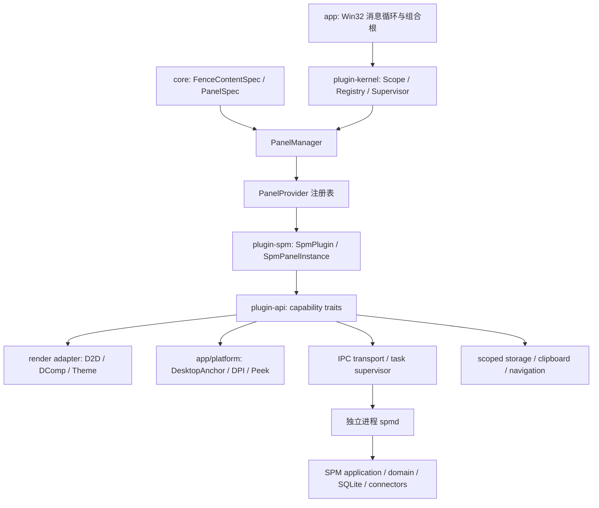
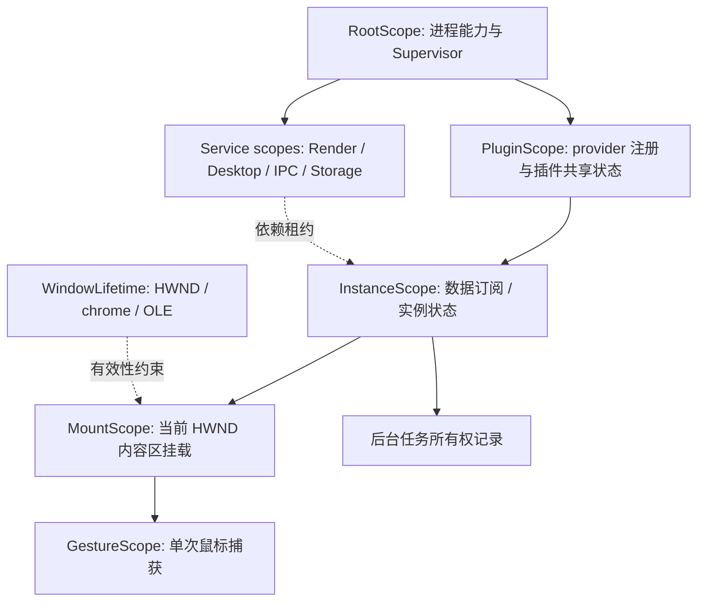
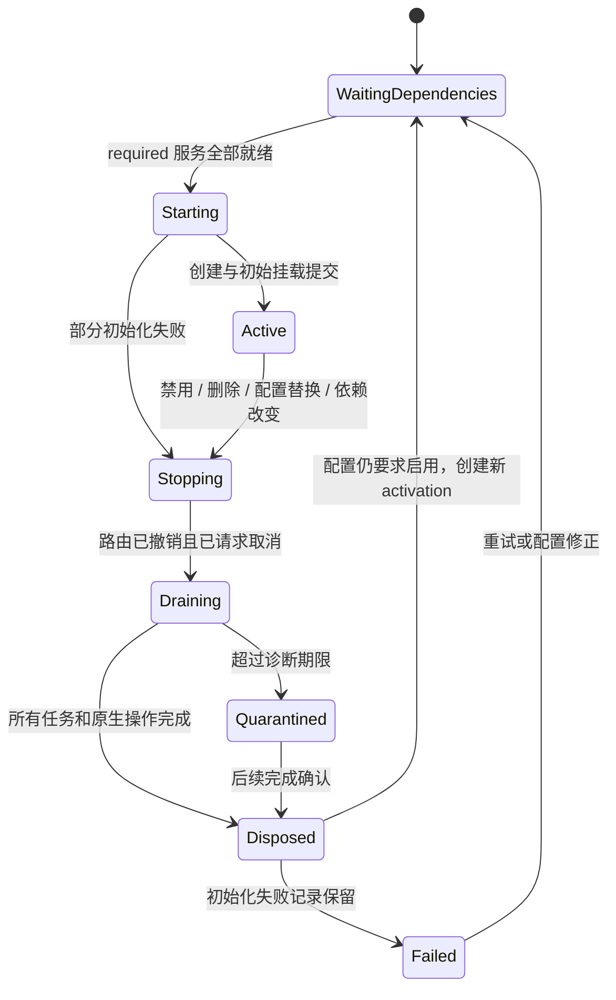
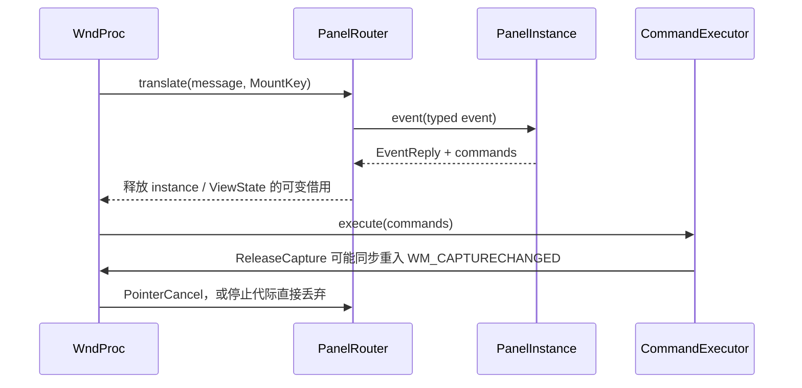
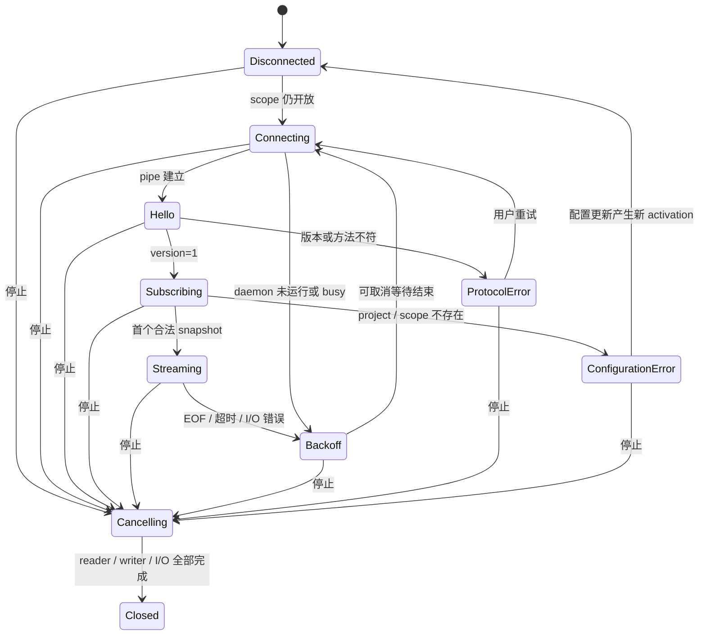

# PecoFence：Cordis 风格插件内核与 SPM 面板集成设计

状态：架构提案。本文规定目标接口、资源契约和迁移顺序，不表示这些接口已经存在于仓库。

核对日期：2026-09-21。PecoFence HEAD：`5d73facf5ec7bb8bf67d0b08ef6cf6e80d7921c3`；SPM HEAD：`5f4b1f70fe9d16b780887cd7d0465b814735a95f`。代码观察包含工作区中尚未提交的 SPM 集成修改，因此不能仅凭这两个提交复现全部现状。

## 1. 设计范围与决策

将 SPM 从宿主内容枚举中的专用实现迁移为注册的 `PanelProvider`。第一阶段采用随 PecoFence 编译、进程内运行的 Rust crate `pecofence-plugin-spm`；支持运行时启用、停用、配置替换和实例销毁。这里的卸载指撤销注册和释放运行实例，不涉及卸载 DLL 映像。

内核包含 scope 树、effect 所有权、服务注册与依赖图、实例状态机、事件路由和后台任务监督。Win32 HWND、DirectComposition 提交、DesktopAnchor、Peek、窗口尺寸和 DPI 仍由宿主实现。插件获得受 scope 约束的能力接口，不接管 WndProc。

本设计中的强制性表述是目标实现的契约。缓存限额、超时和重连参数是初始实现参数，须通过 Windows 验证调整，不能作为现有性能结论。

| 决策 | 目标行为 | 原因或约束 |
| --- | --- | --- |
| 保留 `Files`，新增通用 `Panel` | 文件 fence 继续走当前路径 | 不要求同时重写文件图标、Shell 菜单、OLE 拖放 |
| 第一方插件静态链接 | `SpmPlugin` 在启动组合根注册 | Rust trait object 不作为跨 DLL ABI |
| UI 能力单线程 | `Rc`、`Weak` 和短期借用，不要求面板实现 `Send` | HWND 操作、渲染与现有消息循环保持同一线程 |
| 后台 I/O 单独监督 | 只传不可变数据与带代际的消息 | 不把 HWND、绘制 session 或 `Rc<RefCell<ViewState>>` 传给后台 |
| 两阶段停止 | 先撤销访问，再确认后台完成 | `Drop` 不能异步等待 |
| 实例与挂载分离 | instance 属于逻辑 fence，mount 属于当前显示绑定 | 标签切换、撕出和 HWND 重建不等同于删除配置 |
| 服务替换需要依赖屏障 | 旧消费者停止后再发布新代际 | `TypeId → Any` 查找表本身不提供反应式生命周期 |

SPM daemon 的采集、SQLite、凭据和领域计算继续留在 `spmd`。PecoFence 不链接 `spmd`、`spm-application` 或 `spm-store-sqlite`。

## 2. 当前实现的代码事实

### 2.1 静态耦合点

下列链接相对于本文所在的 `docs` 目录。

| 位置 | 已观察到的行为 | 迁移目标 |
| --- | --- | --- |
| [core/model.rs](../crates/core/src/model.rs) | `FenceContentSpec` 使用 `tag = "kind"`、`rename_all = "camelCase"`；包含 `SpmPanel { project, scope_id }` | `Panel { panel: PanelSpec }` 与版本化读取层 |
| [core/config_store.rs](../crates/core/src/config_store.rs) | `validate` 直接校验 SPM 的 project/scope、Virtual 和空 items；`parse_file` 先反序列化、验证，最后调用当前恒等迁移 | 原始 JSON 迁移先于目标模型反序列化；通用约束与 provider 校验分层 |
| [fence_window/state.rs](../crates/app/src/fence_window/state.rs) | `spm_panel: Option<SpmPanelContent>` | `ContentBinding` 与实例键 |
| [fence_window/api.rs](../crates/app/src/fence_window/api.rs) | `set_content` 构造 `SpmPanelContent`，设置 `TIMER_SPM`；切回文件时停止定时器 | 由 `PanelManager` 执行 reconcile |
| [fence_window/render.rs](../crates/app/src/fence_window/render.rs) | `redraw_content` 直接分支绘制 SPM | 通用面板绘制入口 |
| [handler/mod.rs](../crates/app/src/fence_window/handler/mod.rs)、[handler/nc.rs](../crates/app/src/fence_window/handler/nc.rs) | SPM 消息处理先于普通窗口分支；非客户区命中处理包含 SPM 条件 | 宿主先处理 chrome，再派发内容区类型化事件 |
| [fence_window/dnd.rs](../crates/app/src/fence_window/dnd.rs) | 通过 `spm_panel.is_some()` 阻止文件拖放 | 根据通用内容能力判断 |
| [app/fences.rs](../crates/app/src/app/fences.rs)、[app/items.rs](../crates/app/src/app/items.rs)、[app/state.rs](../crates/app/src/state.rs) | active tab 决定显示内容，部分路径已用 `content.is_files()` | 保留通用判断，补齐面板实例与 tab 绑定 |
| [app/Cargo.toml](../crates/app/Cargo.toml) | app 直接 path 依赖相邻 SPM 仓库的 `spm-protocol`、`spm-domain`，并依赖 chrono | SPM 依赖收敛到 adapter crate |

当前 SPM 绘制与输入代码位于 [spm_panel.rs](../crates/app/src/fence_window/spm_panel.rs)。`TIMER_SPM = 81` 每 1000 ms 请求重绘，roll-up 时跳过绘制。`draw` 每次创建两个 `TextFormat` 和七个 solid brush，并在每次绘制开始递增 hit-test generation。这里能确认的是重复创建资源及绘制会取消既有点击匹配，不能据此断言 COM brush 泄漏。

### 2.2 已有释放机制与不足

- `FenceWindow::Drop` 已在 HWND 销毁之前撤销 OLE drop target，并移除以 HWND 为键的壁纸缓存。这是已有资源顺序约束，不能在迁移时删除。
- `platform/window.rs` 在 `WM_NCDESTROY` 清空 `GWLP_USERDATA` 并回收 `Box<State>`，调用 handler 之前 clone `Rc`，避免同步重入时 handler 被释放。
- `platform/winevent.rs` 已有 `WinEventHook::Drop`。其 `event_proc` 临时取出 callback 后无条件通过 `entry(...).or_insert(cb)` 放回；若 callback 内释放 hook，仅从 map 删除不能证明 callback 不被放回。新增路由须独立保存 registration 的 alive/generation 状态，并测试自撤销场景。
- SPM 的 [ipc.rs](../../spm/crates/spm-protocol/src/ipc.rs) 中，`PanelClient` 已在后台线程运行 Tokio current-thread runtime；`Drop` 已发送 oneshot 停止信号。线程句柄没有保存，调用者不能观察线程结束。不能将其描述为完全没有取消机制。
- `PanelClient` 每次重连等待 2 秒，握手读取超时 10 秒，响应读取超时 15 秒；后台 reader 与 writer 分开，不因本地刷新请求而重建半读 frame。
- [odm.rs](../../spm/crates/spm-protocol/src/odm.rs) 的 `enforce_freshness` 已处理断连、时间失效、数据源覆盖和 Incomplete 状态；插件化不能删除这项语义。

本设计要解决的是：资源撤销点散落在内容切换、窗口过程、客户端析构和渲染路径中，无法通过一个实例状态判断所有资源是否已经停止。

## 3. 与 Cordis 的对应关系

DeepSeek Harness 的 Cordis primer 描述了 context 中的服务、`inject` 依赖、类型化事件以及通过 `ctx.effect()`/`ctx.on()` 管理的可撤销注册。本文沿用这些组织原则，不移植 TypeScript 对象模型、装饰器或事件模式全集。[DeepSeek Harness Cordis Primer](https://github.com/deepseek-ai/deepseek-harness/blob/master/docs/cordis-primer.md)

Cordis 的 registry/fiber 源码实现插件注册和依赖生命周期。本文的 UI 线程约束、代际消息、异步排空屏障、配置事务和 native handle 所有权属于 PecoFence 提案，不是对 Cordis 原实现的逐项描述。[Registry 源码](https://github.com/cordiverse/cordis/blob/main/packages/core/src/registry.ts)、[Fiber 源码](https://github.com/cordiverse/cordis/blob/main/packages/core/src/fiber.ts)

| 维度 | 当前 SPM 嵌入 | 本提案 |
| --- | --- | --- |
| 插件标识 | Rust 枚举变体与 app 字段 | 稳定 provider 字符串、API major、配置版本 |
| Temporal composability | 各调用点手动撤销 | acquisition guard → scope effect → 停止屏障 |
| Spatial composability | import 具体实现与访问 `ViewState` | 声明 required/optional 服务，按 scope 解析与撤销 lease |
| 生命周期 | 构造、赋 `None`、窗口释放 | Waiting、Starting、Active、Stopping、Draining、Disposed |
| 消息目标 | HWND 与固定 timer ID | runtime instance key、mount key、scope epoch |
| 资源失效 | 各绘制调用处理 | 设备代际、surface 代际、主题代际分别处理 |

“可撤销”是撤销本进程继续产生效果的能力。已打开的浏览器页面、已写入剪贴板的数据、已提交的持久化配置、已经被 daemon 接受的刷新，不存在本 scope 能可靠执行的逆操作。不能把 scope 当作外部世界的事务回滚器。

### 3.1 模块边界



依赖方向：`plugin-api → core`，`plugin-kernel → plugin-api`，`plugin-spm → plugin-api + spm-domain + spm-protocol`，`app → kernel + render + platform + plugin-spm`。`render` 可实现 API 定义的画布接口；API 不依赖 render/app，从而没有循环依赖。

## 4. 所有权、scope 与线程

### 4.1 三种身份与三种寿命

```rust
#[derive(Clone, Copy, Debug, PartialEq, Eq, Hash)]
pub struct InstanceKey {
    pub instance_id: uuid::Uuid,
    pub activation: u64,
}

#[derive(Clone, Copy, Debug, PartialEq, Eq, Hash)]
pub struct MountKey {
    pub instance: InstanceKey,
    pub window_slot: u64,
    pub window_generation: u64,
    pub mount_generation: u64,
}

#[derive(Clone, Copy, Debug, PartialEq, Eq, Hash)]
pub struct ScopeId(pub u64);

#[derive(Clone, Copy, Debug, PartialEq, Eq, Hash)]
pub struct EffectId(pub u64);
```

`instance_id` 持久化；`activation` 每次配置替换、服务重启或实例重建递增；`MountKey` 在重新绑定 HWND/content surface 时变化。计数使用 checked increment，耗尽时拒绝创建而不 wrap。原始 HWND 不是身份，Windows 可以复用其数值。



scope 树只有一个拥有型父边，图中虚线是依赖边。`MountScope` 由 instance scope 拥有，同时受 WindowLifetime 撤销约束；窗口撤销先关闭 mount，不能通过第二个强父引用制造环。所有 scope 由 kernel 的 `ScopeTree` arena 拥有；插件只有弱 `ScopeHandle`，不能延长 scope 寿命。

| 对象 | 所有者 | 线程 | 释放条件 |
| --- | --- | --- | --- |
| `Box<dyn PanelProvider>` | PluginRecord | UI | 实例全部排空且注册撤销后 |
| `Box<dyn PanelInstance>` | InstanceRecord | UI | 停止后、后台完成后 |
| 实例状态、命中表 | PanelInstance | UI | instance drop |
| HWND、DComp visual/surface | WindowRecord / render service | UI | mount 撤销后由宿主销毁 |
| D2D session / clip | 当前 draw 调用栈 | UI | draw 返回前 |
| snapshot | 后台与 UI 各持 `Arc` | 只读跨线程 | 最后一个引用释放 |
| pipe / OVERLAPPED / reader task | I/O supervisor | I/O | 取消完成且操作排空 |
| service lease | plugin context / instance | UI | 可以保留弱 lease，但撤销后调用返回错误 |

Rust 的 `'static` effect closure 表示不借用短期栈帧，不表示资源活到进程退出。可以 move 拥有型 RAII guard 到 closure，禁止捕获指向 ViewState、PanelInstance 或 registry 的裸指针。

`Rc` 类型使 UI 对象不能直接跨线程；后台只接受 `Send + 'static` 数据、取消 token 和 `EventSink`。不为 UI 对象增加 `unsafe impl Send`。宿主服务方法返回的引用只活在当前 callback/借用期内。

### 4.2 同步 effect bag 的可编译骨架

以下代码块是仅依赖标准库的最小实现，展示弱 context、逆序撤销、停止后注册的即时回滚和无借用跨回调。它仅完成本地撤销，不包含异步完成判断和父子遍历；完整 kernel 按下一节组织这些步骤。

```rust
use std::cell::{Cell, RefCell};
use std::rc::{Rc, Weak};

#[derive(Clone, Copy, Debug, PartialEq, Eq)]
pub enum LocalPhase { Open, Stopping, LocalClosed }

#[derive(Debug)]
pub struct CleanupError(pub String);

type Undo = Box<dyn FnOnce() -> Result<(), CleanupError>>;

struct ScopeInner {
    phase: Cell<LocalPhase>,
    effects: RefCell<Vec<Undo>>,
    errors: Rc<RefCell<Vec<CleanupError>>>,
}

pub struct Scope {
    inner: Rc<ScopeInner>,
}

#[derive(Clone)]
pub struct ScopeHandle {
    inner: Weak<ScopeInner>,
}

#[derive(Debug)]
pub enum RegisterError {
    Closed,
    Rollback(CleanupError),
}

impl Scope {
    pub fn new(errors: Rc<RefCell<Vec<CleanupError>>>) -> Self {
        Self { inner: Rc::new(ScopeInner {
            phase: Cell::new(LocalPhase::Open),
            effects: RefCell::new(Vec::new()),
            errors,
        }) }
    }

    pub fn handle(&self) -> ScopeHandle {
        ScopeHandle { inner: Rc::downgrade(&self.inner) }
    }

    pub fn begin_stop(&self) {
        if self.inner.phase.get() == LocalPhase::Open {
            self.inner.phase.set(LocalPhase::Stopping);
        }
    }

    pub fn close_local(&mut self) {
        if self.inner.phase.get() == LocalPhase::LocalClosed { return; }
        self.begin_stop();
        let mut effects = {
            let mut bag = self.inner.effects.borrow_mut();
            std::mem::take(&mut *bag)
        };
        while let Some(undo) = effects.pop() {
            if let Err(error) = undo() {
                self.inner.errors.borrow_mut().push(error);
            }
        }
        self.inner.phase.set(LocalPhase::LocalClosed);
    }
}

impl ScopeHandle {
    pub fn defer<F>(&self, undo: F) -> Result<(), RegisterError>
    where F: FnOnce() -> Result<(), CleanupError> + 'static {
        if let Some(inner) = self.inner.upgrade() {
            if inner.phase.get() == LocalPhase::Open {
                inner.effects.borrow_mut().push(Box::new(undo));
                return Ok(());
            }
        }
        match undo() {
            Ok(()) => Err(RegisterError::Closed),
            Err(error) => Err(RegisterError::Rollback(error)),
        }
    }
}

impl Drop for Scope {
    fn drop(&mut self) { self.close_local(); }
}
```

正式版扩展：effect 用 `EffectId → Entry` 加注册顺序栈保存，支持提前撤销与 tombstone；scope 树记录 parent/children；每条 effect 记录资源类型、创建位置、目标 key、创建时间。提前撤销后不能继续保留大型 closure 到 scope 结束，压缩 tombstone 或从 arena 移除资源。

能力方法遵守 acquire-and-track：先创建 RAII guard，再将其转交 effect bag。任一步返回错误时 guard 自行回滚。禁止先成功注册原生回调，再通过一个可能失败而不回滚的独立操作登记 undo。

`Drop` 是兜底，不是正常生命周期协议。safe Rust 允许 `mem::forget`、强引用环，进程也可能 abort；因此内核只对遵守能力契约的代码、正常返回路径和显式 shutdown 提供自动撤销保证。当前 release profile 为 `panic = "abort"`，不能声称 `catch_unwind` 会隔离生产插件 panic。需要对不受信任代码隔离时应使用进程边界。

### 4.3 停止与排空协议

1. 在 UI turn 边界将目标 scope 子树标为 Stopping，关闭事件入口并使 activation/mount/service lease 失效。先标记全部后代，后执行任何 undo。
2. 移除路由、timer 注册和输入捕获；对所有后台任务发取消。先停止依赖消费者，再撤销其依赖服务。
3. 从最深子 scope 开始执行本地 effect LIFO。不同阶段有固定顺序，不能仅凭一条 LIFO 栈代替整个依赖图。
4. 后台 task supervisor 保留 JoinHandle、pipe 和 I/O 缓冲，异步等待完成。UI 继续泵消息；不能在 WndProc 内 `join` 或 `block_on`。
5. 所有后台任务完成后 drop instance；释放 mount 资源引用、缓存配额和存储租约；依赖服务仍保留到消费者排空。
6. 完成后标为 Disposed。关闭根 scope 时，最后关闭服务和 supervisor。

```rust
pub enum StopReason {
    Deleted, Disabled, Reconfigured, DependencyChanged,
    HostShutdown, InitializationFailed,
}

pub enum RuntimePhase {
    WaitingDependencies,
    Starting,
    Active,
    Stopping,
    Draining,
    Disposed,
    Failed,
    Quarantined,
}

pub struct StopTicket {
    pub scope: ScopeId,
    pub pending_tasks: Vec<TaskId>,
    pub pending_native_ops: usize,
}

#[derive(Clone, Copy, Debug, PartialEq, Eq, Hash)]
pub struct TaskId(pub u64);
```

任务句柄不放入会无声 detach 的临时变量。Tokio `JoinHandle` 被丢弃会 detach；即使调用 abort，也须观察 join 结果后才能认定任务析构已执行。[Tokio JoinHandle](https://docs.rs/tokio/latest/tokio/task/struct.JoinHandle.html)

初始 shutdown 诊断期限设为 5 秒。超时进入 Quarantined，记录未完成任务并保留其底层所有权；不释放仍被 native I/O 引用的内存，不谎报 Disposed，不强杀线程。整个进程退出时由 OS 回收进程资源，不作为运行期卸载已成功的证据。每个 scope 的 task 数、pending I/O 数和 effect 数必须可查询。



Failed 是没有活动资源的终态记录；若失败后的清理尚未完成，应保持 Draining/Quarantined。

## 5. ServiceRegistry 与反应式依赖

### 5.1 服务的类型与可见范围

服务键由 Rust marker type 提供，marker 的关联类型为能力 trait object。`TypeId` 仅用于同一进程内查找；持久化 manifest 使用稳定字符串及 major version，不序列化 TypeId。相同 trait 的不同角色使用不同 marker。

服务从当前 scope 向父 scope 查找，最近的显式 binding 覆盖祖先 binding。兄弟插件不能互相访问私有服务。宿主按 provider manifest 的授权能力构造 context，只暴露已声明的键；in-process Rust 插件仍属于受信任代码，这种 API 约束不是 OS sandbox。

```rust
use std::any::{Any, TypeId};
use std::collections::HashMap;
use std::marker::PhantomData;

pub trait ServiceTag: 'static {
    type Api: ?Sized + 'static;
    const NAME: &'static str;
    const MAJOR: u32;
}

struct ServiceEntry {
    generation: u64,
    available: Cell<bool>,
    // 实际内容为 Rc<T::Api>，Rc 本身是 Sized。
    value: Box<dyn Any>,
}

pub struct ServiceRegistry {
    parent: Option<Weak<ServiceRegistry>>,
    entries: RefCell<HashMap<TypeId, Rc<ServiceEntry>>>,
}

pub struct ServiceLease<T: ServiceTag> {
    entry: Weak<ServiceEntry>,
    generation: u64,
    consumer: ScopeHandle,
    marker: PhantomData<T>,
}

#[derive(Debug)]
pub enum ServiceError { ScopeClosed, Missing, Revoked, WrongType }

impl ScopeHandle {
    pub fn is_open(&self) -> bool {
        self.inner.upgrade().is_some_and(|inner| {
            inner.phase.get() == LocalPhase::Open
        })
    }
}

impl ServiceRegistry {
    fn find(&self, key: TypeId) -> Option<Rc<ServiceEntry>> {
        if let Some(entry) = self.entries.borrow().get(&key).cloned() {
            return Some(entry);
        }
        self.parent.as_ref()?.upgrade()?.find(key)
    }

    pub fn resolve<T: ServiceTag>(
        &self, consumer: &ScopeHandle,
    ) -> Result<ServiceLease<T>, ServiceError> {
        if consumer.is_open() == false { return Err(ServiceError::ScopeClosed); }
        let entry = self.find(TypeId::of::<T>()).ok_or(ServiceError::Missing)?;
        if entry.available.get() == false { return Err(ServiceError::Revoked); }
        if entry.value.downcast_ref::<Rc<T::Api>>().is_none() {
            return Err(ServiceError::WrongType);
        }
        Ok(ServiceLease {
            generation: entry.generation,
            entry: Rc::downgrade(&entry),
            consumer: consumer.clone(),
            marker: PhantomData,
        })
    }
}

impl<T: ServiceTag> ServiceLease<T> {
    pub fn with<R>(&self, f: impl FnOnce(&T::Api) -> R) -> Result<R, ServiceError> {
        if self.consumer.is_open() == false { return Err(ServiceError::ScopeClosed); }
        let entry = self.entry.upgrade().ok_or(ServiceError::Revoked)?;
        if entry.available.get() == false || entry.generation != self.generation {
            return Err(ServiceError::Revoked);
        }
        let api = entry.value.downcast_ref::<Rc<T::Api>>()
            .ok_or(ServiceError::WrongType)?;
        Ok(f(api.as_ref()))
    }
}
```

此骨架的类型擦除对象是 `Rc<dyn ServiceTrait>`，不是直接将 unsized trait object 传给 `Any::downcast`。不提供克隆底层 Rc 的 API。发布、替换和撤销由 kernel 控制，必须在 UI turn 边界执行，不能在 `with` 内同步执行 replacement。

正式版 `publish<T>` 还要：验证 major、拒绝同一 scope 重复发布、分配 generation、创建撤销 registration、更新依赖图，并将撤销 registration 登记到服务发布者 scope。服务撤销先置 unavailable、停止依赖者，待其排空后移除 entry。entry 的物理释放不能先于依赖服务的后台任务结束。

### 5.2 依赖与替换算法

```rust
pub struct ServiceRequirement {
    pub name: &'static str,
    pub major: u32,
    pub required: bool,
}

pub struct ProviderDescriptor {
    pub id: &'static str,
    pub api_major: u32,
    pub config_version: u32,
    pub dependencies: &'static [ServiceRequirement],
}
```

依赖图节点是服务发布者和消费者 scope，边记录服务键、实际解析到的发布 scope 及 generation。不能仅记录字符串，因为相同键可能在不同 scope 被覆盖。

1. required 不满足：保持 WaitingDependencies，保留 PanelSpec 并绘制宿主占位内容，不创建 IPC 或 timer。
2. required 满足：按拓扑序初始化；required 依赖环报出完整 cycle path 并拒绝激活。
3. 服务撤销或替换：标记旧 entry unavailable，计算依赖闭包，反拓扑停止消费者。等消费者排空后释放旧服务，再发布新代际并按拓扑顺序重建。
4. optional 改变：受影响的可选功能放在独立 feature child scope，关闭并重建该 scope；不要求重建整个实例。第一阶段仅导航、剪贴板适用 optional；核心渲染、主题、桌面、IPC、存储 required。
5. 同一 UI turn 内多个改变合并为一个 reconcile transaction，避免依赖更新递归进入插件代码。

D2D device reset 不是 RenderService 的撤销。保留 RenderService 身份，更新 `device_epoch` 和 surface generation 并通知 mount 重绘；否则一次设备丢失会无必要地重连所有 SPM daemon。

### 5.3 PluginContext

```rust
pub struct PluginContext {
    scope: ScopeHandle,
    services: Rc<ServiceRegistry>,
    events: EventSink,
    tasks: TaskSpawner,
    timers: ScopedTimers,
    provider_id: &'static str,
    instance: InstanceKey,
}

impl PluginContext {
    pub fn require<T: ServiceTag>(&self) -> Result<ServiceLease<T>, ServiceError>;
    pub fn scope(&self) -> &ScopeHandle;
    pub fn events(&self) -> EventSink;
    pub fn tasks(&self) -> &TaskSpawner;
    pub fn timers(&self) -> &ScopedTimers;
    pub fn instance(&self) -> InstanceKey;
}
```

从本节开始，含省略方法体的 `impl`、宿主封装类型和 adapter 代码均为接口骨架，不是可直接粘贴编译的完整 crate。`PluginResult<T>` 统一表示 `Result<T, PluginError>`；`PluginError` 应包含错误类别、provider、instance key 和原始 cause，不携带可重新使用的裸句柄。

Context 的 scope 弱引用不会维持实例寿命；这里的 registry Rc 只维持查找结构，不应维持已经撤销的服务 entry。`EventSink` 和 TaskSpawner 内部持有 consumer generation gate。子任务不持有 PluginContext，因为它包含 UI 线程对象。

## 6. 宿主能力接口

### 6.1 RenderService、ThemeService 与绘制借用

画布接口放在 `plugin-api`，D2D 实现放在 `render`。首版覆盖当前 SPM 使用的矩形、圆角矩形、文字和裁剪。插件不直接拿到可 clone 的 `ID2D1DeviceContext`，不调用 `BeginDraw`、`EndDraw` 或 DComp Commit。

```rust
#[derive(Clone, Copy, Debug, PartialEq)]
pub struct PointDip { pub x: f32, pub y: f32 }
#[derive(Clone, Copy, Debug, PartialEq)]
pub struct SizeDip { pub width: f32, pub height: f32 }
#[derive(Clone, Copy, Debug, PartialEq)]
pub struct RectDip { pub x: f32, pub y: f32, pub width: f32, pub height: f32 }

#[derive(Clone, Copy, Debug, PartialEq, Eq, Hash)]
pub enum ColorToken { Text, SecondaryText, Surface, Active, Accent, Warning, Stroke }
#[derive(Clone, Copy, Debug, PartialEq, Eq, Hash)]
pub enum FontToken { Body, Label, Heading }

pub struct ThemeTokens {
    pub epoch: u64,
    pub colors: [[f32; 4]; 7],
    pub font_family: String,
    pub body_size_dip: f32,
    pub high_contrast: bool,
}

pub trait Canvas {
    fn fill_round_rect(&mut self, rect: RectDip, radius: f32, color: ColorToken)
        -> PluginResult<()>;
    fn stroke_round_rect(&mut self, rect: RectDip, radius: f32,
        color: ColorToken, width: f32) -> PluginResult<()>;
    fn text(&mut self, text: &str, rect: RectDip,
        font: FontToken, color: ColorToken) -> PluginResult<()>;
}

#[derive(Clone, Copy, Debug, PartialEq, Eq)]
pub struct FrameStamp {
    pub mount: MountKey,
    pub frame: u64,
    pub device_epoch: u64,
    pub surface_epoch: u64,
    pub theme_epoch: u64,
}

pub struct RenderFrame<'a> {
    pub canvas: &'a mut dyn Canvas,
    pub theme: &'a ThemeTokens,
    pub bounds: RectDip,
    pub dpi: u32,
    pub stamp: FrameStamp,
}

pub enum FrameOutcome { Submitted(FrameStamp), DeviceLost, Occluded }

pub trait RenderService {
    fn invalidate(&self, mount: MountKey) -> PluginResult<()>;
    fn with_frame(&self, mount: MountKey,
        paint: &mut dyn FnMut(&mut RenderFrame<'_>) -> PluginResult<()>)
        -> PluginResult<FrameOutcome>;
}

pub trait ThemeService {
    fn current(&self) -> Rc<ThemeTokens>;
    fn watch(&self, scope: &ScopeHandle, sink: EventSink) -> PluginResult<()>;
}

pub enum RenderTag {}
impl ServiceTag for RenderTag {
    type Api = dyn RenderService;
    const NAME: &'static str = "pecofence.render";
    const MAJOR: u32 = 1;
}
```

其他 marker 同样定义：`ThemeTag → dyn ThemeService`、`DesktopTag → dyn DesktopService`、`IpcTag → dyn IpcService`、`StorageTag → dyn StorageService`、`NavigationTag`、`ClipboardTag`。major 均从 1 开始。

`with_frame` 由 PanelManager 使用；context 中暴露给实例的 RenderService facade 只接受该实例的有效 MountKey，并拒绝在 paint 内嵌套绘制。流程为验证 mount → `Panel::draw_ex` → clear 内容 surface → 裁剪到内容区 → 调用 paint → pop clip → EndDraw → 宿主统一提交。`RenderFrame<'_>` 的借用不能存入 `'static` 的 `PanelInstance`。

`Submitted` 表示 EndDraw 成功且宿主接受提交，不声称 GPU 已经呈现到显示器。插件仅在收到对应 stamp 的 `FrameSubmitted` 事件后发布候选 hit-test 表；失败帧不能覆盖最后一次成功帧的输入表。

缓存分层如下。

| 缓存 | key | 失效 |
| --- | --- | --- |
| Solid brush | D2D resource-domain ID、device epoch、theme epoch、ColorToken | 设备/资源域变化；主题变更 |
| TextFormat | 字体集合 epoch、family、weight、size DIP、locale、对齐 | 字体或主题字体变化 |
| TextLayout | 文本、format key、DIP 宽高、换行/裁剪参数 | 文本/尺寸/字体变化；像素相关 key 加 DPI |
| 内容 surface | MountKey、尺寸 px、surface epoch | resize、mount 撤销、device reset |

不能只按颜色共享所有 brush；Direct2D 区分 device-dependent 资源及其资源域，关联设备失效时需要重建。[Direct2D Resources Overview](https://learn.microsoft.com/en-us/windows/win32/direct2d/resources-and-resource-domains)

缓存由 render service 拥有，按 mount 收取引用与配额；mount 撤销时释放其引用，全局可复用资源由有界 LRU 保留。初始限制：每个资源域 64 个 token brush、每个实例 512 个 text layout，另设全局字节预算。多次绘制不往 scope bag 追加相同缓存条目。

### 6.2 DesktopService

```rust
pub struct DesktopMetrics {
    pub monitor_id: String,
    pub dpi: u32,
    pub content_size: SizeDip,
    pub work_area_dip: RectDip,
    pub visible: bool,
    pub rolled_up: bool,
    pub peeking: bool,
    pub geometry_epoch: u64,
}

pub enum PeekRequest { Show, Hide }

pub trait DesktopService {
    fn metrics(&self, mount: MountKey) -> PluginResult<DesktopMetrics>;
    fn watch(&self, scope: &ScopeHandle, sink: EventSink) -> PluginResult<()>;
    fn request_peek(&self, mount: MountKey, request: PeekRequest) -> PluginResult<()>;
    fn request_content_size(&self, mount: MountKey, desired: SizeDip) -> PluginResult<()>;
}
```

DesktopAnchor、WorkerW 层级、z-order、窗口样式、吸附、阴影和 work-area clamp 属于宿主。`request_peek` 发命令给已有 Peek 状态机，受现有设置约束；不能由插件调用 `SetWindowPos` 把窗口永久置顶。

内容坐标统一为 DIP：`x_dip = client_x_px × 96 / dpi`，`y_dip = (client_y_px − content_top_px) × 96 / dpi`。`content_top_px` 包含标题和实际 tab strip 偏移，不假定恒等于一个标题高度。DPI 为零或非有限几何返回错误。

`WM_DPICHANGED` 建议矩形由宿主应用；随后更新 surface px 尺寸、metrics epoch、布局和命中表。`WM_DISPLAYCHANGE`、work-area 变化和 Explorer 重建也由 DesktopService 发布语义事件。负屏幕坐标保留有符号语义。

### 6.3 IpcService、任务与订阅

IpcService 负责已批准的本地 endpoint、连接与 transport 生命周期，不知道 SPM 的项目、业务状态或刷新方法。SPM framing 和消息枚举由 adapter 解释。

```rust
use std::future::Future;
use std::pin::Pin;
use std::sync::Arc;
use std::time::Duration;

pub type IoFuture<'a, T> = Pin<Box<dyn Future<Output = PluginResult<T>> + Send + 'a>>;
pub type TaskFuture = Pin<Box<dyn Future<Output = PluginResult<()>> + Send + 'static>>;

pub struct EndpointId(pub String);
pub struct PipeOptions {
    pub connect_timeout: Duration,
    pub max_frame_bytes: usize,
}

pub trait PipeReader: Send {
    fn read_frame(&mut self) -> IoFuture<'_, Vec<u8>>;
}
pub trait PipeWriter: Send {
    fn write_frame(&mut self, bytes: Vec<u8>) -> IoFuture<'_, ()>;
}
pub trait PipeConnection: Send {
    fn into_split(self: Box<Self>) -> (Box<dyn PipeReader>, Box<dyn PipeWriter>);
}
pub trait PipeConnector: Send + Sync {
    fn connect(&self, cancel: CancellationToken) -> IoFuture<'_, Box<dyn PipeConnection>>;
}
pub trait IpcService {
    fn connector(&self, scope: &ScopeHandle, endpoint: &EndpointId,
        options: PipeOptions) -> PluginResult<Arc<dyn PipeConnector>>;
}

pub struct TaskEnvironment {
    pub cancel: CancellationToken,
    pub events: EventSink,
}
pub trait SpawnScoped {
    fn spawn(&self, scope: &ScopeHandle, name: &'static str,
        make: Box<dyn FnOnce(TaskEnvironment) -> TaskFuture + Send>) -> PluginResult<TaskId>;
}
```

`CancellationToken` 采用 `tokio_util::sync::CancellationToken` 或提供同等唤醒语义的实现，不能仅检查 AtomicBool 后进入无限等待。Tokio/tokio-util 是提案新增的宿主后台依赖，当前 PanelClient 自带 runtime 不代表宿主已有共享 runtime。

`PipeConnector` 的共享 facade 也含 scope/service 失效 gate；克隆 Arc 不允许失效后新建连接。supervisor 在 scope 停止时取消所有 reader/writer 子任务。reader 持有未完成 frame 的缓冲和偏移；其他事件不能丢弃该 frame 后继续读取同一连接。中途取消读取只允许连同整条连接一起关闭。

已有 transport 若继续使用 Tokio，native OVERLAPPED 生命周期交由该实现管理并验证 task completion。若自建 Win32 overlapped transport，`CancelIoEx` 只是取消请求；必须等完成通知后才释放或复用 OVERLAPPED 和缓冲。[CancelIoEx](https://learn.microsoft.com/en-us/windows/win32/api/ioapiset/nf-ioapiset-cancelioex)

### 6.4 StorageService

默认根目录：`%LOCALAPPDATA%/PecoFence/plugins/<provider-id>/`。当前全局 ConfigStore 在 `%APPDATA%/PecoFence`，portable 模式位于 exe 旁 `config`；二者职责不合并。portable 模式使用 `<exe>/config/plugins/<provider-id>/`，路径由宿主策略决定。

```rust
pub struct StorageKey(pub String);
pub struct WriteId(pub u64);
pub trait StorageService {
    fn read_json(&self, key: StorageKey, reply: EventSink) -> PluginResult<()>;
    fn write_json_atomic(&self, key: StorageKey, value: serde_json::Value,
        reply: EventSink) -> PluginResult<WriteId>;
}
```

StorageService 是已经绑定 provider 和实例的 facade，插件不传绝对路径。允许的 provider ID 初始规则为 `[a-z0-9][a-z0-9.-]{0,63}`，拒绝 `..`、尾点、Windows 保留设备名等；storage key 使用受限 segment，不接受盘符、分隔符、ADS、UNC 或 traversal。宿主创建目录并按组件检查 reparse point，不能仅做字符串前缀判断。

目录建议为 `settings.json`、`instances/<uuid>/ui-state.json`、`cache/`。PanelSpec 的 `config` 是布局与导出的权威配置，storage 只存插件级偏好、实例 UI 状态和可丢弃缓存，不能有两个 project/scope 配置来源。daemon 数据库和凭据不复制到此目录。

写入在后台以同目录临时文件、flush 和原子替换完成；每个 key 串行并带 revision，防止旧 activation 的晚到写覆盖新状态。停止时尚未开始的写取消，已完成的替换不回滚，正在执行的写进入 drain。禁用插件保留文件；删除实例是否删除持久化数据属于显式数据操作，不由 effect `Drop` 推断。

## 7. PanelProvider 与 PanelInstance

### 7.1 对象安全接口

```rust
pub struct PanelConstraints {
    pub min_content: SizeDip,
    pub preferred_content: Option<SizeDip>,
    pub accepts_file_drop: bool,
}

pub struct MountContext {
    pub key: MountKey,
    pub scope: ScopeHandle,
    pub metrics: DesktopMetrics,
}

pub struct EventContext<'a> {
    pub instance: InstanceKey,
    pub mount: Option<MountKey>,
    pub metrics: Option<&'a DesktopMetrics>,
}

pub trait PanelProvider {
    fn descriptor(&self) -> &'static ProviderDescriptor;
    // 纯校验和规范化，不注册资源或执行 I/O。
    fn normalize_config(&self, input: &serde_json::Value)
        -> PluginResult<serde_json::Value>;
    // config 已通过 normalize_config，失败时整个 provisional scope 回滚。
    fn create(&self, ctx: PluginContext, config: serde_json::Value)
        -> PluginResult<Box<dyn PanelInstance>>;
}

pub trait PanelInstance {
    fn constraints(&self) -> PanelConstraints;
    fn mount(&mut self, ctx: MountContext) -> PluginResult<()>;
    fn unmount(&mut self);
    fn event(&mut self, ctx: &EventContext<'_>, event: PanelEvent)
        -> PluginResult<EventReply>;
    fn paint(&mut self, frame: &mut RenderFrame<'_>) -> PluginResult<()>;
    fn hit_test(&self, point: PointDip) -> HitResult;
    // 纯内存状态导出；宿主负责调度持久化，不在这里写磁盘。
    fn checkpoint(&self) -> serde_json::Value;
    fn restore(&mut self, state: &serde_json::Value) -> PluginResult<()>;
    // 停止通知必须有界、无阻塞；完整撤销由 scope 负责。
    fn stopping(&mut self, reason: StopReason);
}

#[derive(Clone, Copy, Debug, PartialEq, Eq)]
pub struct HitId(pub u64);
#[derive(Clone, Copy, Debug, PartialEq, Eq)]
pub struct GestureId(pub u64);

pub enum CursorKind { Arrow, Hand, Text }
pub struct HitResult {
    pub target: Option<HitId>,
    pub cursor: CursorKind,
}

pub enum PanelEvent {
    PointerDown { point: PointDip, gesture: GestureId },
    PointerUp { point: PointDip, gesture: GestureId, user_action: UserActionToken },
    PointerMove { point: PointDip },
    PointerCancel,
    PointerLeave,
    CaptureDenied(GestureId),
    Wheel { lines: f32, point: PointDip },
    Key(PanelKeyEvent),
    MetricsChanged(DesktopMetrics),
    ThemeChanged,
    Timer(u32),
    Data(Arc<dyn Any + Send + Sync>),
    FrameSubmitted(FrameStamp),
    DeviceLost,
}

pub enum PanelCommand {
    Invalidate,
    Capture(GestureId),
    ReleaseCapture(GestureId),
    OpenUrl { candidate: String, user_action: UserActionToken },
    CopyText { text: String, user_action: UserActionToken },
}

pub struct EventReply {
    pub handled: bool,
    pub commands: Vec<PanelCommand>,
}
```

`UserActionToken` 是宿主创建、字段私有、一次消费的短时 token，绑定当前 instance/mount/gesture；程序化 IPC 事件不能制造 token。`PanelKeyEvent` 是宿主定义的键、修饰键、按下/抬起数据，不携带 LPARAM 指针。

所有 trait 无关联构造器、无泛型方法，支持 `Box<dyn PanelProvider>` 和 `Box<dyn PanelInstance>`。这些 Rust trait 是同一构建产物内 API；未来 native 动态模块必须另设 C ABI、版本协商、跨边界分配释放规则和映像存活屏障，不能直接导出这些 trait object。Rust Reference 不提供 Rust 默认布局的跨版本稳定性保证。[Rust Type Layout](https://doc.rust-lang.org/reference/type-layout.html)

`stopping`/`unmount` 供插件清理自身纯内存状态，不承担 KillTimer、Unhook、关闭 pipe 的唯一责任。即使 create/mount 返回错误，kernel 也拥有已注册 effect 的撤销路径。

### 7.2 挂载、标签和 ViewState

```rust
pub enum ContentBinding {
    Files,
    Panel { instance: InstanceKey, mount: MountKey },
    Unavailable { instance_id: uuid::Uuid, reason: String },
}

pub struct InstanceRecord {
    pub spec: PanelSpec,
    pub key: InstanceKey,
    pub phase: RuntimePhase,
    pub scope: ScopeId,
    pub instance: Option<Box<dyn PanelInstance>>,
    pub mounted: Option<MountKey>,
}
```

`FenceViewState` 只保存 ContentBinding。实例由 PanelManager 的 `HashMap<InstanceKey, InstanceRecord>` 管理，另有逻辑 `instance_id → 当前 key` 索引；不再有 `spm_panel` 字段。

第一阶段实例策略：只为当前布局中曾显示的面板创建实例；隐藏 tab 的实例保留数据订阅与纯内存状态，但无 mount、输入捕获和绘制 timer；未显示过的面板延迟创建。切换布局关闭旧布局实例，后台任务排空后创建新布局实例，保留持久化 instance_id 并增加 activation。

同一逻辑实例在同一时刻最多一个 mount。标签切换顺序是 PointerCancel → 关闭旧 MountScope → unmount → 清空 content binding → 新 mount → 首帧提交。拖拽撕出时沿用 InstanceRecord，撤销旧 MountKey 并创建新 MountKey。阴影、模糊、Peek 和 chrome 动画由 WindowRecord 继续控制。

隐藏、roll-up、退出 Peek 不自动销毁实例；停止绘制与 freshness UI timer，保留最新数据。再次显示前立即按当前时间重算 freshness，不把“没有画新帧”解释为数据仍然有效。

### 7.3 配置更新事务

首版以“验证后重建 activation”实现动态配置更新，不提供允许任意中途写状态的 `update_config(&mut self)`。

1. 在旧实例仍 Active 时调用 provider.normalize_config；失败则保持旧配置和实例。
2. 相同规范化配置为 no-op；不同配置创建候选记录并导出 checkpoint。
3. 旧实例进入 Stopping/Draining；完成后才为候选分配新 activation 并调用 create。候选在 provisional scope 中初始化，尚未写入全局配置。
4. create、restore、mount 成功后提交新的 PanelSpec 和 binding，随后持久化。持久化失败显示未保存状态并保留可重试记录。
5. 初始化失败：关闭候选 scope，保持旧已保存 PanelSpec，尝试用旧配置重建旧逻辑实例；旧对象已释放，不能声称能原地回滚。重建失败保留错误占位和原始配置。

连接离线是 Active 实例的业务状态，不使 create 失败。这样用户可以在 `spmd` 未运行时保存一个面板。project/scope 变化时 checkpoint 只恢复与配置兼容的视图项，不能把旧项目的选择项带入新项目。

## 8. 数据模型与旧配置兼容

### 8.1 目标模型

```rust
use serde::{Deserialize, Serialize};

#[derive(Clone, Debug, PartialEq, Serialize, Deserialize)]
#[serde(tag = "type", rename_all = "snake_case")]
pub enum FenceContentSpec {
    Files { source: ItemSourceSpec },
    Panel { panel: PanelSpec },
}

#[derive(Clone, Debug, PartialEq, Serialize, Deserialize)]
pub struct PanelSpec {
    pub provider: String,
    pub instance_id: uuid::Uuid,
    pub config: serde_json::Value,
}

impl Default for FenceContentSpec {
    fn default() -> Self {
        Self::Files { source: ItemSourceSpec::Desktop }
    }
}
```

新增 `PartialEq` 以兼容现有 `Fence` 的比较。PanelSpec 字段明确使用 `instance_id`；外层 Config/Fence 的 camelCase 不递归改变嵌套类型字段。`ItemSourceSpec` 继续采用现有 `kind` 标签，不能把所有名为 kind 的字段批量替换成 type。

新配置示例：

```json
{
  "type": "panel",
  "panel": {
    "provider": "pecofence.spm",
    "instance_id": "90b4a27e-59d2-4d78-a1be-0d601278e4ec",
    "config": {
      "version": 1,
      "project": "example-project",
      "scope_id": "example-scope",
      "default_tab": 0
    }
  }
}
```

### 8.2 实际旧格式

现有 enum 的 `rename_all = "camelCase"` 改变 variant 名称，未配置 `rename_all_fields`；`SpmPanel` 的字段实际仍为 `scope_id`。

```json
{"kind":"spmPanel","project":"example-project","scope_id":"example-scope"}
```

还需支持旧 files 格式 `{"kind":"files","source":{"kind":"desktop"}}`，以及完全没有 `content`、仅有 Fence.source 的历史配置。迁移可额外接受曾由工具生成的 `scopeId` alias，但不能把 alias 当作本仓库当前输出。

### 8.3 迁移链

将 `SCHEMA_VERSION` 从 1 升为 2。新的读取路径为：读取 bytes → JSON Value → 检查原始 schemaVersion → v1→v2 结构迁移 → 反序列化目标 Config → 通用校验 → provider 配置校验/占位。当前 `parse_file` 的“先反序列化再迁移”必须修改，否则旧变体在迁移前就被拒绝。

```rust
#[derive(Deserialize)]
#[serde(tag = "kind", rename_all = "camelCase")]
enum LegacyContent {
    Files { source: ItemSourceSpec },
    SpmPanel {
        project: String,
        #[serde(alias = "scopeId")]
        scope_id: String,
    },
}

fn migrate_content_v1(
    fence_id: uuid::Uuid,
    legacy_source: ItemSourceSpec,
    value: Option<serde_json::Value>,
) -> Result<FenceContentSpec, MigrationError> {
    let Some(value) = value else {
        return Ok(FenceContentSpec::Files { source: legacy_source });
    };
    let content: LegacyContent = serde_json::from_value(value)?;
    match content {
        LegacyContent::Files { source } => Ok(FenceContentSpec::Files { source }),
        LegacyContent::SpmPanel { project, scope_id } => {
            let instance_id = uuid::Uuid::new_v5(&SPM_MIGRATION_NAMESPACE, fence_id.as_bytes());
            let config = serde_json::to_value(SpmConfigV1 {
                version: 1, project, scope_id, default_tab: 0,
            })?;
            Ok(FenceContentSpec::Panel { panel: PanelSpec {
                provider: "pecofence.spm".to_owned(), instance_id, config,
            } })
        }
    }
}
```

`SPM_MIGRATION_NAMESPACE` 是迁移实现固定并提交到仓库的 UUID 常量；新增 uuid `v5` feature。迁移 adapter 用 core 内私有的兼容 DTO `SpmConfigV1` 构造 JSON，不依赖 SPM crate；这段一次性旧格式知识保留在 migration 模块，不留在目标通用模型和通用 validate 内。

不能每次读文件调用 `new_v4()`，否则失败重试、备份和 snapshot 恢复会改变实例身份。遍历 `layouts[*].fences[*]` 和 `snapshots[*].layouts[*].fences[*]`；相同逻辑 fence 的旧配置在不同布局/快照中生成相同 ID。迁移应幂等，v2 输入不重复转换。

| 输入情形 | 处理 |
| --- | --- |
| v1 无 content | 从 source 生成 Files；source 缺失沿用 Desktop 默认 |
| v1 content.kind=files | 改成 type=files，保留内部 ItemSourceSpec.kind |
| v1 content.kind=spmPanel | 转成 provider=pecofence.spm，复制 project/scope，生成稳定 ID |
| v2 provider 未安装或禁用 | 原样保存 PanelSpec，显示占位，不降级成 Files |
| v2 provider 配置版本未知/非法 | 实例配置错误占位；保留原始 config JSON，其他 fence 可加载 |
| schemaVersion 高于支持版本 | 返回 UnsupportedVersion；不自动拿旧备份覆盖主文件 |
| content 同时含 type 与 kind，或类型不明 | 返回含 JSON path 的迁移错误，不猜测 |
| 相同活动布局有重复 instance_id | 拒绝该布局的歧义实例绑定并报告；不静默共享一个 mutable instance |

未知 provider 不等于未知 content type。本文模型只支持 Files/Panel；未知 content type 需保留原文件并报错，若以后需要可编辑 opaque 类型，应另行扩充 wire 层。

全局通用校验要求 Panel fence 是 Virtual、items 为空、provider ID 合法、instance_id 非 nil、config JSON 在大小/嵌套限制内。SPM 的非空 project/scope、tab 范围及 config.version 由 provider 校验。Files 的 `Fence.source` 与 `content.source` 过渡期继续通过 `set_file_source` 同步；面板的 legacy source 不参与文件路由。

新建或复制为独立 fence 使用新 instance UUID；同一 fence 的布局快照保持 ID；只对当前活动布局要求唯一，不把历史 snapshot 中的同一 ID 判为冲突。

首次成功写回 v2 前保存不可覆盖的 v1 备份，再按 ConfigStore 原子写流程提交。向后兼容指新程序读取旧配置，不承诺旧程序读取 v2。降级需要恢复 v1 备份；不能把通用第三方面板无损转换为旧枚举。

## 9. Win32 事件路由与窗口销毁

### 9.1 路由顺序

WndProc 继续由 platform/window.rs 拥有。普通插件注册类型化订阅，不调用 `SetWindowLongPtr` 改写宿主 WndProc，也不保存借用的 LPARAM。原生扩展如确有需要，只能通过 platform 内的 scoped subclass/hook guard 实现并在所属 UI 线程移除。

| 消息 | 宿主处理 | 面板得到的事件 |
| --- | --- | --- |
| `WM_NCHITTEST` | screen→client，先边框 resize、标题、tabs，再内容区 | 内容区 HitResult 仅决定 cursor/交互，不修改窗口框架 |
| `WM_GETMINMAXINFO` | constraints 的最小内容尺寸加 chrome，并换算 px | 无原始指针 |
| `WM_LBUTTONDOWN/UP` | 校验 mount、坐标和输入序列；调用 event 后执行命令 | PointerDown/PointerUp |
| `WM_MOUSEMOVE/LEAVE` | 维护 hover，跟踪 leave，转换 DIP | PointerMove/PointerLeave |
| `WM_MOUSEWHEEL` | LPARAM 是屏幕坐标，必须 ScreenToClient；累积高精度 wheel delta | Wheel |
| `WM_CAPTURECHANGED`、`WM_CANCELMODE` | 撤销宿主 CaptureGuard | PointerCancel |
| `WM_KILLFOCUS` | 取消键盘/鼠标未完成手势 | PointerCancel，必要时焦点状态事件 |
| `WM_DPICHANGED`、`WM_SIZE` | 应用几何和 surface，再发布 metrics | MetricsChanged |
| `WM_THEMECHANGED`、设置通知 | 更新 ThemeService epoch | ThemeChanged |
| `WM_TIMER` | 中央 timer table 校验 owner/代际 | Timer(logical_id) |
| 自定义 `WM_APP` wake | 从有界消息队列拉取数据并校验 scope/activation | Data |
| `WM_DESTROY` | 关闭 mount 输入/订阅、撤销 anchor 注册、发起停止需要的部分 | 无任意插件 WndProc 拦截 |
| `WM_NCDESTROY` | 无条件失效 WindowKey，清用户数据并回收平台 State | 不再向该 HWND 投递 |

`WM_DESTROY` 必须属于宿主生命周期通道，不能被插件 handled 标记截断。`WM_NCDESTROY` 的清理也不能被 Shell 菜单前置转发短路；迁移时把不可跳过的生命周期处理置于可消费消息路径之外。

### 9.2 重入与命令执行



路由记录 `dispatch_depth`。实例正在执行 event/paint 时到来的嵌套语义事件入队，外层返回后处理；同步 Win32 查询用预计算 constraints/hit snapshot 应答。停止请求在重入点立即关闭 gate，但对象销毁延迟至 dispatch_depth 归零。不能以 `try_borrow_mut` 失败为由静默丢弃销毁事件。

### 9.3 定时器与晚到消息

SPM 不再分配 Win32 ID 81。中央 `ScopedTimers` 使用进程内不复用的原生 timer ID，表项保存 scope、InstanceKey、可选 MountKey 和 logical timer ID。首版 native timers 全部挂到生命周期覆盖所有窗口的宿主 dispatcher HWND；计数耗尽则返回错误。

撤销顺序为删除路由条目 → KillTimer → effect 标记完成。旧 `WM_TIMER` 只携带 HWND/ID，不能只更新表项的 generation 后马上复用同一个 ID，否则旧消息可能命中新 timer。KillTimer 不清除已入队 WM_TIMER，因此“不复用 ID + 查表拒绝”是必要契约。[KillTimer](https://learn.microsoft.com/en-us/windows/win32/api/winuser/nf-winuser-killtimer)

后台 EventSink 写入宿主所有的有界队列，再向 dispatcher PostMessage 唤醒；不把 `Box<T>` 裸指针塞进 LPARAM。wake 只表示“检查队列”，重复 wake 合并，PostMessage 失败时队列项仍由宿主拥有并按关闭策略丢弃。dispatcher 保持到所有 worker 排空，不向已销毁的 panel HWND 发送 payload。

数据 envelope 至少包含 `(scope, activation, optional mount, topic, payload)`。快照 topic 用容量 1 的 latest slot，控制/错误/完成事件走独立有界队列；slot 写入与 wake flag 的更新使用同一锁或验证过的原子协议，消费者重置 flag 时再次检查队列，避免丢失唤醒。任务完成记录写入 supervisor ledger，不依赖可能丢弃的 UI 数据通道。

### 9.4 捕获与 hook guard

CaptureGuard 绑定 MountKey 和 GestureId，由 GestureScope 拥有。撤销时先移除 owner 记录，再检查当前 capture 是否仍是对应 HWND 且宿主捕获代际一致，最后 ReleaseCapture。不能释放后来由另一个面板获得的捕获。`SetCapture` 的返回值是之前的捕获窗口，不是成功布尔值；宿主通过当前捕获状态核验，失败向实例发送 CaptureDenied。[SetCapture](https://learn.microsoft.com/en-us/windows/win32/api/winuser/nf-winuser-setcapture)、[ReleaseCapture](https://learn.microsoft.com/en-us/windows/win32/api/winuser/nf-winuser-releasecapture)

停用、unmount、DPI 重排、窗口销毁和取消模式都关闭 GestureScope。Foreground WinEvent hook 由 DesktopService 统一持有；面板仅订阅语义事件，不重复安装全局 hook。需要 native hook 时，guard 带 UI 线程标记并在安装线程 UnhookWinEvent。[UnhookWinEvent](https://learn.microsoft.com/en-us/windows/win32/api/winuser/nf-winuser-unhookwinevent)

callback 表中的记录在执行中只临时 take callback 字段，不移除 alive/generation 记录；回调结束只在记录仍存在且代际相符时放回 callback。这覆盖自撤销和回调期间 scope 被关闭的情况。

## 10. SPM 第一方插件参考实现

### 10.1 包与注册

建议新增目录：

```text
crates/plugin-api/src/{lib.rs,panel.rs,services.rs,event.rs}
crates/plugin-kernel/src/{scope.rs,registry.rs,lifecycle.rs,tasks.rs,router.rs}
crates/plugin-spm/src/{lib.rs,config.rs,instance.rs,layout.rs,subscription.rs,actions.rs}
crates/app/src/plugins/{mod.rs,host.rs,desktop.rs,storage.rs,ipc.rs}
```

`plugin-spm` 依赖 `spm-domain` 的 `action_lane`、`daily_briefing`、`navigation_url` 和 `spm-protocol` 的快照/协议 DTO。初期可以保留相邻仓库 path 依赖，但只出现在 plugin-spm 的 Cargo.toml；可复现发布前改为固定 Git revision、workspace/submodule 或版本化发布包，不能在发布构建中依赖任意相邻目录的工作区状态。

现有 `spm-protocol` 将 Tokio/client/security 与 DTO 放在同一 crate。可先增加 `client`/`transport` feature，adapter 仅启用所需部分；随后是否拆出 wire crate 由依赖体积决定。不能同时运行旧 PanelClient 后台线程和新的 scoped subscription。

```rust
pub struct SpmPlugin;

#[derive(Clone, Debug, PartialEq, Serialize, Deserialize)]
pub struct SpmConfig {
    pub version: u32,
    pub project: String,
    pub scope_id: String,
    #[serde(default)]
    pub default_tab: usize,
}

static SPM_REQUIREMENTS: [ServiceRequirement; 7] = [
    ServiceRequirement { name: "pecofence.render", major: 1, required: true },
    ServiceRequirement { name: "pecofence.theme", major: 1, required: true },
    ServiceRequirement { name: "pecofence.desktop", major: 1, required: true },
    ServiceRequirement { name: "pecofence.ipc", major: 1, required: true },
    ServiceRequirement { name: "pecofence.storage", major: 1, required: true },
    ServiceRequirement { name: "pecofence.navigation", major: 1, required: false },
    ServiceRequirement { name: "pecofence.clipboard", major: 1, required: false },
];

static SPM_DESCRIPTOR: ProviderDescriptor = ProviderDescriptor {
    id: "pecofence.spm", api_major: 1, config_version: 1,
    dependencies: &SPM_REQUIREMENTS,
};

impl PanelProvider for SpmPlugin {
    fn descriptor(&self) -> &'static ProviderDescriptor { &SPM_DESCRIPTOR }

    fn normalize_config(&self, input: &serde_json::Value)
        -> PluginResult<serde_json::Value> {
        let config: SpmConfig = serde_json::from_value(input.clone())?;
        config.validate()?;
        Ok(serde_json::to_value(config)?)
    }

    fn create(&self, ctx: PluginContext, input: serde_json::Value)
        -> PluginResult<Box<dyn PanelInstance>> {
        let config: SpmConfig = serde_json::from_value(input)?;
        let render = ctx.require::<RenderTag>()?;
        let theme = ctx.require::<ThemeTag>()?;
        let desktop = ctx.require::<DesktopTag>()?;
        let storage = ctx.require::<StorageTag>()?;
        let ipc = ctx.require::<IpcTag>()?;
        theme.with(|s| s.watch(ctx.scope(), ctx.events()))??;
        let subscription = SpmSubscription::start(&ctx, &ipc, &config)?;
        Ok(Box::new(SpmPanelInstance::new(
            ctx, config, render, theme, desktop, storage, subscription,
        )))
    }
}
```

`SpmConfig::validate` 要求 version=1、project/scope trim 后非空、长度有界、default_tab 在已定义 tab 集合内。对于非法标识返回错误，不静默 trim 成另一个 daemon scope。外层 JSON 大小限制由 kernel 先执行。

宿主唯一 SPM 专用注册位于组合根：

```rust
fn register_first_party(host: &mut PluginHost) -> PluginResult<()> {
    host.register_provider(Box::new(pecofence_plugin_spm::SpmPlugin))?;
    Ok(())
}
```

registration 属于 PluginScope；禁用时先停止该 provider 所有实例，再撤销 provider entry，最后 drop SpmPlugin。菜单中的可创建面板列表从 descriptor 注册表获取，不在菜单逻辑枚举 SPM 类型。

### 10.2 实例数据结构与边界

```rust
use spm_domain::odm::SourceKey;
use spm_protocol::odm::PanelSnapshot;

pub enum SpmAction {
    SelectTab(usize),
    Open(SourceKey),
    CopyBriefing,
    Refresh,
}

pub struct Pressed {
    pub gesture: GestureId,
    pub hit: HitId,
    pub hit_epoch: u64,
}

pub struct SpmPanelInstance {
    ctx: PluginContext,
    config: SpmConfig,
    render: ServiceLease<RenderTag>,
    theme: ServiceLease<ThemeTag>,
    desktop: ServiceLease<DesktopTag>,
    storage: ServiceLease<StorageTag>,
    subscription: SpmSubscription,
    snapshot: Option<Arc<PanelSnapshot>>,
    connection: ConnectionState,
    connection_epoch: u64,
    last_revision: Option<u64>,
    tab: usize,
    scroll: usize,
    mount: Option<MountKey>,
    pressed: Option<Pressed>,
    committed_layout: Option<SpmLayout>,
    candidate_layout: Option<(FrameStamp, SpmLayout)>,
    hit_epoch: u64,
}
```

`SpmLayout` 是纯数据：DIP bounds、text、color/font token、HitId→SpmAction、可访问性标签和语义摘要。迁移当前 Cell/layout 算法到独立模块；不导入 HWND、COM 或 ViewState。

实例最小内容尺寸先保持当前 360×280 DIP；宿主加标题/tab strip 形成窗口 min track size。列表空白区仍是面板内容，不能落入文件 fence 的框选逻辑。首版 `accepts_file_drop=false`，不处理 Shell 文件拖放。

`hit_epoch` 仅在目标身份、动作、bounds、滚动、DPI 或 tab 改变时增加。文本年龄标签变化但命中目标不变时保持它，避免每秒心跳刷新取消鼠标点击。候选布局在 `FrameSubmitted` 且 mount/stamp 匹配后才成为 committed_layout。

### 10.3 管道协议事实与 adapter

当前协议为 little-endian u32 长度加 UTF-8 JSON，单 frame 最大 8 MiB，version=1；每条连接只有一个订阅。Windows endpoint 来源于当前 token SID：`\\.\pipe\spm.v1.<SID>`。server 已创建仅当前 SID 的 DACL 并拒绝 remote clients。[SPM ipc.rs](../../spm/crates/spm-protocol/src/ipc.rs)

| 顺序 | 实际 wire 方法 | 校验 |
| --- | --- | --- |
| 1 | `spm.hello {version:1}` | 响应方法与 version 一致 |
| 2 | `spm.panel.subscribe {project,scope_id}` | daemon 当前配置匹配该项目和 scope |
| 3 | `spm.panel.snapshot {snapshot}` | schema、project、scope、大小与数据结构有效 |
| 可选 | `spm.refresh {project,scope_id}` | `accepted` 仅表示入队，不能当作新数据已经到达 |
| 停止 | 关闭连接 | v1 没有 unsubscribe 方法，不发送不存在的请求 |

`odm::PanelRequest` 中虽有 GetSnapshot/ResolveNavigation/CopyDailyBriefing DTO，当前 ipc server 实际接受的是 `ipc::Request` 的上述三个方法；不能把未实现的 DTO 当作 daemon RPC。URL 和 briefing 继续在 adapter 调用 domain 纯函数生成。

宿主 endpoint catalog 将 `spm.current-user.v1` 映射到 SID endpoint，插件配置不允许提供任意 pipe 路径。用户 SID 约束不证明同用户进程必然是受信任 daemon；若后续威胁模型要求鉴别 daemon，需补充 server PID/token 或协议认证，不能由路径名称推导身份保证。

第一版每实例一连接；同 project/scope 多面板可以各订阅，但不假定 v1 在一连接内支持多 scope。共享连接优化需要独立 provider scope、订阅引用计数及最后一个消费者退出后的关闭规则，放在后续阶段。

```rust
pub struct SpmSubscription {
    refresh: tokio::sync::mpsc::Sender<()>,
}

impl SpmSubscription {
    pub fn start(ctx: &PluginContext, ipc: &ServiceLease<IpcTag>, config: &SpmConfig)
        -> PluginResult<Self> {
        let endpoint = EndpointId("spm.current-user.v1".to_owned());
        let connector = ipc.with(|s| s.connector(ctx.scope(), &endpoint, PipeOptions {
            connect_timeout: Duration::from_secs(10),
            max_frame_bytes: spm_protocol::ipc::MAX_FRAME,
        }))??;
        let (tx, rx) = tokio::sync::mpsc::channel(1);
        let config = config.clone();
        ctx.tasks().spawn(ctx.scope(), "spm.subscription", Box::new(move |env| {
            Box::pin(run_spm_subscription(connector, config, rx, env))
        }))?;
        Ok(Self { refresh: tx })
    }

    pub fn request_refresh(&self) -> PluginResult<()> {
        // Full 表示已有刷新请求等待发送，可合并；Closed 表示订阅已停止。
        coalesce_refresh(self.refresh.try_send(()))
    }
}
```

`ctx.tasks().spawn` 返回前必须把 TaskId、取消 token 和 JoinHandle 登记到 scope/supervisor；若登记失败，任务不能脱离监督继续运行。`SpmSubscription` 只持命令 sender，drop sender 不替代 supervisor 的停止与 join。transport 的 frame API 统一实现 len32-le framing，adapter 仅对 JSON payload 编解码，不能再叠加一次长度头。



runner 的顺序契约：

1. 每次成功建立新连接增加本地 connection_epoch，重置 revision 比较基线。daemon 重启后的 revision 可以从较小值重新开始，不能永远用上一连接的最大 revision 拒绝数据。
2. 握手、订阅写入及后续写入各有 10 秒超时；读取维持当前 15 秒无响应超时。现有 daemon 每秒发布 aged snapshot，15 秒超时与该行为兼容；未来若改成静默推送，需要协商 heartbeat，而不是把无业务更新当断线。
3. reader 独占 read_frame future，writer 独占 refresh 队列。刷新不得取消半读 frame。connection supervisor 在任一子任务失败后取消另一子任务并等待，随后才进入重连。
4. 初始重连参数为 500 ms 指数增长至 30 s，带 0.8–1.2 倍 jitter；只对暂时性连接错误自动重试。收到首个合法 snapshot 后重置失败计数；用户 Reconnect 只跳过当前等待一次，不额外创建并行任务。
5. `spm.error` 当前只有文本，没有结构化错误码。首版把显式 daemon Error 作为需用户重试/改配置的状态，不靠解析英文消息分类无限重试；协议下一版可增加稳定 error code。
6. Snapshot 的 JSON/frame、schema、project/scope 先验证，再投递 `(connection_epoch, revision, Arc<PanelSnapshot>)`。UI 丢弃旧 activation、旧连接 epoch 和同连接倒退 revision；同 revision 不触发重复处理。
7. 除 scope stop 外，解析错误也关闭整条连接，不尝试从未知 frame 边界继续读取。worker 错误上报但保留最后一个已验证快照。

### 10.4 快照、freshness 与绘制

`spmd` 当前以一秒 tick 更新 aged snapshot 的 revision、snapshot_id、as_of。插件不得把每个 heartbeat 都解释为领域数据变化，也不能删除消费者侧 freshness 判断。

每次显示/命令读取快照时先复制只读快照的视图或计算派生状态，调用 `enforce_freshness(now, disconnected)`；不要改写共享 Arc 的原始数据。断线保留最后数据并显示 stale/offline，`coverage_complete=false` 或过期时保持 Incomplete，不能继续显示 ready。

可见 mount 安装 scope 管理的 1 秒逻辑 timer，仅用于检测过期和年龄标签变化；数据事件、主题、尺寸变化也可触发重算。比较渲染语义摘要后再 invalidate，不无条件重画。隐藏 mount 取消 timer，恢复显示时立即重新计算。

绘制骨架：

```rust
fn paint_spm(instance: &mut SpmPanelInstance, frame: &mut RenderFrame<'_>)
    -> PluginResult<()> {
    let view = instance.checked_view_at(chrono::Utc::now());
    let layout = build_layout(&view, frame.bounds, instance.tab, instance.scroll);
    for cell in &layout.cells {
        if cell.card {
            frame.canvas.fill_round_rect(cell.bounds, 4.0, cell.background)?;
            frame.canvas.stroke_round_rect(cell.bounds, 4.0, ColorToken::Stroke, 1.0)?;
        }
        frame.canvas.text(&cell.text, cell.text_bounds, cell.font, cell.foreground)?;
    }
    instance.candidate_layout = Some((frame.stamp, layout));
    Ok(())
}
```

SPM 不缓存 brush/COM 指针，theme 的 token 到颜色映射由 frame 固定在同一 theme epoch。theme 变化时同帧不混用旧文字色和新卡片色。`DeviceLost` 清候选布局、取消当前手势，并由 RenderService 重建 surface；IPC 订阅保持。

### 10.5 输入与 URL 导航

PointerDown 只记录 committed hit 和 hit_epoch，并返回 Capture 命令。PointerUp 只在同 gesture、同 MountKey、同 hit_epoch、同命中动作时执行；先产生 ReleaseCapture 命令，再产生导航/复制命令。cmd executor 在不持有 instance/ViewState 借用时执行原生操作。

URL 从 `SourceKey → spm_domain::odm::navigation_url` 生成，不能直接接受 snapshot 文本中的任意 URL。当前 domain 函数固定 Jira/飞书/Gerrit origin，并校验 record_id；宿主 NavigationService 再按 provider 的 origin grant 解析和校验。

```rust
pub trait NavigationService {
    fn open(&self, mount: MountKey, candidate: &str,
        action: UserActionToken) -> PluginResult<()>;
}
```

origin 匹配使用规范化的 scheme、host、port，拒绝用户名密码、控制字符、NUL 和未授权 scheme。允许 `https` 与已配置 origin 的 `http`；不能一律禁用 http，因为当前 Jira 和 Gerrit 导航配置就是企业内网 http。禁用 `file`、`javascript`、`shell`、UNC 和任意可执行路径。

验证后的 URL 作为 `ShellExecuteExW` 的目标 URL，使用 `open` verb、无拼接命令行、不经过 cmd/powershell；若需要 process handle 则由 wrapper 管理，否则不请求保留进程句柄。卸载只阻止新导航，不关闭已打开的浏览器。

### 10.6 站会简报与剪贴板所有权

`daily_briefing(project, phase, as_of, cases)` 使用一次取得的已校验快照，避免 project/report/cases 来自不同 revision。UI 标明复制的是当前显示的快照，断连时保留 stale 标记；插件不擅自向外部系统发送简报。

```rust
pub trait ClipboardService {
    fn copy_text(&self, mount: MountKey, text: &str,
        action: UserActionToken) -> PluginResult<()>;
}

// platform 层封装，下面使用安全 wrapper 表达所有权转换。
fn copy_unicode(owner: LiveWindow, text: &str) -> PluginResult<()> {
    let wide = checked_nul_terminated_utf16(text)?;
    let mut memory = OwnedGlobalMemory::allocate_moveable(checked_byte_len(&wide)?)?;
    {
        let mut locked = memory.lock()?;
        locked.copy_utf16(&wide)?;
    } // GlobalUnlock；返回值按 Win32 规则区分已解锁与错误。
    let clipboard = OpenClipboardGuard::open(owner)?;
    clipboard.empty()?;
    clipboard.transfer_unicode(memory)?;
    Ok(()) // CloseClipboard；成功转交的内存由 OS 持有。
}
```

`OwnedGlobalMemory` 持 `Option<HGLOBAL>`，Drop 在 Some 时 GlobalFree。`transfer_unicode` 在 SetClipboardData 成功后才取走句柄以解除 guard 所有权，失败则仍由 guard 释放。`OpenClipboardGuard` 保证所有返回路径 CloseClipboard；owner 必须是仍活着的宿主 HWND。采用 `GMEM_MOVEABLE`、`CF_UNICODETEXT` 和尾部 UTF-16 NUL，拒绝内部 NUL，字节长度 checked multiply 并限额。

SetClipboardData 成功后系统拥有该对象，插件 unload 不能 GlobalFree 它。这里采用立即渲染文本，不注册 `WM_RENDERFORMAT` 延迟回调，不使剪贴板依赖面板继续存活。[SetClipboardData](https://learn.microsoft.com/en-us/windows/win32/api/winuser/nf-winuser-setclipboarddata)

先分配和填充内存，再打开并清空剪贴板，减少分配失败时破坏旧内容的路径。OpenClipboard 被其他程序占用时返回 Busy 或最多三次间隔 50 ms 的 scoped 重试，不在 UI 线程 sleep；停止/mount 失效会取消重试。EmptyClipboard 成功后 SetClipboardData 失败仍可能改变剪贴板内容，不能声称这是一项可回滚事务。

## 11. 资源释放的完整约束

### 11.1 acquisition/inverse 表

| 正向操作 | 所有者 scope | 逆操作 | 完成证据 |
| --- | --- | --- | --- |
| provider 注册 | PluginScope | 停实例后从 provider table 移除 | 无 provider entry、无运行实例 |
| 注册语义监听器 | Instance/Mount | 路由 entry 失效并删除 closure | dispatcher 不再可达 closure |
| 原生 HWND subclass | 受控 Window/Mount adapter | 同线程移除 subclass | 无挂载记录、无 in-flight dispatch |
| SetWinEventHook | Desktop service 或 native adapter | 同安装线程 Unhook + gate 失效 | hook 解除、回调深度归零 |
| SetTimer | Mount 或 feature scope | 删表再 KillTimer | timer 表项为零，晚到 ID 无匹配 |
| SetCapture | GestureScope | owner 代际校验后 ReleaseCapture | 无 gesture owner，按键状态清空 |
| 创建 D2D brush/cache 引用 | render resource-domain scope | 降引用或移除失效缓存 | COM owner 数下降到缓存策略所需值 |
| 创建 surface/visual binding | Mount/Window | 脱离视觉树、释放资源引用 | 无 mount 引用；GPU 由图形栈异步完成 |
| 开 pipe/发起异步 I/O | Instance task group | 取消、完成回收、关闭 handle | task join + pending I/O=0 |
| 后台重连等待 | Instance task group | cancellation token 唤醒 | task group 完成 |
| OLE RegisterDragDrop | Window | 在活 HWND 上 RevokeDragDrop | 已释放注册持有的引用 |
| Clipboard Open/GlobalAlloc | 一次命令 | CloseClipboard、未转交内存 GlobalFree | guard 状态终结；成功转交不再由插件拥有 |
| 配置临时写 | storage task | 未提交时删临时文件；已提交保持结果 | 写任务完成和 revision 状态已记录 |

“消除僵尸资源”的可验证定义：Disposed 的实例在 timer/router/task/mount 表中没有活动项，且不存在由该实例拥有的未完成 native I/O。允许有界全局缓存仍保留可复用资源，允许 OS 持有已成功转交的剪贴板数据；两者不是实例存活的证据。

释放函数错误进入 `CleanupReport`，继续尝试其他独立资源，不因一个 KillTimer/Unhook 失败跳过后续资源；涉及仍可能回调或读写内存的失败使资源进入 Quarantined，由监督者继续拥有。普通 effect closure 必须不 panic，原生 callback 不允许 unwind 穿越 FFI 边界。

### 11.2 HWND 销毁顺序

受控窗口关闭的正常路径：关闭 mount gate → cancel gesture/timers/handlers → 调用实例 unmount → RevokeDragDrop → 移除 HWND 缓存和 anchor 注册 → 解除 content visual 绑定 → DestroyWindow → WM_NCDESTROY 清平台 State。每步幂等，因为 WM_DESTROY 还可能触发兜底路径。

外部触发销毁或 DestroyWindow 同步重入时，WM_DESTROY 立即使 WindowLifetime 失效。mount 的本地关闭在消息处理安全点完成，所有会用 HWND 的 guard 均检查 lifetime token；已失效 HWND 不调用 ReleaseCapture/RemoveSubclass 等要求原窗口的操作。不能仅通过 IsWindow 判断原窗口仍活着，因为同一数值可能已被复用。

窗口销毁不必等待独立数据订阅结束，因为后台不持 HWND；如果只是 tab 撕出后销毁旧 host，实例可继续存在。如果逻辑 fence 同时删除，则另外停止 InstanceScope。进程退出必须在销毁 dispatcher/runtime 前完成实例排空。

### 11.3 初始化失败与服务消失

例：SPM create 已注册主题监听和 subscription task，后续实例分配/restore/mount 失败。kernel 先关闭 provisional scope gate，再撤销监听、取消 task 并进入 drain；不能仅丢弃 `Box<dyn PanelInstance>`，也不能要求失败的构造函数返回一个“可 dispose 的半实例”。

例：IPC service 被替换。旧 connector gate 失效，consumer closure 按依赖顺序停止，旧任务排空后才释放 transport runtime。新 IPC service 发布后创建新 activation；晚到旧快照由于 activation 不匹配被丢弃。ThemeService 仅改变 tokens 时不走这条路径，改用 ThemeChanged；替换 service implementation 才走依赖重建。

## 12. 迁移与集成路线

每阶段必须能构建、运行，并保留前一阶段回退入口。不能让一个 HWND 同时由旧 SpmPanelContent 和新 PanelInstance 消费输入或维护 IPC。

### 阶段 0：固定现状与协议 fixture

- 保存 v1 无 content、files、spmPanel、tab host、snapshot 的真实结构 fixture，不提交用户凭据或业务数据。
- 固定当前 SPM 展示行为：筛选、滚动、Refresh、导航、简报、stale/Incomplete。
- 记录资源基线：窗口数、task 数、handle 数、每帧字体/brush 创建计数、输入到重绘延迟。基线是待测数据，不在本文虚构数字。
- 对当前 WinEvent callback 自撤销路径增加独立回归用例，再复用到 kernel router。

退出条件：fixture 可独立测试，协议与现有 UI 行为有对应断言。

### 阶段 1：新增 plugin-api / plugin-kernel

- API 放纯数据、PanelProvider/PanelInstance、service traits，不包含 app 私有类型。
- kernel 完成 ScopeTree、EffectId、弱 handle、注册回滚、TaskSupervisor 和代际 EventSink。
- 加入 ServiceRegistry 类型擦除与依赖图，required 缺失和循环有显式状态。
- 使用 fake timer、fake service 和可控制完成时刻的 fake worker 验证生命周期，不先接 SPM。

退出条件：停止后注册立即回滚；重复 close 无额外效果；旧 activation 消息被拒绝；未完成任务阻止 Disposed。

### 阶段 2：改造 core 的模型与迁移

- `crates/core/src/model.rs` 加 PanelSpec，目标 enum 改用 type/snake_case。
- 新增 `crates/core/src/migrations.rs`，原始 Value 级迁移遍历 layouts 和 snapshots；一次性 legacy SPM DTO 只存在此处。
- `config_store.rs` 调整 parse pipeline、schemaVersion=2、不可覆盖旧版本备份和 UnsupportedVersion 处理。
- 通用 validate 不调用 SPM crate；维护 Virtual/空 items 等内容约束。
- 文件路由、复制 fence、snapshot 恢复区分保留身份与创建新身份。

退出条件：v1→v2→序列化→重新加载数据等价；重复迁移 UUID 稳定；未知 provider 保留；旧配置主文件不会因缺插件被恢复成旧备份或 Fresh。

### 阶段 3：改造 render 与宿主能力

- `crates/render/src/panel.rs` 保留现有 `draw_ex`/Clip guard，增加实现 Canvas 的 frame adapter。
- 增加有界字体/brush/layout cache、resource-domain 标识和设备 epoch。
- app 实现 Theme/Desktop/Storage/Ipc facade，接入现有 DesktopAnchor、Peek 和 portable 路径策略。
- platform 增加 CaptureGuard、TimerRegistration、剪贴板/导航安全 wrapper 和 WindowLifetime。
- 所有注册 API 返回 guard 或在返回前自动 track 到 scope。

退出条件：fake panel 在 96/144/192 DPI 下绘制及命中一致；device reset 重建资源且不重启实例；错误/设备丢失路径平衡 BeginDraw/EndDraw 与 push/pop clip。

### 阶段 4：通用内容宿主

- `fence_window/state.rs` 用 ContentBinding 替换 `spm_panel`。
- `api.rs::set_content` 改为向 PanelManager reconcile spec，避免在持有 ViewState 借用时 create/destroy instance。
- `render.rs` 只判断 Files/Panel/Unavailable，面板分发到 PanelInstance。
- `handler/mod.rs` 和 `handler/nc.rs` 改为宿主优先的语义事件路由；SPM min-size 和 hit-test 分支移除。
- `dnd.rs` 读取通用能力；`app/fences.rs`、`app/items.rs`、`state.rs` 处理 active tab 和 mount lifetime。
- `platform/window.rs` 生命周期消息不被普通消费路径跳过，WM_NCDESTROY 仍是平台 State 的最终释放点。

退出条件：文件 fence、folder portal、inbox、tabs、Peek、拖放现有行为通过回归；面板占位不接收文件、不进入图标框选和 portal 导航。

### 阶段 5：迁入 SPM adapter

- 从 `fence_window/spm_panel.rs` 搬出纯 layout、筛选和 action；采用第 10 节 provider 和 instance。
- `PanelClient` 迁为 scope 监督的订阅 actor，或先对其增加 stop/completion 句柄和事件通知再切换。过渡 wrapper 只有完成确认后才满足正式 unload 验收。
- 保留协议 v1 framing、SID endpoint、freshness、SourceKey URL 和 daily_briefing 语义。
- app/Cargo.toml 移除直接 SPM domain/protocol 依赖，组合根依赖 plugin-spm；chrono 若宿主别处无用途再移除。
- 删除 TIMER_SPM、专用 WndProc 分发和 `SpmPanelContent`，旧格式知识仅在 migration fixture/兼容读取中保留。

退出条件：`rg 'SpmPanel|spm_panel|TIMER_SPM' crates/app` 无运行期专用分支；SPM 名称只允许出现在组合根、feature wiring 和插件 UI 元数据资源中。adapter 的任务完成可观测，不保留旧 client 的无监督线程。

### 阶段 6：启用动态配置和卸载

- provider 启用/停用、配置替换、required 服务消失按状态机执行。
- Settings 展示 provider、实例数量、等待依赖、连接状态和清理错误；不向最终用户暴露 COM/OVERLAPPED 细节。
- 诊断日志包含 scope/instance/activation/mount/service generation；debug 页面提供资源计数，不默认记录完整 snapshot 或 project 业务数据。
- 每次服务替换或配置事务保留可查询结果，Quarantined 必须可见，不显示为已卸载成功。

退出条件：第 13 节场景全部满足资源和行为断言。DLL 热加载、第三方代码隔离、进程外画面传输不属于此阶段。

## 13. 验证规范

### 13.1 可在非 Windows 运行的测试

| 测试 | 刺激 | 必须观察到的结果 |
| --- | --- | --- |
| effect 逆序 | 注册 A/B/C，关闭 scope | C/B/A 各执行一次 |
| 部分失败 | 第 N 个资源注册失败 | 已成功取得资源均回滚，错误可追踪 |
| 晚注册 | 在 undo 内或停止后注册新 effect | 新资源立即撤销，不留到下次 close |
| 重入 | callback 撤销自身后返回 | callback 不复活，不 alias mutable 状态 |
| 父子树 | 关闭父 scope | 先使全子树失效，再子先父后撤销 |
| 服务依赖 | A 依赖 B，替换 B | A 排空前 B 不释放，新 A 使用新 generation |
| optional | 剪贴板服务消失 | 复制入口不可用；SPM 数据订阅继续 |
| scope 已关闭 | 保留弱 context/service lease | 能力调用返回 ScopeClosed/Revoked |
| activation 隔离 | 新配置启动后旧消息晚到 | 旧消息无状态改变 |
| schema 迁移 | 无 content/旧 files/旧 SPM/snapshot | 结构保持、ID 稳定、backup 规则成立 |
| 帧边界 | 在每个字节切分长度头/JSON，交错刷新 | 无重复长度头、无丢失半帧 |
| 协议错误 | 0/超限长度、非法 JSON、错项目、错版本 | 有界失败，不发布快照 |
| reconnect | daemon 重启 revision 归零 | 新 connection_epoch 的合法快照被接受 |
| freshness | 无 observed_at、未来时间、边界到期、断线 | 与 spm-protocol 的 Incomplete/STALE 规则一致 |
| 队列合并 | 快照到达速率大于 UI 消费速率 | 内存有界、收到最新值、stop/completion 不丢失 |

测试 runner 使用可控时钟和固定 jitter seed 验证重连，不通过长时间真实 sleep 判断正确性。Scope、Registry、migration、layout 和 framing 可做 Linux 测试；fake backend 测试不能替代 native 集成验证。

### 13.2 Windows 集成与人工检查

| 场景 | 检查点 |
| --- | --- |
| 重复启停同实例 100 次 | 每轮最终 scope/task/timer/route/mount 活动计数归零；句柄数在预热后无持续增长趋势 |
| create 每一步注入错误 | 不出现残留 timer/hook/pipe，文件 fence 继续响应 |
| 按住鼠标删除面板 | 捕获释放且不误释放另一窗口捕获；UP 不触发旧动作 |
| 按下后数据心跳 | 仅年龄文字改变时合法点击仍可完成；目标移走时取消 |
| tab 快速切换、撕出、撤销撕出 | 同一实例最多一个 mount，旧 HWND 消息不改变新窗口 |
| HWND/timer ID 复用压力 | window generation 阻断旧 HWND 访问；timer ID 不复用策略成立 |
| 96→144→192 DPI，负坐标显示器 | 点击和文字一致，wheel 屏幕坐标转换正确，最小尺寸不含重复缩放 |
| Peek、roll-up、quick-hide | 只改变挂载可见性/绘制；恢复时 freshness 重新计算 |
| Explorer 重启 | DesktopService 重新锚定；不使每个 SPM 面板安装全局 hook |
| daemon 启动前打开面板 | 离线占位可操作，重连有界且可取消 |
| 读半帧时停 daemon/插件 | 取消后操作完成，OVERLAPPED 缓冲不被提前回收 |
| 设备移除/重建 | 无旧域 brush 使用，EndDraw 配对，IPC 不重复连接 |
| 高对比度/主题切换 | 同帧 token 一致，不遗留旧 cache 引用 |
| 剪贴板被占用、分配/转交失败 | 失败内存释放、CloseClipboard 配对，无 UI sleep |
| 成功复制后立即停插件 | 文本仍可粘贴，插件不释放 OS 所有内存 |
| 正常退出时 I/O 未完成 | dispatcher/runtime 保持到 drain；超时如实记录 |

资源验收以 kernel ledger 为主，配合进程 handle 计数、DirectX debug 输出及必要的 ETW 记录。系统缓存和驱动延迟可能影响瞬时数量，不能要求进程总句柄每帧精确回到同一值。

性能验收分别记录 snapshot→UI 延迟、输入 dispatch 时长、paint 时长和字体/brush 创建次数。重绘没有新增 token/resource-domain 时不再创建相同 brush；无可视变化时不提交新帧。是否降低 CPU/GPU 使用由前后相同场景的测量决定。

### 13.3 编译与架构边界检查

建议 CI 检查新增纯 Rust crate 的 unit tests、目标 Windows 的 build/check、现有 core/app 回归和 native 生命周期集成。rustfmt/clippy 的目标是新增实现，不因本文文档提交改写当前未提交代码。

架构静态检查包括：core 不依赖 Windows/SPM；plugin-api 不依赖 app/render 实现；plugin-spm 不直接使用 HWND/WndProc/SetTimer；app 不调用 SPM 领域函数；任何独立后台 spawn 都必须归 TaskSupervisor 管理；所有 native guard 都有唯一 owner 和停止后行为。

## 14. 后续扩展的边界

| 事项 | 当前决策 | 后续进入实现的条件 |
| --- | --- | --- |
| 文件 fence 也作为 provider | 保留 Files 原实现 | 通用接口覆盖文件枚举、Shell、OLE、可访问性后再迁移 |
| 共享 SPM 连接 | 每实例单连接 | 实测连接/内存开销需要共享，且引用计数与排空测试齐备 |
| DLL 动态插件 | 不在首版加载 | 定义稳定 C ABI、allocator 边界、in-flight 调用与代码指针排空 |
| 不受信任插件 | 不在主进程运行 | 独立进程 capability RPC、配额和崩溃隔离 |
| Rust panic 隔离 | release abort 仍退出进程 | 改用进程隔离；不能仅添加 catch_unwind 宣称隔离 |
| 多项目 daemon | 不由本次宿主重构提供 | daemon 协议和业务配置明确支持后再拓展 |
| 无障碍导航 | 保留语义 label/HitId，宿主预留焦点事件 | 实现 UI Automation provider 和键盘遍历，不能仅凭鼠标面板宣称完成 |

## 15. 资料与实现状态

仓库事实链接分布在第 2、8、10 节；外部接口约束在对应段落链接到 Cordis、Microsoft Learn、Rust Reference 和 Tokio 文档。外部页面使用其公开分支/最新文档，可能随后变化；实施时应锁定依赖版本并在该版本上复核行为。

本文的 Rust 代码分为两类：第 4.2 节和第 5.1 节为可组合验证的标准库骨架；其他代码用于规定拟新增接口和 adapter 控制流，包含待实现的宿主 wrapper、错误转换与数据类型。本文不等于完成插件内核实现，也不构成 Windows 原生资源释放已经通过测试的结论。
