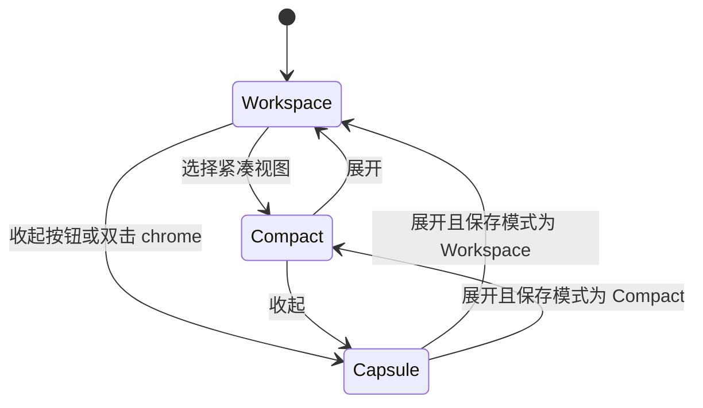
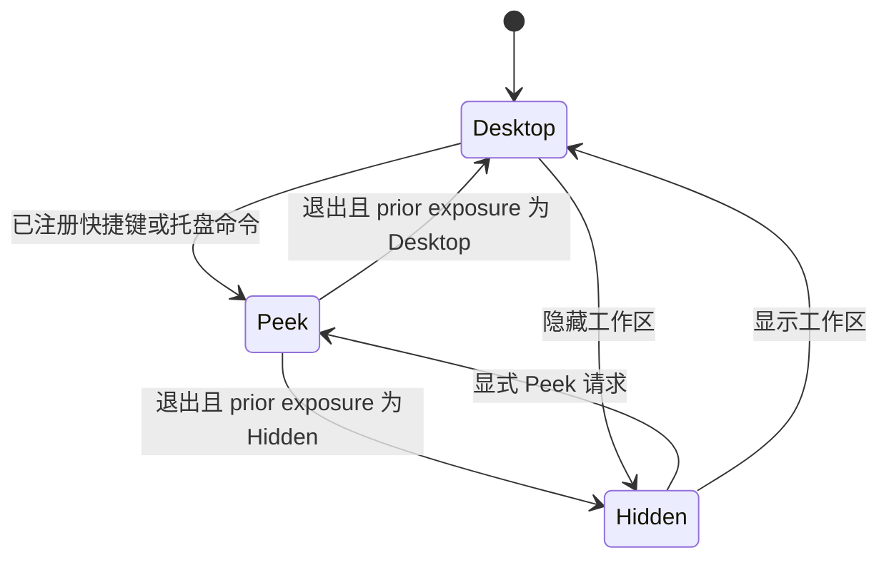
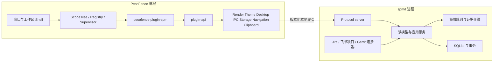
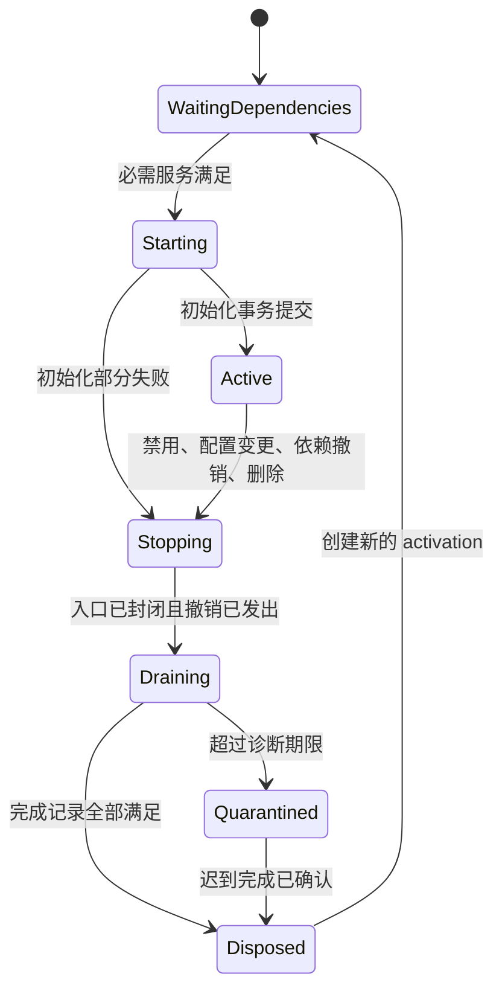
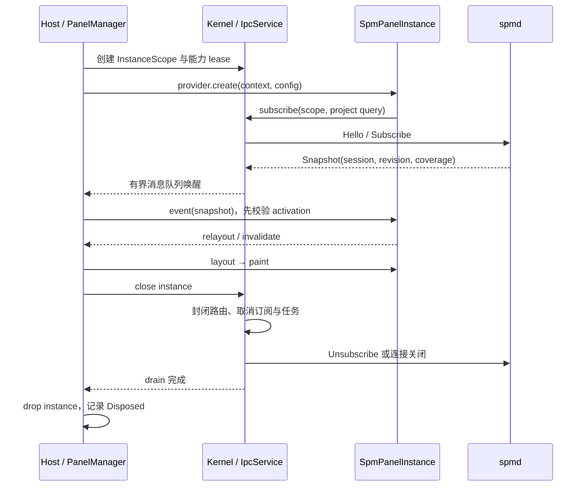

# PecoFence 与 SPM：界面及 Cordis 风格架构重设计规范

日期：2026-09-21。状态：目标设计，供实现与验收使用。本文中的“必须”是实现契约；尺寸、配额、超时和性能预算是初始设计参数，不是现有产品的测量结果。

本轮交付为设计文档和文内 Rust 接口骨架，不表示桌面程序或 daemon 已完成重构。正文中的示例项目、缺陷数量与日期均为设计样例。

## 1. 设计决策与范围

PecoFence 定义为 Windows 桌面工作区宿主，负责容器、输入、布局、合成、桌面层级和插件生命周期。SPM 定义为 Android ODM 多项目交付领域应用，通过第一方插件呈现，由独立 `spmd` 进程采集与计算。

设计起点是项目、交付基线、里程碑、缺陷、客户义务与证据。历史 Excel、已有数据库表和临时导入格式不参与目标模型的定义。目标版本创建独立的配置与数据库命名空间；不提供旧数据导入或迁移链。这里不要求删除现有文件。

| 决策 | 目标契约 |
| --- | --- |
| 工作区作为容器 | 一个窗口可包含多个面板标签；一个面板实例绑定一个项目视图或组合视图 |
| 统一内容协议 | SPM、文件集合与后续面板通过 `PanelProvider` 注册；宿主没有 `SpmPanel` 专用分支 |
| 桌面常驻 | 默认位于桌面图标上方、普通应用窗口下方；Peek 临时改变展示层级 |
| 信息顺序 | 里程碑判断与证据状态 → 待办及责任人 → 趋势与源系统跳转 |
| 静态链接第一方插件 | `pecofence-plugin-spm` 与宿主同一构建；启停是实例生命周期操作，不是 DLL 卸载 |
| 微内核 | scope 树、effect 记录、任务监督、服务依赖、事件路由；不放入 SPM 领域规则 |
| daemon 所有权 | `spmd` 拥有凭据、连接器、数据库、关联证据、规则计算和读模型 |
| 新协议 | 明确版本、会话、请求、订阅和修订号；不受当前 v1 消息格式约束 |
| 事实与未知分离 | 通过、未通过、不适用与无法判定分别表示；断连不自动变成业务失败或业务通过 |
| 写操作边界 | 第一版面板执行读取、刷新、导航、生成与复制简报；不直接修改 Jira、飞书或 Gerrit |

本文取代旧设计中关于界面组织、`FenceContentSpec::SpmPanel` 目标形态、旧数据迁移和新版本协议的约束。既有文档继续作为历史观察记录，不作为新模型的兼容要求。

## 2. 仓库观察与目标差异

核对的 PecoFence HEAD 为 `5d73facf5ec7bb8bf67d0b08ef6cf6e80d7921c3`，SPM HEAD 为 `5f4b1f70fe9d16b780887cd7d0465b814735a95f`。两个工作区均存在未提交修改；以下观察包含这些修改，不能仅通过 HEAD 复现。

| 观察位置 | 当前事实 | 目标处理 |
| --- | --- | --- |
| [app/Cargo.toml](../crates/app/Cargo.toml) | 宿主直接 path 依赖相邻 SPM 仓库的 domain 与 protocol | SPM 依赖收敛到插件；发布使用固定版本依赖 |
| [core/model.rs](../crates/core/src/model.rs) | 存在 `FenceContentSpec::SpmPanel` | 新工作区配置只保存 provider、实例标识和版本化配置 |
| [spm_panel.rs](../crates/app/src/fence_window/spm_panel.rs)、[api.rs](../crates/app/src/fence_window/api.rs) | 面板使用 `PanelClient`，窗口设置 1000 ms 的 SPM 定时器 | 数据推送与失效截止时间驱动更新；无 SPM 专属 Win32 timer |
| [render/lib.rs](../crates/render/src/lib.rs)、[panel.rs](../crates/render/src/panel.rs) | 当前实现为 Windows.UI.Composition visual tree 与 Direct2D surface，绘制输入使用 DIP | 在宿主渲染能力后封装现有 backend；不把它误称为现有经典 `IDCompositionDevice` 实现 |
| [anchor.rs](../crates/app/src/anchor.rs) | 存在桌面锚定、图标 host、Show Desktop 与 Peek 状态 | 提取为宿主 `DesktopService`，插件不查找 Explorer 窗口 |
| [app/peek.rs](../crates/app/src/app/peek.rs) | 当前快捷键选项是 Win+Space、Ctrl+Alt+Space、Win+Shift+Space | 新设计期望 Win+Alt+D；运行时明确显示实际注册结果 |
| [winevent.rs](../crates/platform/src/winevent.rs) | 有 Drop unhook；回调取出后重新插入 map | 采用 registration generation 和 alive 标记，覆盖回调中自撤销场景 |
| [SPM ipc.rs](../../spm/crates/spm-protocol/src/ipc.rs) | v1 为 u32 长度加 JSON，一条连接一个订阅；客户端 Drop 发送停止信号，创建线程的 join handle 未保存 | 新 transport supervisor 保留完成句柄；请求取消与排空完成分别报告 |
| [spmd/main.rs](../../spm/crates/spmd/src/main.rs) | 有采集、可选 SQLite 持久化、订阅发布与每秒 freshness 派生 | 采集、证据与读模型保留在 daemon 边界，重新定义调度及多项目模型 |
| [既有 Cordis 提案](PECOFENCE_CORDIS_PLUGIN_ARCHITECTURE.md) | 包含服务、scope 和旧配置迁移 | 沿用已识别的生命周期约束；取消迁移依赖 |

Cordis 提供 context 服务、声明依赖、事件与可撤销注册的组织方式。本文的 UI apartment、原生 I/O 排空、容器状态和业务数据模型是 PecoFence 的设计，并非 Cordis 已提供的 Windows 功能。[DeepSeek Harness Cordis Primer](https://github.com/deepseek-ai/deepseek-harness/blob/master/docs/cordis-primer.md)、[Cordis Fiber 源码](https://github.com/cordiverse/cordis/blob/main/packages/core/src/fiber.ts)

## 3. 用户任务与信息架构

目标用户为同时负责多个手机项目及客户版本的 SPM。一个“项目”可有多个交付基线，例如硬件 SKU、Android 分支、区域与客户版本。所有统计显式绑定交付基线和规则版本。

| 任务 | 界面入口 | 完成条件 |
| --- | --- | --- |
| 早间检查多项目交付 | 组合总览 | 看到各项目下一里程碑、未满足条件、缺失证据和责任人 |
| 确认单项目是否满足门槛 | 项目 → 交付 | 查看每条门槛的分子、分母、阈值、截止时间和来源 |
| 跟踪缺陷收敛 | 项目 → 缺陷 | 查看固定统计口径下新增、重开、验证关闭和剩余数量 |
| 核对客户承诺 | 项目 → 客户义务 | 每项义务具有交付对象、负责人、期限和验收证据 |
| 跨三系统追踪 | 待办行 → 详情 → 来源 | 查看关联依据，分别进入 Jira、飞书项目、Gerrit 的指定记录 |
| 准备站会 | 项目或组合 → 简报 | 预览有时间与范围标记的简报，用户执行复制 |

导航分为两个层次。宿主标签表示面板实例，例如“组合”“Atlas / EU”“Boreal / IN”。面板内部的“交付、缺陷、客户义务、简报”切换同一实例的视图，不创建第二条项目连接。

默认项目视图保留五类信息：项目及交付范围、门槛摘要、待办队列、证据详情、数据状态。趋势是解释剩余工作的辅助视图，不替代可核查的数量和条件。

### 3.1 初次使用与状态文案

首次进入显示“添加项目视图”和“配置数据源”。数据源配置经插件设置页提交给 daemon，凭据输入由 daemon 管理的配置流程接收；宿主布局配置不保存 token。

| 状态 | 文案样例 | 操作 |
| --- | --- | --- |
| 未选择范围 | 选择项目与交付基线 | 打开范围选择器 |
| 第一次采集 | 正在获取 Jira，飞书项目尚未返回 | 保留数据源逐项进度 |
| 完整且数量为零 | 当前筛选下无待办，共检查 126 条记录 | 清除筛选、查看口径 |
| 没有可用证据 | 尚无可用快照 | 配置数据源、重试 |
| 部分数据 | Gerrit 数据不完整；合入条件无法判定 | 查看失败范围 |
| 过期 | 最近成功采集 09:10，已超过 5 分钟有效期 | 刷新、查看历史快照 |
| daemon 断开 | 后台连接已断开；显示 09:10 的历史快照 | 重连状态、启动后台 |
| 权限失效 | 飞书项目授权已失效 | 打开连接器设置 |
| 协议不兼容 | 后台协议版本不兼容 | 显示宿主与后台版本、打开更新说明 |

刷新按钮收到 accepted 只显示“已请求刷新”；收到新证据后才显示采集完成。禁止把请求成功当作数据已更新。

## 4. 视觉系统

### 4.1 坐标、排版与密度

全部布局以 client-area 左上角为原点，采用 DIP；窗口阴影不参与内容尺寸。基础间距 4 DIP，常用间距 8、12、16、24。标准控件高度 32，触控模式 40；列表默认行高 56，双行说明列表为 72。宽度变化调整列与换行，不同比例缩小字号。

| 令牌 | 数值 | 用途 |
| --- | --- | --- |
| `font.family.ui` | Segoe UI Variable；缺字由 DirectWrite fallback 至系统中文字体 | 拉丁字母、界面中文 |
| `font.family.code` | Cascadia Mono；fallback Consolas | 缺陷编号、提交短 ID |
| `type.caption` | 12 / 16，400 | 时间、数据来源 |
| `type.body` | 14 / 20，400 | 列表、详情正文 |
| `type.label` | 14 / 20，600 | 按钮、选中标签 |
| `type.section` | 16 / 24，600 | 分区标题 |
| `type.title` | 20 / 28，600 | 项目名 |
| `type.metric` | 28 / 36，600，等宽数字特性 | 数量与比例 |
| `radius.container` | 12 | 窗口外框 |
| `radius.surface` / `radius.control` | 8 / 4 | 信息区与按钮 |
| `stroke.separator` | 1 DIP | 表格和边界；高对比度采用系统色 |
| `focus.ring` | 2 DIP，外偏移 2 | 键盘焦点 |

字号与行高均为 DIP。文本缩放独立于 DPI；系统文本比例增大后，行高随内容增加，表格可转换为两行布局。任何关键条件、期限和计数不能仅以 tooltip 提供。

### 4.2 颜色令牌

颜色为不透明 sRGB 基准值。背景材质另行定义，文本前景不随壁纸采样改变。状态同时显示图标和文字。

| 令牌 | 浅色 | 深色 | 语义 |
| --- | --- | --- | --- |
| `surface.base` | `#F4F6F8` | `#171B22` | 后备窗口底色 |
| `surface.panel` | `#FFFFFF` | `#202630` | 正文承载面 |
| `surface.subtle` | `#E9EEF4` | `#2A3340` | 表头、次级区域 |
| `text.primary` | `#17212E` | `#F2F5FA` | 正文 |
| `text.secondary` | `#46586D` | `#B9C5D6` | 时间和辅助信息 |
| `text.disabled` | `#657386` | `#8A98AB` | 不可操作状态 |
| `border.subtle` | `#C6D0DD` | `#435167` | 非交互分隔 |
| `border.control` | `#738399` | `#8496AE` | 必须可辨识的输入边界 |
| `accent.fg` | `#005CB8` | `#8BC3FF` | 链接、选中标记 |
| `accent.bg` | `#E5F0FF` | `#173957` | 选中区域 |
| `status.pass` | `#116B43` | `#80D8A8` | 条件已满足 |
| `status.risk` | `#805200` | `#FFD078` | 距期限不足、计划缺口 |
| `status.fail` | `#B42332` | `#FF9DA8` | 条件未满足、已逾期 |
| `status.unknown` | `#586579` | `#C3CDDB` | 无法判定、覆盖未知 |

目标为正文前景与承载面至少 4.5:1、必要交互边界至少 3:1。验收需覆盖合成后的像素；半透明面不能仅检查原始 token。高对比度模式使用系统颜色、实心背景和边框，关闭 blur 与透明层。

### 4.3 材质与图形

默认正文 surface 不透明；窗口外围和 chrome 使用材质。独立常规窗口可请求 Mica，临时弹出层可请求 Desktop Acrylic，标签 chrome 可请求 Mica Alt。`DWM_SYSTEMBACKDROP_TYPE` 的文档最低客户端为 Windows 11 build 22621；材质由系统决定，不能承诺所有窗口样式均获得相同效果。[Microsoft DWM backdrop 枚举](https://learn.microsoft.com/en-us/windows/win32/api/dwmapi/ne-dwmapi-dwm_systembackdrop_type)

桌面 anchor 窗口、透明 composition target 与 DWM 系统背景的组合须单独验证。选择顺序为：经过验证的系统材质 → 宿主 composition tint/blur → `surface.base` 实心后备。壁纸采样模拟效果应标识为宿主材质，不称为系统 Mica。远程会话、透明关闭、节能或设备恢复时允许直接使用实心后备。

状态图形为 16 DIP，操作图形为 20 DIP。折线区使用 2 DIP 线宽，关闭数与新增数采用线型和文字区分。图表不使用渐变面积表示进度。数据缺失区间断开折线，并可切换数值表。

## 5. DIP 布局规范

### 5.1 默认工作区：1120 × 760

外边距 16，正文宽 1088。下图的数字为位置说明，绘制实现以坐标表为准。

```text
┌──────────────────────────────────────────────────────────────────────┐ y=0
│ 工作区：手机交付                       搜索  设置  收起  关闭视图      │ 40
├──────────────────────────────────────────────────────────────────────┤
│ 组合 │ Atlas / EU │ Boreal / IN │ +                                  │ 36
├──────────────────────────────────────────────────────────────────────┤ y=76
│ Atlas / EU · Android 分支 · 客户版本            TR5 · 09-25 18:00      │
│ [交付]  缺陷  客户义务  简报                                         │
│ 条件未满足 2 项  │ 严重缺陷 5 │ 待验证 11 │ 客户待验收 3              │
│ Jira 09:20 · 飞书 09:18 · Gerrit 覆盖未知        刷新数据              │
├──────────────────────────────────────────┬───────────────────────────┤
│ 待办  客户义务  严重缺陷  待验证  外部阻塞 │ 所选事项                  │
│ 事项 / 责任人 / 期限 / 下一步             │ 义务、缺陷与变更关联      │
│ …                                        │ 来源和确认依据            │
│ …                                        │ Jira  飞书项目  Gerrit    │
├──────────────────────────────────────────┤                           │
│ 14 日缺陷变化：新增 / 重开 / 验证关闭     │ 证据更新时间              │
├──────────────────────────────────────────┴───────────────────────────┤
│ 范围：Atlas EU · 规则 v3 · 最近采集 09:20    生成简报  复制简报       │
└──────────────────────────────────────────────────────────────────────┘ y=760
```

| 区域 | x | y | w | h | 内部规则 |
| --- | ---: | ---: | ---: | ---: | --- |
| 宿主 chrome | 0 | 0 | 1120 | 40 | 左侧拖动区，右侧 32 × 32 控件 |
| 宿主标签 | 0 | 40 | 1120 | 36 | 单标签宽 120–200；溢出进入菜单 |
| 项目与里程碑 | 16 | 88 | 1088 | 44 | 范围选择在左，期限在右 |
| 内部视图导航 | 16 | 140 | 1088 | 32 | 选中条 2 DIP，不复用宿主标签颜色 |
| 指标行 | 16 | 184 | 1088 | 88 | 四格，每格 263，间隔 12 |
| 数据状态条 | 16 | 280 | 1088 | 28 | 最右刷新，来源文本可打开明细 |
| 工作列表 | 16 | 320 | 712 | 248 | 筛选 32，表头 32，滚动区 184 |
| 趋势区 | 16 | 580 | 712 | 132 | 标题 24，绘图区 92，边距 8 |
| 详情区 | 744 | 320 | 360 | 392 | 内边距 16，独立纵向滚动 |
| 底栏 | 16 | 724 | 1088 | 28 | 左侧口径，右侧简报操作 |

列表局部列宽为：状态 32、事项 320、负责人 88、期限 112、下一步 160，总计 712。默认列表每行 56 DIP，184 DIP 可见区显示三行及下一行的一部分，滚动条始终表明还有内容。缺陷视图可将趋势区折叠为 28 DIP，为列表增加 104 DIP。

上述列宽对应 1120 DIP 样例窗口；其他宽工作区固定状态、负责人、期限和下一步列，事项列取 `列表宽−392`。列标题和内容使用同一布局结果。窄工作区取消固定列布局，依次显示事项、负责人/期限、下一步，不保留横向溢出的隐藏操作。

门槛格内展示“已满足条数 / 适用条数”和未满足条件摘要；严重缺陷格显示未关闭数并可查看验证口径。格子点击产生筛选，不直接跳到浏览器。

### 5.2 流式布局与最小尺寸

设窗口宽为 W、高为 H。宽布局中正文宽为 `W−32`，详情宽 360，间隔 16，列表宽为 `W−408`。H 增加时列表获得全部增量；顶部、趋势与底栏保持高度。H 减小时先折叠趋势，再减少列表可见行。

| 模式 | 进入条件或尺寸 | 布局 |
| --- | --- | --- |
| 宽工作区 | W ≥ 1040，H ≥ 680 | 列表与详情并列，四格指标 |
| 中工作区 | 760 ≤ W < 1040，H ≥ 560 | 四格指标；详情替换主区，可返回列表；趋势默认折叠 |
| 窄工作区 | 480 ≤ W < 760，H ≥ 520 | 指标 2 × 2；事项改成双行，详情单页；导航可横向滚动 |
| Compact | 用户选择，默认 480 × 320，最小 400 × 280 | 项目、门槛、前三项待办、数据状态与展开入口 |
| Capsule | 用户选择，默认 360 × 48，最小 280 × 48 | 项目短名、里程碑、未满足数或无法判定、展开按钮 |

正常 resize 的最小值为 480 × 520，不会因拖小而隐式进入 Capsule。工作区不足以容纳时，宿主提供“切换 Compact”，不缩小字体。文本缩放 200% 时 Capsule 高度增为 64，其余模式依据文本度量增高和滚动。

窄工作区与文本放大后的工作区采用正文纵向滚动；宿主 chrome/标签固定，数据状态保留在可访问的固定底栏。指标和筛选不以固定高度挤压到重叠。详情页与列表页分别保存滚动位置。

Compact 480 × 320 坐标：chrome `(0,0,480,36)`；项目 `(12,44,456,32)`；门槛 `(12,84,456,44)`；待办 `(12,136,456,132)`，三行各 44；状态与展开 `(12,280,456,28)`。Compact 不绘制趋势或保留不可见详情树。

Capsule 360 × 48 坐标：拖动图标 `(8,8,32,32)`；项目 `(44,8,112,32)`；里程碑与状态 `(160,8,112,32)`；数据状态按钮 `(276,8,32,32)`；展开 `(316,8,32,32)`。280 宽时项目缩为 88、状态缩为 88，仅保留展开按钮，数据状态合并为状态文案。未知状态优先于装饰性里程碑文本。

### 5.3 组合总览与三系统详情

组合总览沿用宿主 chrome 和标签。顶部提供交付范围、客户、里程碑窗口筛选；主体每行高 64，列为项目/基线、下一里程碑、条件、客户待验收、严重未闭环、数据状态。默认按“逾期 → 七日内 → 其他”分组，组内按截止时间和稳定项目 ID 排序。无法判定独立标记，不被排序为通过。

详情区按“交付义务 → 缺陷 → 代码变更 → 验证证据”展示关联。一个义务可关联多个 Jira、飞书和 Gerrit 记录；一个 Gerrit Change 可有多个 patch set。三系统按钮始终带系统名及数量，多个目标打开选择列表。匹配未确认显示“候选关联”，不自动当作验证闭环。

### 5.4 DPI、命中与多显示器

进程采用 Per-Monitor V2 DPI awareness；`px = DIP × dpi / 96`。保存逻辑尺寸、显示器标识和相对 work area 的位置，不保存上一次的物理像素作为跨屏尺寸。处理 `WM_DPICHANGED` 时应用新 DPI 与系统建议矩形，再约束到目标屏工作区。[Microsoft WM_DPICHANGED](https://learn.microsoft.com/en-us/windows/win32/hidpi/wm-dpichanged)

布局、文字、命中与 UIA 共享一份 `LayoutSnapshot`。相邻列用共同边界换算为像素，避免独立四舍五入产生缝隙。面板事件坐标为内容区 DIP，宿主已经减去 chrome、标签和内容原点。屏幕坐标允许负值。

鼠标按下保存 action ID、layout revision 与 mount generation；抬起时仅在仍命中同一 action、同一有效布局时执行。单纯 repaint 不增加 layout revision。跨屏、滚动、筛选、重排和设备重挂载取消未完成点击。双击 chrome 收起；双击标签进入重命名；内容区双击不收起。

## 6. 交互与状态机

容器不使用一个枚举组合所有状态。采用三个正交维度：`Presentation`（Workspace、Compact、Capsule），`Grouping`（Single、Tabbed），`Exposure`（Desktop、Peek、Hidden）。插件运行状态单独管理。





| 事件 | 状态变化 | 生命周期动作 |
| --- | --- | --- |
| 收起 | 保存展开矩形和 presentation，进入 Capsule | 释放正文 mount，保留实例与摘要订阅；无全文绘制 |
| 展开 | 恢复保存模式与矩形，约束屏幕工作区 | 创建新 mount generation，绘制最新读模型 |
| 切换标签 | active instance 改变 | 原正文 mount 停止；实例保留，订阅降为摘要；新标签订阅详细视图 |
| 标签拖出 | 新建窗口并移动实例绑定 | 旧 mount 排空后创建新 mount；不复制实例和连接 |
| 合并窗口 | 标签加入目标容器 | 被关闭的窗口先解除所有 mount 与桌面注册 |
| 关闭标签 | 删除对应视图配置 | 实例 stop/drain；不删除 daemon 项目数据 |
| 隐藏工作区 | Exposure 为 Hidden | 停止绘制和动画；保留摘要状态 |
| 重启 Explorer | DesktopAnchor generation 改变 | 暂停旧锚定，恢复 host 后重新挂接；面板实例保持 |
| 设备丢失 | render device epoch 改变 | 清除设备资源，重建 surface；保留业务快照 |

### 6.1 Win+Alt+D Peek

期望快捷键为 Win+Alt+D，交互采用按一次进入、再次退出。Windows 保留一部分 Win 组合，其他程序也可能占用；`RegisterHotKey` 失败必须显示“未注册”，可从设置改键或托盘进入，不把期望组合显示为已生效。[Microsoft RegisterHotKey](https://learn.microsoft.com/en-us/windows/win32/api/winuser/nf-winuser-registerhotkey)

进入时创建 `PeekSession`，保存每个窗口的 prior exposure、presentation、矩形、anchor generation 和前台窗口标识。只提升当前虚拟桌面的工作区，临时暂停 desktop anchor 的 z-order 修正。Capsule 可临时展开为 Compact；退出恢复原 presentation。

初次展示使用 no-activate，不改变当前键盘焦点。点击面板后允许正常激活；键盘入口可显式请求激活当前工作区。Escape 在面板获得键盘焦点时退出，快捷键无论焦点位置均可退出。点击其他应用、会话锁定、虚拟桌面切换、显示器移除或 anchor 重建都终止 Peek。禁止用全桌面透明输入窗吞掉用户对其他应用的点击。

退出先撤销 topmost，再依据当前 desktop host 重算层级。旧 HWND 与旧 z-order 不能直接恢复。只有在 PecoFence 仍持有由本次 Peek 获取的前台状态时才尝试归还焦点，不抢回用户已经切换到的应用。

### 6.2 键盘、可访问性与反馈

焦点顺序为宿主标签 → 范围 → 面板视图导航 → 指标 → 筛选 → 列表 → 详情 → 底栏。Ctrl+Tab 切换宿主标签；方向键在同一 tablist 内移动；Enter 打开事项；Alt+Left 返回列表；Ctrl+C 在列表选中项上复制事项摘要。Ctrl+Shift+C 打开简报预览，不在未预览时隐式替换剪贴板。

面板构建语义树，宿主映射为 UI Automation providers。列表提供 Selection、Scroll、VirtualizedItem，对按钮提供 Invoke，对标签提供 SelectionItem。自绘控件需要实现 UIA provider，不能因为 Direct2D 绘制而省略可访问性。[Microsoft UI Automation providers](https://learn.microsoft.com/en-us/windows/win32/winauto/uiauto-providersoverview)

UIA RuntimeId 由 instance activation 和 node ID 组成；卸载后查询返回 element unavailable。跨线程 UIA 调用只读不可变语义快照，动作排队到 UI 线程，不在 WndProc 持锁等待 COM 回调。数据刷新不重置焦点与阅读位置；状态播报只在业务状态或连接状态变化时触发。

动效参数：hover 80 ms、模式转换 160 ms、Peek 120 ms、详情切换 120 ms。动画只改变 opacity、clip 和 transform；结束时提交目标布局。系统减少动画时全部直接切换。不得通过持续脉冲或循环颜色变化提示阻塞。

## 7. 新领域模型与可核查的交付判断

### 7.1 实体与关联

| 实体 | 主键与核心字段 | 关系 |
| --- | --- | --- |
| Project | ProjectId、名称、时区、责任组 | 多个 DeliveryScope |
| DeliveryScope | ScopeId、ProjectId、客户、SKU、区域、分支、版本、有效期 | 多个 Milestone 与 ReleaseBaseline |
| ReleaseBaseline | BaselineId、build ID、branch、manifest revision、创建时间 | 明确代码与验证对应的交付版本 |
| Milestone | MilestoneId、目标时间、阶段、PolicyVersion | TR 阶段名称由项目配置，不硬编码数量 |
| Defect | DefectId、severity、owner、规范化 lifecycle | 通过 SourceRef 关联原系统记录 |
| CustomerObligation | ObligationId、客户记录、约定内容、负责人、due_at、acceptance | 多对多关联缺陷和交付基线 |
| Change | ChangeId、repository、branch、patch set、merge state | 多对多关联缺陷；合入与验证关闭分别记录 |
| Verification | VerificationId、baseline、结果、执行时间、证据引用 | 回归结果必须对应具体交付基线 |
| RelationEvidence | 端点、关系种类、依据、确认状态、确认人、时间 | 明示标识匹配、人工确认或候选推断 |
| SourceObservation | SourceRef、source_revision、observed_at、payload hash | 每次源系统观察可追溯 |
| Coverage | source、范围、分页完成、权限覆盖、watermark、错误 | 不将返回空列表解释为完整覆盖 |

`SourceRef = (system, tenant, project, record_kind, record_id)`；缺陷标题不是唯一键。关联是一张带证据的多对多图，不把“三系统”建模成每个缺陷固定三个 URL。

### 7.2 门槛计算

每个 `GateRule` 包含适用范围、所需数据源、分母定义、分子状态、阈值、截止时间和允许例外。输出 `Satisfied / Unsatisfied / Unknown / NotApplicable`，同时返回证据、实际值与原因码。总体判断规则为：存在可证实的 Unsatisfied → Unsatisfied；否则存在必需 Unknown → Unknown；否则所有适用条件满足 → Satisfied；无适用条件 → NotApplicable。即使已知失败，也单独显示未知证据数量。

对于“验证关闭比例 ≥ T”规则，T 用有理数 `p/q` 表示，N 为纳入口径的缺陷总数，V 为对应基线已验证关闭数：

```text
required = ceil(N × p / q)
gap = max(0, required − V)
示例：N=43，V=38，p=95，q=100 → required=41，gap=3
```

整数运算使用 checked 宽整数，禁止浮点百分比四舍五入后判断通过。N=0 时按规则定义为 NotApplicable 或显式通过，不能默认显示 100%。排除项、豁免和分母变更独立记账。Gerrit merged 仅证明变更合入；不推导客户验收或指定 build 的验证通过。

期限使用带时区的业务规则，存储 UTC instant 与项目 IANA timezone；“还有 3 天”同时可查看绝对时间。按自然日还是工作日由规则标识，未配置工作日历不推断节假日。

### 7.3 缺陷燃尽与趋势

默认显示 14 日区间，项目时区日终采样。图表提供 cohort-fixed（锁定里程碑基线）和 live-scope（当前范围）两种明确口径。公式为 `剩余(t)=剩余(t−1)+新增+重开−验证关闭−移出范围`，移入和移出分别可查看。严重性变化保留历史事件，不能用今天严重性覆盖过去曲线。

计划线来自已保存的交付计划，缺少计划时显示“未设置计划线”。预计关闭时间作为可选派生值单独显示算法、观察窗口与不确定范围；首版不依赖预测结果作门槛判断。缺少某日覆盖时该点标为缺失，不连成连续下降曲线。

### 7.4 新鲜度与一致性

快照包含 `daemon_session`、`revision`、`computed_at`、各源 `observed_at`、coverage、policy revision 和 freshness TTL。revision 仅在一个 daemon session 内单调递增。多数据源快照记录来源向量，表示聚合读模型，不宣称跨系统原子事务。

默认设计参数：活跃项目采集间隔 60 秒，非活跃 300 秒；Jira/飞书 TTL 300 秒，Gerrit TTL 120 秒，可按连接器调整。UI 按各源最后成功时间与接收时基计算过期，不以 UI repaint 或 heartbeat 重置证据时间。系统时钟回拨或异常偏差触发时间不确定状态；单调时钟用于接收后的 TTL 消耗。

离线期间显示历史快照并标注“当前状态无法判定”，可展开查看历史门槛结果。新快照必须整体替换读模型，不把旧分母、新分子和不同规则版本拼接。

### 7.5 站会简报

简报为确定性模板，由 daemon 对同一 snapshot revision 生成，插件只负责预览排版。包含：日期/时区/范围、下一里程碑、未满足条件、客户待验收、前三项待办及责任人、较上一工作日变化、来源缺失与链接。变化基线不存在时显示“无可比较基线”。复制操作固定预览 revision；新数据到达提示可刷新预览。

```text
Atlas / EU · TR5 · 截止 2026-09-25 18:00 Asia/Shanghai
证据：Jira 09:20；飞书项目 09:18；Gerrit 覆盖未知
条件：严重缺陷验证关闭 38/43，阈值 95%，还需 3 项
客户义务：待验收 3 项，其中到期 1 项
今日跟进：客户义务 C-104，负责人 王某，下一步 确认验收结果
限制：代码合入条件无法判定
```

复制纯文本与可选 HTML 格式，成功提示 2 秒。ClipboardService 完成交接后，scope 卸载不清空用户剪贴板；外部已完成副作用不纳入 Undo 回滚。

## 8. 宿主、插件与 daemon 边界



### 8.1 Rust crate 拆分

| 仓库 / crate | 责任 | 允许依赖 |
| --- | --- | --- |
| PecoFence `pecofence-types` | 几何、标识、输入、语义节点、工作区配置 | std、serde、uuid |
| `pecofence-plugin-api` | 能力接口、面板协议、错误、版本 | types；不依赖 Win32 |
| `pecofence-plugin-kernel` | scope、registry、graph、任务记录、PanelManager | plugin-api；不依赖 app 或 SPM |
| `pecofence-platform` | HWND、COM、WinEvent、desktop、管道底层适配 | Windows bindings |
| `pecofence-render` | Direct2D/Composition、字体、资源缓存 | platform、types、plugin-api |
| `pecofence-host` | 工作区控制器、service adapters、输入路由、设置 | kernel、platform、render |
| `pecofence-plugin-spm` | 读模型消费、面板布局、领域动作映射 | plugin-api、spm-contracts |
| `pecofence-plugin-files` | 文件集合内容、Shell 能力的受控使用 | plugin-api、文件领域契约 |
| `pecofence` 二进制 | 构建服务与注册内置 provider 的组合根 | host、内置插件 |
| SPM `spm-domain` | 纯规则、实体、证据与时间口径 | 不依赖 UI、SQLite、HTTP |
| `spm-application` | 查询、采集协调、读模型投影 | domain、存储与连接器端口 |
| `spm-contracts` | 版本化 DTO、错误码、协议 schema | serde；不导出数据库实体 |
| `spm-store-sqlite` | repository、读模型事务与保留策略 | application/domain 端口、SQLite |
| `spm-connectors` | HTTP 连接器、分页、限流、凭据引用 | application 端口 |
| `spmd` | 组合根、运行时、IPC server、调度器 | 上述 SPM crates |
| `spm-cli` | 配置、诊断与查询客户端 | contracts |

SPM 插件不依赖 `spm-domain`，避免 UI 复制业务判定。协议 DTO 是读模型与命令契约，不是整个领域模型的序列化导出。`spm-widget` 不作为目标版本的第二套桌面宿主；需要独立入口时由 PecoFence 打开对应 workspace。

开发时可以使用本地 workspace patch，发布构建锁定 `spm-contracts` 的版本与校验来源，不要求用户机器存在相邻源码仓库。插件 API 为同工具链静态 Rust 接口，不承诺跨 DLL ABI。未来第三方插件走独立进程和消息协议，不能把 `Box<dyn PanelInstance>` 传过动态库边界。

### 8.2 线程与内存所有权

UI STA 线程拥有 HWND、面板实例、Render/Theme/Desktop adapters、布局和输入。I/O runtime 拥有 pipe、连接重试与消息编解码；存储服务在工作线程执行磁盘事务。跨线程传 `Arc` 不可变 DTO、命令和 generation，不传 HWND、COM drawing session、裸指针或 `Rc<RefCell<PanelState>>`。

daemon 运行独立的 Tokio runtime；数据库写入经单 writer 调度。宿主关闭只断开自己的订阅，不终止仍被其他客户端使用的 daemon。首次连接失败时可按显式配置启动已安装 `spmd`；记录启动错误和版本，不无限重复创建进程。daemon 的自启动与退出策略由它自己的配置管理。

## 9. 时序组合：scope、Undo 与两阶段停止

### 9.1 scope 树和标识

```text
RootScope
├─ ServiceScope(Render / Theme / Desktop / IPC / Storage / Navigation / Clipboard)
├─ PluginScope(spm provider)
│  ├─ InstanceScope(Atlas, activation=7)
│  │  ├─ MountScope(window=3, mount=12)
│  │  │  └─ GestureScope(pointer capture)
│  │  └─ SubscriptionScope(query=DeliveryOverview)
│  └─ InstanceScope(Boreal, activation=2)
└─ ShellScope
   ├─ WindowScope(3)
   └─ PeekScope
```

每个 scope 只有一个拥有型父边，由 kernel arena 持有。Mount 属于 Instance，受 WindowScope 的撤销约束；它没有第二个拥有型父节点。service dependency 为独立有向图，不混入 scope 树。

持久化 `InstanceId` 与运行时 `activation` 分开。mount、窗口、服务、设备、布局各有独立 generation。计数溢出返回错误，不 wrap。所有异步消息携带 instance activation，涉及绘制或输入的消息另带 mount generation；原始 HWND 值不是身份。

### 9.2 effect 注册契约

effect 记录包含 ID、scope、注册序号、资源种类、创建位置、撤销状态、停止动作和完成记录。acquire-and-track 必须为一个能力操作：资源创建后先进入局部 RAII guard，再转交 scope；scope 已关闭或登记失败时立即回滚。禁止“先成功注册回调，稍后再登记释放”。

scope 的 Undo 栈按注册逆序执行。子 scope 的 stop 屏障先于父资源最终释放；同一资源的停止与销毁分别记录。Undo 的含义是撤销后续作用，不意味着所有外部结果都能逆转。浏览器已打开、剪贴板已写入、事务已提交均不会在卸载时倒退。

对异步资源，Undo 先返回或关联一个 drain obligation，直到其完成才可执行 destroy。原生 I/O 缓冲、回调 tombstone 和 COM owner 不能放进立即释放的 closure。单条 LIFO 栈不能替代跨 scope 的依赖顺序。

### 9.3 stop / drain 算法

1. UI turn 边界将目标 scope 子树全部标为 Stopping；封闭能力调用、事件投递、后台提交与 effect 注册。先标记所有后代，后执行任何用户回调。
2. 使所有路由与 lease 失效，移除输入捕获、timer/hook 入口和订阅；给任务发出取消。允许此时已有的回调退出，但不能启动新的回调。
3. 对每个 scope 执行 stop Undo，子节点先行、节点内部 LIFO；把仍被 I/O 或 callback 使用的资源转入 drain ledger，不提前 drop。
4. 进入 Draining。supervisor 保留 JoinHandle、native pending-op、callback-in-flight 和 cleanup obligation；UI 继续泵消息，不在 WndProc 中 join 或 block_on。
5. 完成通知进入内核专用 control lane，该通道不受插件业务事件撤销影响。待所有依赖资源完成后，在所属线程运行 destroy LIFO。
6. drop PanelInstance、mount 数据和租约引用；所有子 scope 与 ledger 均为空才记录 Disposed。然后才能销毁依赖服务的后端资源。



初始诊断期限 5 秒。超时保留资源所有权并报告 Quarantined，不报告成功、不强杀线程、不为同一实例继续累积新 activation。需要同一独占服务的新实例继续等待。宿主可提示重启进程；进程退出由 OS 回收不等于运行时卸载验证通过。

`Drop` 只能发起同步兜底，不能作为异步排空的唯一入口。Tokio JoinHandle 被丢弃会 detach；abort 请求之后仍需观察完成。`spawn_blocking` 的已运行任务不能依赖 abort 终止。[Tokio JoinHandle](https://docs.rs/tokio/latest/tokio/task/struct.JoinHandle.html)

`CancelIoEx` 不等待取消完成；OVERLAPPED 与 buffer 保持有效，直到完成结果已观察到。取消和正常完成可能竞争，完成账本必须去重。[Microsoft CancelIoEx](https://learn.microsoft.com/en-us/windows/win32/api/ioapiset/nf-ioapiset-cancelioex)

### 9.4 原生资源释放矩阵

| 资源 | Stop | Drain 证据 | Destroy |
| --- | --- | --- | --- |
| Win32 timer | KillTimer，撤销 route generation | 已排队消息只经过 tombstone 检查 | 移除记录；不复用旧 route key |
| WinEvent hook | alive=false，再 UnhookWinEvent | 当前 callback-in-flight=0 | 在安装线程移除 closure 与 hook 记录 |
| pointer capture | 取消 gesture、ReleaseCapture | 当前事件返回 | 清理 gesture 状态 |
| named pipe | 停止新写入，取消 pending read/write | 所有 I/O 完成，reader/writer task joined | 释放 buffer、handle、连接记录 |
| Tokio task | cancel token，必要时 abort | join 已观察 | 删除任务记录 |
| std thread | 协作取消 | 非 UI 路径完成 join | 删除记录 |
| D2D draw/clip | 停止新增 draw | 当前绘制栈返回、Begin/End 成对 | 在 UI 线程释放资源 |
| DComp/Composition target | 停止动画，detach visual | 无进行中的提交访问、mount 已清空 | target/surface 引用按 owner 顺序 drop |
| HWND / OLE | 关闭 mount、撤销 drop target | 无窗口绑定的 callback 使用状态 | DestroyWindow，WM_NCDESTROY 清 userdata |
| COM apartment | 停止所有相关 scope | apartment 对象已在所属线程释放 | 最后执行匹配的反初始化 |

WinEvent 必须在安装线程 unhook，kernel 不把它作为任意线程可执行的 Send cleanup。[Microsoft UnhookWinEvent](https://learn.microsoft.com/en-us/windows/win32/api/winuser/nf-winuser-unhookwinevent)

回调执行期间如自撤销，返回时检查 registration ID、alive 和 generation，不能无条件重新插入 callback map。事件派发不持有 registry 或实例 `RefCell` 借用进入插件回调；回调返回的宿主命令在当前调用栈退出后执行。

生产构建当前使用 `panic=abort`。第一方插件 panic 可终止宿主；本文不承诺进程内 panic 隔离。scope 协议保证适用于遵守能力接口且正常返回的代码；恶意插件、无限循环与绕过 supervisor 的资源创建需要进程隔离。

## 10. 空间组合：ServiceRegistry 与 PluginContext

### 10.1 服务解析与反应式依赖

服务键包含 `namespace + name + API major`，服务记录包含 provider scope、可见域、generation、Ready/Revoking/Absent 状态。根、工作区和实例域逐级解析；仅配置明确的覆盖可遮蔽父服务。相同域同键重复发布为错误，不采用“最后写入覆盖”。

类型化 `Capability<dyn Service>` 通过弱引用访问 registry cell，绑定消费 scope 和 service generation。每次调用与异步结果提交均验证有效性。插件不能获得可独立延长后端寿命的裸 `Rc<ServiceImpl>`。内部可使用 Any 做注册表擦除，但只能由编译期 typed key 转换，不能以字符串强转对象。

必需服务缺失使 activation 停留 WaitingDependencies；可选服务缺失产生 UI 降级事件。服务依赖图在发布前检查环与版本。服务 A 依赖 B，则 B 撤销时先停止 A 的消费者，再停止 A，再销毁 B。

替换事务：验证候选配置与依赖图 → 构建不可见的新 generation → 旧服务 Revoking → 反向拓扑停止受影响消费者 → 等待旧消费者 drain → 销毁旧 generation → 发布新服务 → 按正向拓扑启动新 activation。任一消费者 Quarantined 时旧后端保持，替换事务不越过屏障。

Theme 的色值变化是同一服务的版本化数据更新，不重启插件。Render 的 device loss 是设备 epoch 变化，不等于 RenderService 被撤销。只有服务实例或契约代际改变才触发依赖重启。

### 10.2 七项能力

| 服务 | 插件可请求 | 宿主掌握 | SPM 依赖 |
| --- | --- | --- | --- |
| RenderService | 文字度量、布局资源 token、invalidate | surface、COM、设备、frame clock、缓存配额 | 必需 |
| ThemeService | immutable token snapshot、主题通知 | 系统主题、高对比、文本缩放 | 必需 |
| DesktopService | 容器状态、模式切换意图、显示器逻辑信息 | HWND、z-order、anchor、Peek、DPI | 必需 |
| IpcService | 在命名 endpoint 上发送与订阅、有界数据事件 | pipe、runtime、重连、取消、ACL 校验 | 必需 |
| StorageService | scoped key/value、CAS 版本写入 | 路径、原子写、I/O 线程、配额 | 必需 |
| NavigationService | 打开已解析的外部目标 | URI 校验、shell 调用、错误提示 | 可选；缺失禁用链接 |
| ClipboardService | 写入文本/HTML | clipboard ownership、格式、busy 重试 | 可选；缺失保留预览 |

内部 TaskSupervisor、事件队列和诊断由 kernel 提供，不作为任意插件可取得的 Tokio runtime。SPM 插件不拥有自己的 thread spawn 入口。所有产生资源的服务方法自带 consumer scope，返回的 token 仅用于提前取消。

StorageService 仅存宿主视图偏好和插件配置，不存 SPM 权威数据或凭据。插件 namespace 有独立配额。更改布局使用期望 revision 的 CAS，后台写入失败在界面显示“设置未保存”，不阻塞拖动。

NavigationService 接受结构化目标，校验 HTTPS、配置的源系统 origin 和编码后的记录路径；拒绝 `file:`、`javascript:`、任意程序执行和携带凭据的 URL。daemon 解析源记录，宿主再校验打开策略。已经打开的浏览器不随 scope 卸载关闭。

## 11. Rust 接口骨架

以下单一代码块仅依赖标准库，可作为 library 编译。它定义动态分发边界、scope 本地撤销模型与能力租约；不包含 Win32 backend、完整 ScopeTree、supervisor、IPC 编解码或领域实现。`LocalUndo` 仅适用于同步可释放的注册；异步 native resource 必须由第 9 节 drain ledger 持有。

```rust
use std::cell::{Cell, RefCell};
use std::rc::{Rc, Weak};
use std::sync::Arc;

#[derive(Clone, Copy, Debug, PartialEq, Eq, Hash)]
pub struct InstanceKey { pub id: u128, pub activation: u64 }
#[derive(Clone, Copy, Debug, PartialEq, Eq, Hash)]
pub struct MountKey { pub instance: InstanceKey, pub generation: u64 }
#[derive(Clone, Copy, Debug, PartialEq, Eq, Hash)]
pub struct ScopeId(pub u64);
#[derive(Clone, Copy, Debug, PartialEq, Eq, Hash)]
pub struct Token(pub u64);
#[derive(Clone, Copy, Debug)]
pub struct RectDip { pub x: f32, pub y: f32, pub w: f32, pub h: f32 }
#[derive(Clone, Copy, Debug)]
pub enum Presentation { Workspace, Compact, Capsule }
#[derive(Clone, Copy, Debug, PartialEq, Eq)]
pub enum Phase { Open, Stopping, LocalClosed }
#[derive(Debug)]
pub enum Error { Closed, Revoked, Invalid(String), Backend(String) }
pub type Result<T> = std::result::Result<T, Error>;
pub type LocalUndo = Box<dyn FnOnce() -> Result<()>>;

pub struct LocalScope {
    id: ScopeId,
    phase: Cell<Phase>,
    closing: Cell<bool>,
    undos: RefCell<Vec<LocalUndo>>,
    errors: RefCell<Vec<Error>>,
}
#[derive(Clone)]
pub struct ScopeHandle(Weak<LocalScope>);
impl LocalScope {
    pub fn new(id: ScopeId) -> Rc<Self> {
        Rc::new(Self {
            id, phase: Cell::new(Phase::Open), closing: Cell::new(false),
            undos: RefCell::new(Vec::new()), errors: RefCell::new(Vec::new()),
        })
    }
    pub fn handle(this: &Rc<Self>) -> ScopeHandle {
        ScopeHandle(Rc::downgrade(this))
    }
    pub fn begin_stop(&self) {
        if self.phase.get() == Phase::Open { self.phase.set(Phase::Stopping); }
    }
    pub fn close_local(&self) {
        if self.phase.get() == Phase::LocalClosed { return; }
        if self.closing.replace(true) { return; }
        self.begin_stop();
        let mut undos = std::mem::take(&mut *self.undos.borrow_mut());
        while let Some(undo) = undos.pop() {
            if let Err(error) = undo() { self.errors.borrow_mut().push(error); }
        }
        self.phase.set(Phase::LocalClosed);
        self.closing.set(false);
    }
    pub fn take_errors(&self) -> Vec<Error> {
        std::mem::take(&mut *self.errors.borrow_mut())
    }
}
impl Drop for LocalScope {
    fn drop(&mut self) { self.close_local(); }
}
impl ScopeHandle {
    pub fn check(&self) -> Result<ScopeId> {
        let scope = self.0.upgrade().ok_or(Error::Closed)?;
        match scope.phase.get() {
            Phase::Open => Ok(scope.id),
            _ => Err(Error::Closed),
        }
    }
    pub fn defer(&self, undo: LocalUndo) -> Result<()> {
        if let Some(scope) = self.0.upgrade() {
            if scope.phase.get() == Phase::Open {
                scope.undos.borrow_mut().push(undo);
                return Ok(());
            }
        }
        undo()?;
        Err(Error::Closed)
    }
}

// Kernel owns these cells; plugin-api exposes only Capability.
struct ServiceCell<S: ?Sized> {
    generation: u64,
    ready: Cell<bool>,
    service: Box<S>,
}
pub struct Capability<S: ?Sized> {
    cell: Weak<ServiceCell<S>>,
    generation: u64,
    consumer: ScopeHandle,
}
impl<S: ?Sized> Capability<S> {
    pub fn with<R>(&self, call: impl FnOnce(&S) -> Result<R>) -> Result<R> {
        self.consumer.check()?;
        let cell = self.cell.upgrade().ok_or(Error::Revoked)?;
        if cell.ready.get() && cell.generation == self.generation {
            call(&cell.service)
        } else {
            Err(Error::Revoked)
        }
    }
}

pub struct ThemeSnapshot { pub revision: u64, pub high_contrast: bool }
pub struct TextSpec { pub text: String, pub size_dip: f32 }
pub struct TextMetrics { pub width: f32, pub height: f32 }
pub struct Query { pub endpoint: String, pub payload: Arc<[u8]> }
pub struct ExternalTarget { pub system: String, pub https_uri: String }
pub struct VersionedValue { pub revision: u64, pub bytes: Arc<[u8]> }

pub trait RenderService {
    fn measure(&self, text: &TextSpec, width: f32) -> Result<TextMetrics>;
    fn invalidate(&self, mount: MountKey, rect: Option<RectDip>) -> Result<()>;
}
pub trait ThemeService {
    fn snapshot(&self) -> Result<Arc<ThemeSnapshot>>;
}
pub trait DesktopService {
    fn request_mode(&self, instance: InstanceKey, mode: Presentation) -> Result<()>;
}
pub trait IpcService {
    fn subscribe(&self, scope: &ScopeHandle, query: Query) -> Result<Token>;
    fn send(&self, scope: &ScopeHandle, payload: Arc<[u8]>) -> Result<Token>;
    fn cancel(&self, token: Token) -> Result<()>;
}
pub trait StorageService {
    fn read(&self, scope: &ScopeHandle, key: &str) -> Result<Token>;
    fn compare_and_set(
        &self, scope: &ScopeHandle, key: &str,
        expected: Option<u64>, bytes: Arc<[u8]>,
    ) -> Result<Token>;
}
pub trait NavigationService {
    fn open(&self, scope: &ScopeHandle, target: ExternalTarget) -> Result<Token>;
}
pub trait ClipboardService {
    fn write_text(&self, scope: &ScopeHandle, text: String) -> Result<Token>;
}

pub struct PluginContext {
    pub scope: ScopeHandle,
    pub render: Capability<dyn RenderService>,
    pub theme: Capability<dyn ThemeService>,
    pub desktop: Capability<dyn DesktopService>,
    pub ipc: Capability<dyn IpcService>,
    pub storage: Capability<dyn StorageService>,
    pub navigation: Option<Capability<dyn NavigationService>>,
    pub clipboard: Option<Capability<dyn ClipboardService>>,
}
pub struct ProviderDescriptor {
    pub id: &'static str,
    pub api_major: u16,
    pub config_major: u16,
    pub required_services: &'static [&'static str],
}
pub struct PanelConfig { pub version: u16, pub bytes: Arc<[u8]> }
pub struct CreatePanel { pub key: InstanceKey, pub config: PanelConfig }
pub struct MountContext {
    pub key: MountKey,
    pub scope: ScopeHandle,
    pub viewport: RectDip,
    pub dpi: u32,
}
pub struct LayoutInput {
    pub viewport: RectDip,
    pub mode: Presentation,
    pub text_scale: f32,
}
pub struct HitNode { pub id: u64, pub rect: RectDip, pub action: u64 }
pub struct SemanticNode {
    pub id: u64, pub parent: Option<u64>, pub role: String,
    pub name: String, pub rect: RectDip, pub action: Option<u64>,
}
pub struct LayoutSnapshot {
    pub revision: u64, pub hits: Vec<HitNode>, pub semantics: Vec<SemanticNode>,
}
pub trait Canvas {
    fn fill(&mut self, rect: RectDip, rgba: [f32; 4]) -> Result<()>;
    fn text(&mut self, rect: RectDip, text: &TextSpec) -> Result<()>;
}
pub enum PanelEvent {
    Invoke { action: u64, layout_revision: u64 },
    Snapshot { subscription: Token, bytes: Arc<[u8]> },
    Completion { operation: Token, result: Result<Arc<[u8]>> },
    ThemeChanged { revision: u64 },
    VisibilityChanged { visible: bool },
    SuspendInput,
}
pub enum HostCommand { Invalidate, SetTitle(String), RequestMode(Presentation) }
pub struct PanelUpdate { pub commands: Vec<HostCommand>, pub relayout: bool }
pub enum StopReason { Disabled, Deleted, Reconfigured, DependencyLost, Shutdown }

pub trait PanelProvider {
    fn descriptor(&self) -> ProviderDescriptor;
    fn validate(&self, config: &PanelConfig) -> Result<()>;
    fn create(&self, ctx: PluginContext, input: CreatePanel)
        -> Result<Box<dyn PanelInstance>>;
}
pub trait PanelInstance {
    fn mount(&mut self, ctx: MountContext) -> Result<()>;
    fn event(&mut self, event: PanelEvent) -> Result<PanelUpdate>;
    fn layout(&mut self, input: LayoutInput) -> Result<LayoutSnapshot>;
    fn paint(&self, canvas: &mut dyn Canvas, layout: &LayoutSnapshot) -> Result<()>;
    fn unmount(&mut self, key: MountKey);
    fn begin_stop(&mut self, reason: StopReason);
}

// Compile-time use of dynamic dispatch, with no HWND or WndProc in the API.
pub fn validate_provider(p: &dyn PanelProvider, c: &PanelConfig) -> Result<()> {
    p.validate(c)
}
pub fn stop_panel(p: &mut dyn PanelInstance, reason: StopReason) {
    p.begin_stop(reason);
}

// Kernel-side ownership sketch; these records are not plugin capabilities.
pub enum RuntimePhase {
    WaitingDependencies, Starting, Active, Stopping,
    Draining, Quarantined, Disposed,
}
pub type JoinCompletion = std::pin::Pin<
    Box<dyn std::future::Future<Output = Result<()>> + Send>
>;
pub struct TaskRecord {
    pub owner: ScopeId,
    pub cancel: Option<Box<dyn FnOnce() + Send>>,
    pub join: JoinCompletion,
}
pub struct DrainLedger {
    pub tasks_pending: usize,
    pub native_ops_pending: usize,
    pub callbacks_in_flight: usize,
    pub cleanup_in_flight: usize,
    pub children_pending: usize,
}
impl DrainLedger {
    pub fn ready_for_destroy(&self) -> bool {
        self.tasks_pending == 0 && self.native_ops_pending == 0
            && self.callbacks_in_flight == 0 && self.cleanup_in_flight == 0
            && self.children_pending == 0
    }
}
pub struct ScopeRecord {
    pub id: ScopeId,
    pub parent: Option<ScopeId>,
    pub children: Vec<ScopeId>,
    pub phase: RuntimePhase,
    pub local: Rc<LocalScope>,
    pub ledger: DrainLedger,
    // Native owners stay captured here until completion is observed.
    pub destroy_lifo: Vec<LocalUndo>,
}
```

`PanelProvider` 与 `PanelInstance` 没有泛型方法、关联常量、返回 Self 或直接 async trait 方法，能够通过 dyn 分发。`Capability::with` 是具体泛型包装器的方法，不影响面板 trait 的对象安全。Rust Reference 使用 dyn compatibility 描述这一约束。[Rust dyn compatibility](https://doc.rust-lang.org/reference/items/traits.html#dyn-compatibility)

此骨架中的 fields 为解释接口开放，正式 crate 将 context/lease 构造器设为 kernel 私有并通过 builder 建立。实际 service methods 必须确认传入 scope 与 token 属于调用者；仅靠 `ScopeHandle::check` 不构成权限隔离。`Token` 正式定义包括 owner、activation、service generation 和 checked sequence。

`mount` 失败由宿主停止已创建的 MountScope；实例可保留错误视图。`begin_stop` 是幂等通知，kernel 即使遇到插件返回错误也继续撤销已登记资源。`unmount` 在 mount 入口已关闭、当前调用栈退出后运行，只释放实例侧的 mount 状态，不等待后台。`paint` 不执行 I/O、领域计算或修改布局。

`LocalScope::close_local` 用于已标记停止的本地 effect 层，不能单独证明 Disposed。正式 ScopeTree 先对整棵子树 begin_stop，再执行对应的本地 close 和 ledger 完成。正式版还须支持 EffectId 提前撤销、tombstone 压缩、重入队列和当前 cleanup 执行深度。

`TaskRecord` 由 supervisor 保管直到 join 返回；丢弃这条记录不是取消协议。`DrainLedger` 正式版按 TaskId/NativeOpId 保存集合，计数为派生值，以去重迟到完成。`ready_for_destroy` 只表示可开始最终释放，执行 `destroy_lifo` 成功且无新增完成义务后才可变更为 Disposed。后台任务输出的错误需转换为可跨线程传递的错误 DTO。

## 12. SPM 插件与数据流

目标插件模块为 `provider.rs`、`instance.rs`、`view_model.rs`、`layout.rs`、`actions.rs`、`semantics.rs`。`view_model` 只把 DTO 转为显示值，不计算 gate。

实例状态包含：InstanceKey、PluginContext、已验证的配置、最新 `Arc<ProjectSnapshot>`、当前 view/filter、选中 record ID、滚动锚点、布局 revision、可选 MountState、连接状态。滚动锚点绑定稳定 record ID 加偏移，刷新不依赖旧行号。



后台消息通过宿主有界队列进入 UI；Win32 message 只负责唤醒，不把堆分配的裸指针放入 LPARAM。未消费的 payload 由队列所有权回收。项目切换、实例删除或服务重启后的迟到 snapshot 因 activation/session 不匹配被丢弃。

点击来源时，插件发送 `ResolveNavigation(source_ref, snapshot_revision)`；daemon 返回结构化目标或 stale/missing 错误。打开前再次核对当前 action token。关闭实例后未执行的导航请求取消；已由 Shell 打开的页面不回滚。

## 13. IPC、daemon 与新存储

### 13.1 协议与连接

目标管道名为 `\\.\pipe\pecofence.spmd.v2.<user-sid>.<session-id>`。仅本地连接，使用显式 DACL 约束当前用户与必要系统主体，创建第一实例防止重复 server，拒绝远程客户端。SID 出现在名字里不是认证。客户端确认 server 所属用户与安装身份；同用户恶意进程不被视为可由管道名字隔离的安全域。[Microsoft named pipe security](https://learn.microsoft.com/en-us/windows/win32/ipc/named-pipe-security-and-access-rights)

frame 为 little-endian u32 payload 长度加 UTF-8 JSON envelope。首版最大 frame 4 MiB，超过上限在分配 payload 前拒绝。批量列表采用分页：默认 100、最大 500 行，不发送整个项目历史。手写 framing reader 必须保持半读状态；取消读取后重用连接需从原 state 继续，不能从帧中间重新读取长度。

```json
{
  "protocol_major": 2,
  "protocol_minor": 0,
  "daemon_session": "session-uuid",
  "request_id": "request-uuid",
  "subscription_id": "subscription-uuid",
  "kind": "snapshot",
  "revision": 42,
  "payload": {
    "project_id": "project-atlas",
    "delivery_scope_id": "scope-eu",
    "policy_revision": 3,
    "computed_at": "2026-09-21T01:20:00Z"
  }
}
```

上例只展示 envelope 和部分字段，不是完整 snapshot schema。方法集合：Hello、GetCapabilities、Subscribe、Unsubscribe、QueryPage、Refresh、ResolveNavigation、BuildBriefing、Ping。响应以 request_id 对应请求，订阅事件以 subscription_id 对应视图。Hello 请求不要求已有 daemon_session；协商完成后所有消息使用返回的 session。

major 不一致拒绝协作并保留错误界面；minor 通过 feature negotiation，新增 optional field 可忽略，未知关键枚举状态拒绝作为有效业务结果。新版本不与旧 v1 静默互通。

握手期限 5 秒，查询期限 10 秒，heartbeat 间隔 15 秒、45 秒无通信判定连接失活；重连为 0.5、1、2、4、8、15 秒上限并增加 ±20% jitter。连接器自身采集超时与 pipe 查询超时分开。断开即使 freshness TTL 尚未到期也明确显示 disconnected。

### 13.2 多项目、背压和幂等性

宿主每个 daemon endpoint 共享一个受监督 transport，连接上 multiplex 多个 subscription。相同查询在 transport 内引用计数复用；最后一个消费者退出才撤销该订阅。关闭插件不能关闭其他插件仍使用的 IPC 服务。

首版推送完整的视图 snapshot，不推增量 patch。每 subscription 使用容量 1 的 latest-value 槽；控制响应独立有界队列容量 128。snapshot 可合并，命令结果不可静默丢弃；控制队列满时暂停读或返回 backpressure。队列按字节和条数双重限制，总 host IPC 缓存默认 32 MiB。reader 不调用 panel callback。

分页 cursor 固定到 snapshot revision，页面不能混用修订。revision 过期返回 `SnapshotExpired`，UI 重新查询并保持 record 锚点。reconnect 后重新订阅并接收完整 snapshot，旧 session 的 revision 即使较大也不采用。

Refresh 对同一项目合并进行中的任务，返回 operation ID；重试携带 idempotency key。业务写入若以后引入，需要独立授权、审计和重试协议，不复用刷新消息。

### 13.3 新数据库与采集过程

目标数据库为 daemon 专用版本化文件，初始 schema 包含 `project`、`delivery_scope`、`release_baseline`、`milestone`、`gate_policy`、`defect`、`customer_obligation`、`change_record`、`verification`、`relation_evidence`、`source_observation`、`coverage`、`snapshot_revision`、`trend_bucket`、`connector_checkpoint`。不读取旧 workbook 的列名来生成字段。

采集按 source/tenant/project 分区：取得 checkpoint → 拉取分页 → 校验覆盖 → 保存观察与关联 → 计算读模型 → 同一 SQLite 事务提交读模型、来源向量与 revision → 发布。某源失败时保留旧证据并输出 source error；不能用空集合覆盖失败的 source。

连接器处理限流、Retry-After、分页、水位和删除 tombstone。增量游标失效执行该 source 的完整重新采集，不重置其他源。凭据放入当前用户的凭据存储或受 OS 保护的 secret backend，日志只记录 credential reference。

SQLite 采用 WAL 和单写者；快照查询使用读事务。HTTP、JSON 大对象解析与 SQLite 阻塞工作不占 UI 线程。取消数据库操作使用其适配层的中断或有界事务；已开始的阻塞工作依旧纳入 supervisor 完成记录。

新宿主配置为 workspace、container、panel 三层：workspace 管理容器集合；container 管理矩形、模式、标签顺序；panel 管理 instance ID、provider ID、config major 和项目查询。窗口移动不修改 daemon 的领域数据。布局先内存更新，在停止拖动后 300 ms debounce 保存。

## 14. 渲染与桌面宿主实现契约

### 14.1 backend 与 frame pipeline

目标保留一个渲染 backend 接口，可由当前 Windows.UI.Composition + D2D 路径实现，也可后续实现经典 DirectComposition。插件不区分两者。visual tree 分为 backdrop、chrome、content、focus/tooltip 四层；content 严格裁剪到面板 viewport。

一次 UI turn：取有界事件批次 → 校验代际 → 更新实例 → 合并宿主命令 → 必要时 layout → 原子提交命中与语义树 → 绘制脏 surface → 合成提交。输入、paint 与 UIA 对同一 layout revision 操作。绘制失败不发布部分新的命中树。

字体格式缓存按字体、字号、weight、locale、text scale；文字布局按内容、宽度与格式；brush 按 device epoch 与颜色；surface 按 mount 与 device epoch。主题改变使颜色资源失效，DPI 改变使尺度相关布局失效，设备丢失使全部 device resource 失效。禁止将 device epoch 缓存错误地延续到新 device。

画面静止时不启动周期 repaint。新数据、输入、滚动、主题、DPI 或 freshness deadline 才 invalidate。时间文案按下次显示变化注册单次 timer，不为每个面板每秒生成完整快照。Capsule、非活跃标签和 Hidden 容器不进行正文绘制。

### 14.2 DesktopAnchor

desktop anchoring 是宿主的平台适配层。目标关系为 icon host < PecoFence < 普通应用；只在 Peek 期间临时 topmost。Explorer 内部窗口层级不是本文可以承诺稳定的公开插件契约，必须用 Windows build 矩阵验证。

维护 anchor generation 和当前可验证 host，监听 Explorer 重启、前台变化、Show Desktop、显示器和虚拟桌面变化。修正 z-order 时有重入 guard，不无限响应自己产生的 WinEvent。检测失败时显示托盘状态并退化到可访问的普通窗口，不关闭桌面图标或反复抢占前台。

WndProc 处理顺序：原生生命周期与 DPI → chrome/resize/drag/tab → content 坐标转换 → panel event。SPM 不获取 HWND，不实现 HTCAPTION/HTCLIENT 分支，不安装 WinEvent，不修改系统桌面图标可见性。

### 14.3 性能预算与测量口径

以下为目标预算，需在记录硬件、Windows build、分辨率、DPI 与电源模式后测量。

| 项目 | 初始预算 | 场景 |
| --- | --- | --- |
| UI turn 业务处理 | p95 ≤ 4 ms | 10 个项目标签，一个展开，500 条当前列表数据 |
| 输入到首个可见反馈 | p95 ≤ 50 ms | 筛选、切标签、Compact 展开；不含网络完成 |
| 60 Hz 绘制提交 | p95 CPU ≤ 8 ms | 1120 × 760 DIP，150% DPI，滚动 |
| host 私有工作集增量 | ≤ 120 MiB | 同一 host 基线对比，10 个 SPM 标签 |
| GPU surface/cache 增量 | ≤ 96 MiB | 一个工作区展开，其余无正文 surface |
| 静止 CPU | 平均 ≤ 0.5% 整机 CPU | 60 秒无输入、无数据变化；报告核数与方法 |
| 正常实例卸载 | p95 ≤ 2 秒 | 连通管道，任务协作取消；5 秒为诊断阈值 |

设备丢失、窗口重建与采集延迟分别统计，不能并入普通交互数据后只报告平均值。回归检测使用 ETW、宿主 trace、进程 handle/GDI/USER/线程计数与 kernel effect ledger。

## 15. 实现阶段与验收

不设数据迁移阶段。开发使用新 schema 的合成 fixtures，覆盖多个项目、不同交付范围、缺失证据、零分母和迟到事件。旧数据不作为验收输入。

| 阶段 | 产物 | 完成门槛 |
| --- | --- | --- |
| A：协议与领域规格 | types、contracts、schema、带期望结果的 fixture | gate、coverage、趋势和简报口径明确；协议版本用例通过 |
| B：内核 | ScopeTree、Undo、Supervisor、Registry、fake services | 依赖撤销、自撤销、失败回滚、超时隔离用例通过 |
| C：宿主工作区 | 通用 PanelManager、四种展示形态、输入/UIA、主题 | fixture panel 可在单窗、标签与 Peek 中操作 |
| D：SPM 接入 | spmd 新读模型、multiplex transport、spm plugin | 三系统连接器 contract tests 与端到端订阅验证通过 |
| E：Windows 验证 | DPI、材质、桌面锚定、生命周期故障注入 | 下列验收矩阵完成，未通过项有明确阻断条件 |

### 15.1 必须验证的行为

| 编号 | 场景 | 通过条件 |
| --- | --- | --- |
| L01 | provider create 第 N 个资源注册失败 | 前 N−1 个资源逆序撤销；无 Active 残留 |
| L02 | 父 scope stop 时子 scope 回调尝试注册 timer | 注册失败且新 timer 立即回滚；子树先全部封闭 |
| L03 | WinEvent callback 内自撤销 | 回调返回后不恢复注册，hook 数回到基线 |
| L04 | pipe 半帧、取消与正常完成竞争 | 无 buffer 提前释放；completion 只记账一次 |
| L05 | 服务替换且消费者 drain 延迟 | 新代际等待屏障；旧 lease 调用失败；完成通知可达 |
| L06 | std thread 无法在期限内退出 | Quarantined 保留所有权，无虚假 Disposed，无重复激活 |
| L07 | 1000 次启停与标签拖出/合并 | ledger 清零，handle/线程计数无持续增长；记录平台缓存基线 |
| U01 | 100%、125%、150%、200% 跨屏 | 命中与绘制一致，无双缩放、列缝、负坐标错误 |
| U02 | 收起后展开、切标签、关闭后迟到消息 | 恢复正确视图和滚动位置；旧 activation 不改变新实例 |
| U03 | Win+Alt+D 被占用 | 设置显示注册失败，托盘入口可用，未静默宣称成功 |
| U04 | Peek 中切应用、Explorer 重启或虚拟桌面切换 | topmost 清理，原模式恢复，不抢夺新前台 |
| U05 | 高对比、文本缩放 200%、Narrator | 无仅颜色表达；可读可操作；关键文字没有裁切 |
| U06 | repaint 发生在鼠标 down/up 之间 | 布局未变时点击可完成；布局变化时取消而非误操作 |
| D01 | N=43、V=38、95% 阈值 | required=41、gap=3；零分母与溢出有显式结果 |
| D02 | source 失败、覆盖部分、时钟回拨 | 不显示无依据的通过，不更新最后成功采集时间 |
| D03 | patch merged 但验证失败 | 合入状态和验证状态独立，客户验收不被推导 |
| D04 | 多页查询期间数据变更、daemon 重启 | cursor 固定 revision；session 改变触发完整重取 |
| D05 | 简报预览后数据更新 | 复制内容仍是预览版本，包含 scope、时间与缺失来源 |
| A01 | crate dependency graph 检查 | host/kernel 不依赖 spm-domain/store；plugin-api 不依赖 Windows |

Windows 矩阵至少覆盖目标支持范围内的 build 22621 与交付时仍受支持的 Windows 11 build，单/双显示器、RDP、锁屏恢复、透明设置开关、混合 DPI 与 Explorer 重启。操作系统支持清单在发布时核对，本文不把某个版本的当前支持状态固化为长期结论。

### 15.2 可观测性和诊断

日志关联字段为 scope、instance、activation、mount、service generation、daemon session、request ID、revision。生命周期日志记录创建、停止请求、入口撤销、drain 数量、完成与隔离原因。连接器日志记录 source、范围、耗时和脱敏错误码，不记录 token 与原始客户文本。

诊断页显示活动实例、等待服务、各 scope effects/tasks/native-ops/callbacks 计数、最后一次 shutdown report、IPC 队列字节和布局/设备 epoch。导出诊断前展示包含字段，领域数据正文默认不进入包。

### 15.3 本轮交付边界

本轮仅新增本设计文档。文内标准库 Rust 骨架进行提取编译检查，布局坐标、链接和文档结构进行静态核查；Windows 程序未重构，DPI、材质、anchor、UIA、性能和原生资源排空尚需按上述矩阵实机验证。

实现首先建立新 contracts 与可验证的 scope/registry，再接通通用宿主面板。每一阶段的完成以契约和验收结果为依据，不以旧数据展示成功作为完成条件。
